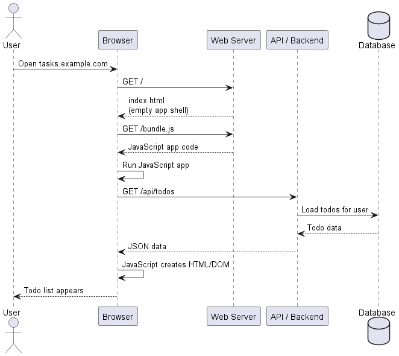
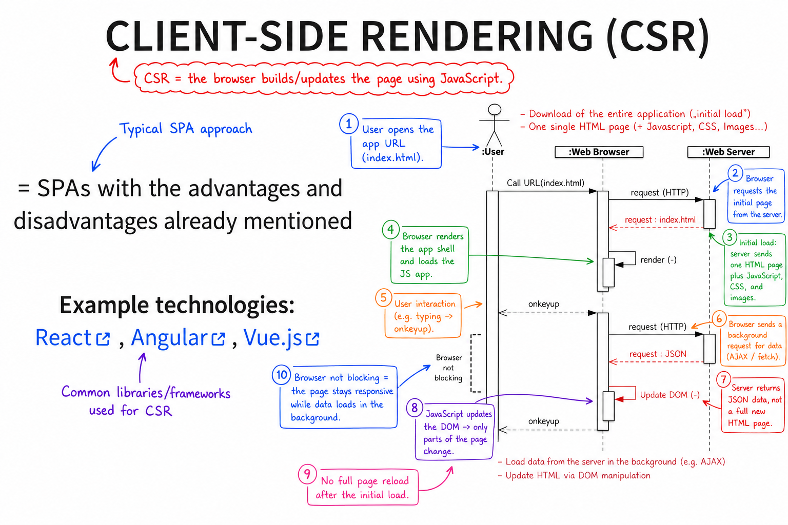

# F02 SPA — Client-Side Rendering Questions

[Source chat](https://chatgpt.com/g/g-p-6a295be0712c8191a00e1149bb7206ea-software-architecture-exam-preparation/c/6a49062c-bafc-83eb-ad19-b118011f3599)

## 1. What happens in a real-life client-side rendering process?

# Real-life example of Client-Side Rendering: an online todo/task app

Imagine you open a task manager app, for example:

```text
https://tasks.example.com
```

The app shows your todos:

```text
- Learn JavaScript
- Check GraphQL
- Submit assignment
```

In **client-side rendering (CSR)**, the server does **not** send this ready-made todo list as final HTML. Instead, the server sends a small HTML file plus JavaScript. Then the **browser runs JavaScript**, asks the server for data, and builds the visible page itself.

The lecture describes CSR as the typical SPA approach, with technologies such as React, Angular, and Vue.js. `F-02-javascript-spas_en.pdf`
# Main idea

In server rendering:

```text
Server creates HTML → Browser displays HTML
```

In client-side rendering:

```text
Server sends app code → Browser runs JavaScript → Browser creates HTML
```

So the important difference is:

> In CSR, the **browser** constructs the actual view.
# Step-by-step process

## Step 1: User opens the app

The user enters:

```text
https://tasks.example.com
```

The browser sends a request:

```http
GET /
```

The browser is asking:

> “Give me the web app.”
## Step 2: Server sends a small HTML shell

The server returns something like this:

```html
<!DOCTYPE html>
<html>
  <head>
    <title>Task App</title>
    <link rel="stylesheet" href="/style.css">
  </head>
  <body>
    <div id="app"></div>

    <script src="/bundle.js"></script>
  </body>
</html>
```

Notice this part:

```html
<div id="app"></div>
```

At this moment, the actual task list is **not inside the HTML**.

There is no:

```html
<li>Learn JavaScript</li>
<li>Check GraphQL</li>
```

The HTML only contains an empty placeholder:

```html
<div id="app"></div>
```

This placeholder means:

> “JavaScript will later put the application here.”
## Step 3: Browser downloads JavaScript

The browser sees:

```html
<script src="/bundle.js"></script>
```

So it sends another request:

```http
GET /bundle.js
```

The server returns the JavaScript application code.

This JavaScript may be written using React, Angular, or Vue.
## Step 4: Browser runs the JavaScript app

Now the browser executes `bundle.js`.

The JavaScript app starts and says:

> “I need todo data.”

So it sends a background request to the server, usually to an API:

```http
GET /api/todos
```
## Step 5: Server sends data, not HTML

The server responds with JSON:

```json
[
  {
    "id": 1,
    "title": "Learn JavaScript",
    "done": false
  },
  {
    "id": 2,
    "title": "Check GraphQL",
    "done": false
  },
  {
    "id": 3,
    "title": "Submit assignment",
    "done": true
  }
]
```

This is not a finished web page.

It is just **data**.
## Step 6: Browser creates the visible HTML

The JavaScript app takes the JSON data and creates DOM elements.

Conceptually, it creates something like:

```html
<h1>My Tasks</h1>

<ul>
  <li>Learn JavaScript</li>
  <li>Check GraphQL</li>
  <li>Submit assignment</li>
</ul>
```

Then it inserts that generated HTML into:

```html
<div id="app"></div>
```

Now the user finally sees the task list.
# Full process as a diagram


# What happens when the user clicks something❓

Suppose the user clicks a checkbox:

```text
Learn JavaScript ✅
```

In CSR, the whole page does **not** reload.

Instead:

1. JavaScript catches the click event.
2. JavaScript updates the local app state.
3. JavaScript updates the DOM.
4. JavaScript may send a background request to the server.

Example request:

```http
PATCH /api/todos/1
```

With data:

```json
{
  "done": true
}
```

The server saves the change and responds:

```json
{
  "id": 1,
  "title": "Learn JavaScript",
  "done": true
}
```

The browser updates only that checkbox/list item.

No full page reload happens.
# Important difference from static rendering

In **static rendering**, the final HTML page already exists before the user visits.

In **client-side rendering**, the final visible page is created in the browser after JavaScript runs.

```text
Static rendering:
Build time → HTML already created → browser receives complete HTML

Client-side rendering:
Runtime in browser → JavaScript creates the HTML after loading
```
# Important difference from server rendering

In **server rendering**, the server sends ready-made HTML:

```html
<ul>
  <li>Learn JavaScript</li>
  <li>Check GraphQL</li>
</ul>
```

In **client-side rendering**, the server first sends mostly an empty shell:

```html
<div id="app"></div>
<script src="/bundle.js"></script>
```

Then the browser builds the list after fetching JSON data.
# Simple mental model

Client-side rendering is like receiving:

```text
1. An empty stage
2. A script
3. Raw data
```

Then the browser acts like the stage crew:

```text
Browser runs the script → arranges the stage → shows the final scene
```

So the final page is not prepared by the server. It is prepared by the browser using JavaScript.

## 2. How can the client-side rendering slide be understood visually❓


