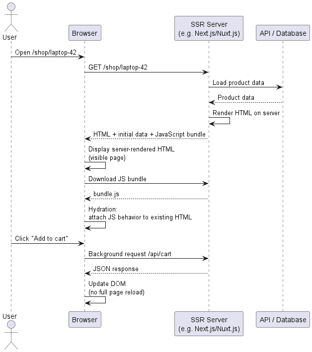
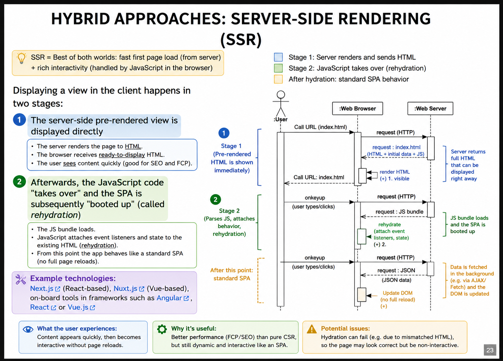

# F02 SPA — Hybrid Approach and Server-Side Rendering Questions

[Source chat](https://chatgpt.com/g/g-p-6a295be0712c8191a00e1149bb7206ea-software-architecture-exam-preparation/c/6a49062c-bafc-83eb-ad19-b118011f3599)

## 1. How does the hybrid approach with Server-Side Rendering work❓

# Hybrid approach: Server-Side Rendering / SSR

**Server-Side Rendering (SSR)** is called a **hybrid approach** because it combines two ideas:

```text
Server rendering + Client-side rendering
```

The lecture says SSR is a combination of CSR and server rendering, also called **Universal Rendering**. The server first creates a ready-to-display HTML view, and the response also contains JavaScript code for the SPA. `F-02-javascript-spas_en.pdf`

So the short idea is:

> **First, the server sends a visible page. Then JavaScript takes over and turns that page into a normal SPA.**
# 1. Why is SSR needed❓

In pure **Client-Side Rendering**, the browser often receives something like:

```html
<div id="app"></div>
<script src="/bundle.js"></script>
```

At first, the page may be almost empty. The browser must download JavaScript, run it, fetch data, and then build the page.

SSR tries to improve this.

With SSR, the browser receives actual HTML immediately, for example:

```html
<h1>My Todos</h1>
<ul>
  <li><input type="checkbox"> Learn JavaScript</li>
  <li><input type="checkbox"> Check GraphQL</li>
</ul>
```

So the user can **see content quickly**. Then JavaScript loads and makes the page interactive.

That is why the lecture says SSR can make **FCP faster than pure CSR**, because the initial load already contains directly displayable static parts. `F-02-javascript-spas_en.pdf`
# 2. Simple mental model

Think of SSR like a restaurant menu.

In pure CSR:

```text
You enter the restaurant.
The waiter gives you an empty menu cover.
Then the kitchen prints the menu later.
```

In SSR:

```text
You enter the restaurant.
The waiter immediately gives you a printed menu.
Then someone later adds interactive buttons to it,
like “order now”, “add to cart”, “filter”, etc.
```

So SSR gives the user something visible quickly, but JavaScript is still needed to make it behave like an SPA.
# 3. Explain the slide

The slide says:

> “Displaying a view in the client happens in two stages.”

These two stages are the whole idea of SSR.

## Stage 1: Server-side pre-rendered view is displayed directly

The user opens:

```text
/index.html
```

The browser sends an HTTP request to the server.

The server does **not** send an empty app shell only. Instead, the server pre-renders the page and sends HTML that can already be displayed.

In the diagram, this is the upper part:

```text
User → Browser → Server
Server → Browser: request: index.html
Browser: render
```

That means:

```text
Server creates visible HTML → Browser displays it
```

The page is visible quickly.
## Stage 2: JavaScript takes over - rehydration

After the HTML is displayed, the JavaScript bundle loads.

The slide says:

```text
JavaScript code "takes over"
SPA is booted up
called rehydration
```

This is shown in the diagram with:

```text
render (-)
rehydrate (-)
```

After rehydration, the page behaves like a standard SPA. That is why the diagram has the note:

```text
After this point: standard SPA
```

After this point, user interactions do not require full page reloads. The browser can send background HTTP requests, receive JSON, and update the DOM.

That is the lower part of the diagram:

```text
onkeyup
request (HTTP)
request: JSON
Update DOM
```

Meaning:

```text
User interacts → browser requests data → server sends JSON → JavaScript updates page
```
# 4. Real-life example: online shop product page using SSR

Imagine an online shop product page built with something like **Next.js**.

The user opens:

```text
/shop/laptop-42
```

The product page has:

```text
Product name
Product image
Price
Description
Reviews
Add to cart button
```

## Step-by-step process

### Step 1: User opens product URL

The browser sends:

```http
GET /shop/laptop-42
```
### Step 2: Server prepares the visible page

The server loads product data:

```text
Product ID: 42
Name: Laptop ABC
Price: 899 €
Description: Lightweight laptop
```

Then the server renders HTML:

```html
<h1>Laptop ABC</h1>
<p>899 €</p>
<p>Lightweight laptop</p>
<button>Add to cart</button>
```

This is already visible HTML.
### Step 3: Browser receives and displays HTML

The browser can immediately show:

```text
Laptop ABC
899 €
Lightweight laptop
[Add to cart]
```

At this moment, the page is visible.

But the button may not yet be fully controlled by the JavaScript app.
### Step 4: JavaScript loads

The browser downloads:

```html
<script src="/bundle.js"></script>
```

This JavaScript contains the SPA code.
### Step 5: Hydration happens

The JavaScript looks at the already existing HTML and says:

```text
This h1 belongs to my ProductTitle component.
This price belongs to my ProductPrice component.
This button belongs to my AddToCartButton component.
```

Then it attaches behavior:

```text
When user clicks Add to cart → run JavaScript function
When user changes quantity → update page
When user opens reviews → fetch more data
```

Now the page is not only visible; it is interactive.
### Step 6: After hydration, it behaves like an SPA

The user clicks:

```text
Add to cart
```

The whole page does not reload.

Instead, JavaScript sends:

```http
POST /api/cart
```

The server responds with JSON:

```json
{
  "success": true,
  "cartItems": 1
}
```

JavaScript updates only the cart icon:

```text
Cart: 1 item
```

So after hydration, it behaves like client-side rendering.
# 5. Process diagram


# 6. Hydration in simple words

**Hydration** means:

> JavaScript connects itself to the HTML that the server already created.

Before hydration:

```text
The page is visible.
But it may be like a picture/poster of the app.
```

After hydration:

```text
The page is alive.
Buttons, forms, menus, and SPA navigation work.
```

A very simple analogy:

```text
Server-rendered HTML = body
JavaScript = brain and nerves
Hydration = connecting the brain and nerves to the body
```

More technically, hydration does these things:

1. JavaScript loads in the browser.
2. The framework reads the existing HTML.
3. It matches the HTML with its components.
4. It attaches event listeners, such as click handlers.
5. It restores/uses initial data.
6. The app becomes interactive.

The lecture also warns about the bad case: if hydration fails, the page may look fully rendered but remain non-interactive. `F-02-javascript-spas_en.pdf`
# 7. The lecture’s todo example

The lecture shows this SSR example:

```html
<!DOCTYPE html>
<html lang="de">
<head>
  <meta charset="utf-8">
  <title>My Todos</title>
  <link rel="stylesheet" href="/style.css" />
</head>
<body>
  <h1>My Todos</h1>
  <ul>
    <li><input type="checkbox"> Learn JavaScript</li>
    <li><input type="checkbox"> Check GraphQL</li>
  </ul>

  <script>
    var DATA = { "todos": [
      { "text": "Lorem ipsum...", "title": "Learn JavaScript", "id": "42" },
      { "text": "Dolor sit amet...", "title": "Check GraphQL", "id": "23" }
    ]};
  </script>

  <script src="/bundle.js"></script>
</body>
</html>
```

This example has three important parts.

## Part 1: Server-rendered visible HTML

```html
<h1>My Todos</h1>
<ul>
  <li><input type="checkbox"> Learn JavaScript</li>
  <li><input type="checkbox"> Check GraphQL</li>
</ul>
```

This part is visible immediately. The lecture explicitly marks this as server-side pre-rendered static HTML for quick display. `F-02-javascript-spas_en.pdf`

## Part 2: Initial data for the SPA

```html
<script>
  var DATA = { "todos": [
    { "text": "Lorem ipsum...", "title": "Learn JavaScript", "id": "42" },
    { "text": "Dolor sit amet...", "title": "Check GraphQL", "id": "23" }
  ]};
</script>
```

This gives the browser-side JavaScript the data it needs. Otherwise, the browser might need to request the same todo data again.

The lecture says this data is repeated in code form so the SPA can process it quickly. `F-02-javascript-spas_en.pdf`

## Part 3: JavaScript for rehydration

```html
<script src="/bundle.js"></script>
```

This loads the SPA code. The lecture identifies this as the SPA code for rehydration. `F-02-javascript-spas_en.pdf`

So the todo page works like this:

```text
Server sends visible todo list
        ↓
Browser displays todo list
        ↓
bundle.js loads
        ↓
JavaScript connects behavior to the existing todo list
        ↓
Checkboxes and interactions become SPA-controlled
```
# 8. Why is SSR called “hybrid”❓

Because it has two lives:

```text
First life: server-rendered page
Second life: client-side SPA
```

At first, it behaves like server rendering:

```text
Server sends ready-made HTML
```

Then, after hydration, it behaves like CSR:

```text
Browser handles interactions with JavaScript
Browser fetches JSON
Browser updates DOM
```

That is exactly why the slide calls it a **hybrid approach**.

## 2. How can the Server-Side Rendering slide be understood visually❓


