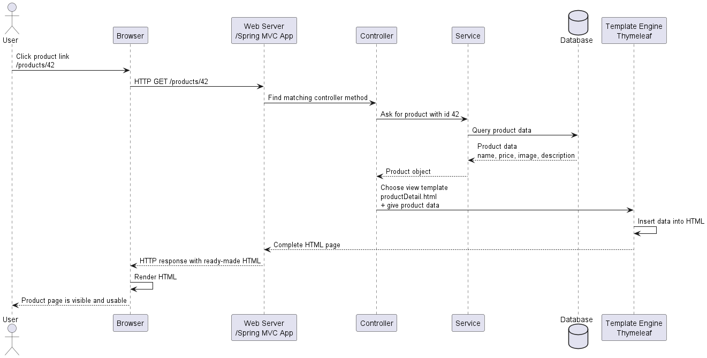

# F02 SPA — Server Rendering and Thymeleaf Questions

[Source chat](https://chatgpt.com/g/g-p-6a295be0712c8191a00e1149bb7206ea-software-architecture-exam-preparation/c/6a49062c-bafc-83eb-ad19-b118011f3599)

## 1. What happens in a real-life server rendering process?

A real-life example of **server rendering** is opening a **product detail page** on an online shop, for example:

```text
https://shop.example.com/products/42
```

In server rendering, the lecture says the **view is rendered entirely on the server**, dynamically when the request arrives. This is the classic MPA style, and examples include Spring MVC with Thymeleaf, Ruby on Rails, and PHP. `F-02-javascript-spas_en.pdf`

## Example: opening a product page

Imagine you click on:

```text
/products/42
```

You want to see the page for “Laptop ABC”.

### Step-by-step process



## What exactly happens?

First, the **browser sends a request** to the server:

```http
GET /products/42
```

The browser is basically saying:

> “Please give me the page for product 42.”

Then the **server receives the request**. In a Spring MVC-style application, the request is handled by a controller. The controller does not usually do all the work itself. It calls business logic, for example a `ProductService`, to get the product data.

The service may ask the database:

```text
Give me the product where id = 42
```

The database returns something like:

```text
id: 42
name: Laptop ABC
price: 899 €
description: Lightweight laptop
```

Now the server has the data, but the browser still needs an HTML page. So the server takes an HTML template, for example:

```html
<h1 th:text="${product.name}">Product name</h1>
<p th:text="${product.price}">Price</p>
<p th:text="${product.description}">Description</p>
```

Thymeleaf replaces the dynamic parts with real values. Thymeleaf templates use expressions such as `${...}` to read values from the model, and dynamic parts are written using special HTML attributes such as `th:text`. `D-12-springmvc-view_en.pdf`

So the server produces final HTML like this:

```html
<h1>Laptop ABC</h1>
<p>899 €</p>
<p>Lightweight laptop</p>
```

Then the server sends this **complete ready-made HTML** back to the browser.

The browser does not need to build the page using lots of JavaScript. It simply receives HTML and displays it.

## The key idea

In **server rendering**, the browser receives the already prepared page.

So the main work happens here:

```text
Server → load data → create HTML → send complete HTML to browser
```

That is why the lecture says **FCP** and **TTI** can be fast: the browser receives ready-made HTML and does not need much JavaScript before showing and using the page. But **TTFB** can be slower, because the server first has to do work such as database access, API calls, calculations, and rendering before sending the first byte. `F-02-javascript-spas_en.pdf`

## 2. What is Thymeleaf used for?

**Thymeleaf is used to create the final HTML page on the server.**

In Spring MVC, the controller usually returns a **view name**, and a view technology is needed to turn that view into real HTML. Thymeleaf is one such **view/template technology** supported by Spring MVC. The lecture describes Thymeleaf as a Java template engine that supports HTML, CSS, JavaScript, XML, and plain text, and integrates well with Spring. `D-12-springmvc-view_en.pdf`

Think of Thymeleaf as a **fill-in-the-blanks HTML machine**.

You write an HTML template like this:

```html
<p>Name: <span th:text="${todo.title}">My todo</span></p>
```

Here:

```html
<span th:text="${todo.title}">My todo</span>
```

means:

> “Take the value `todo.title` from the model and put it here.”

The lecture says Thymeleaf templates are normal `.html` files, and dynamic parts are written using expressions inside special HTML attributes such as `th:text`. `D-12-springmvc-view_en.pdf`

So if the model contains:

```text
todo.title = "Learn JavaScript"
```

Thymeleaf produces final HTML like:

```html
<p>Name: <span>Learn JavaScript</span></p>
```

Then the server sends this ready-made HTML to the browser.

## Where Thymeleaf fits in the process

```text
Controller gets request
        ↓
Controller gets data from service
        ↓
Controller puts data into Model
        ↓
Controller returns view name, e.g. "todoDetail"
        ↓
Thymeleaf uses todoDetail.html template
        ↓
Thymeleaf inserts model data into HTML
        ↓
Browser receives final HTML page
```

Example from the lecture:

```html
<title th:text="${'Todo ' + todo.title}">Todo My Todo</title>
<p>ID: <span th:text="${todo.id}">4711</span></p>
<p>Name: <span th:text="${todo.title}">My todo</span></p>
<p>Text: <span th:text="${todo.text}">Lorem ipsum dolor sit amet...</span></p>
```

This means Thymeleaf replaces the placeholder values with real values from the `todo` object. `D-12-springmvc-view_en.pdf`

So, in one sentence:

> **Thymeleaf is the tool Spring MVC can use to combine an HTML template with server-side data and produce the final HTML response.**

## 3. Why is Thymeleaf needed if HTML already exists?

You are right to question it. **For a completely fixed/static page, you do not need Thymeleaf. Plain HTML is enough.**

Example:

```html
<h1>About us</h1>
<p>We are a small company.</p>
```

This page is always the same. HTML can handle this alone.

But Thymeleaf is needed when the HTML page must contain **dynamic server data**.

For example, plain HTML can write this:

```html
<p>Name: Learn JavaScript</p>
```

But plain HTML **cannot know** that today the todo title is `"Learn JavaScript"` and tomorrow it may be `"Check GraphQL"`.

HTML is just the final document. It does not ask the database, read Java objects, loop over lists, or decide conditions by itself.

That is where Thymeleaf comes in.

The lecture says Thymeleaf templates are normal `.html` files, but their dynamic parts are written with expressions and special HTML attributes such as `th:text`; values can come from variables in the model, for example `${todo.title}`. `D-12-springmvc-view_en.pdf`
## Simple mental model

Plain HTML is like a **printed form already filled in**:

```html
<p>Name: Learn JavaScript</p>
```

Thymeleaf is like a **form template with blanks**:

```html
<p>Name: <span th:text="${todo.title}">My todo</span></p>
```

The server says:

```text
todo.title = "Learn JavaScript"
```

Then Thymeleaf produces final HTML:

```html
<p>Name: <span>Learn JavaScript</span></p>
```

The browser only receives the final HTML.
## Why not just write HTML directly?

Because your data usually changes.

Imagine a todo detail page:

```html
<h1>Details about the todo</h1>
<p>ID: 42</p>
<p>Name: Learn JavaScript</p>
<p>Text: Practice DOM manipulation</p>
```

This works for **one todo only**.

But what if the user opens:

```text
/todo/42
/todo/23
/todo/99
```

You do not want to manually create separate HTML files for every todo.

Instead, you create one Thymeleaf template:

```html
<h1>Details about the todo</h1>
<p>ID: <span th:text="${todo.id}">4711</span></p>
<p>Name: <span th:text="${todo.title}">My todo</span></p>
<p>Text: <span th:text="${todo.text}">Lorem ipsum...</span></p>
```

Then the server fills it with the correct todo object.

The lecture’s example uses exactly this idea: `th:text="${todo.id}"`, `th:text="${todo.title}"`, and `th:text="${todo.text}"` insert dynamic values from the model into the HTML template. `D-12-springmvc-view_en.pdf`
## What Thymeleaf adds on top of HTML

Plain HTML can display content, but Thymeleaf helps with server-side dynamic behavior:

```html
<p th:text="${todo.title}">My todo</p>
```

Replaces text with model data.

```html
<tr th:each="todo : ${todos}">
  <td th:text="${todo.title}">Dummy Todo</td>
</tr>
```

Repeats HTML for every item in a list.

```html
<p th:if="${todo.done}">Done.</p>
<p th:unless="${todo.done}">Open.</p>
```

Shows or hides parts depending on data.

```html
<a th:href="@{/todo/list}">Todo list</a>
```

Creates application-relative links.

These are shown in the lecture as Thymeleaf attributes like `th:text`, `th:value`, `th:href`, `th:each`, `th:if`, and `th:unless`. `D-12-springmvc-view_en.pdf`
## Key sentence

**HTML is the final page. Thymeleaf is the tool that creates that final page by combining an HTML template with server-side data.**

So:

```text
HTML alone = good for fixed pages
Thymeleaf + HTML = useful for dynamic server-rendered pages
```

You can technically avoid Thymeleaf by manually building HTML strings in Java, but that quickly becomes messy. Thymeleaf keeps the page as readable HTML while still allowing dynamic server data.
