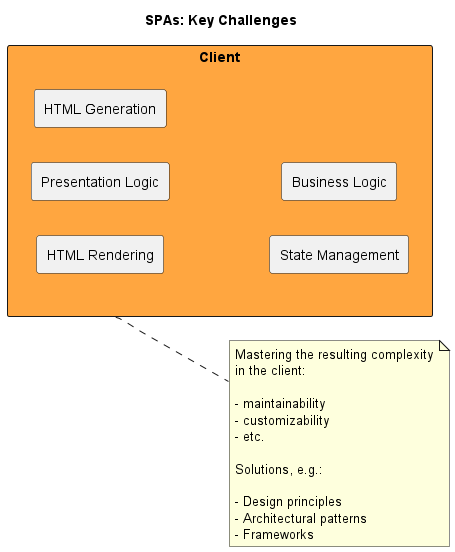
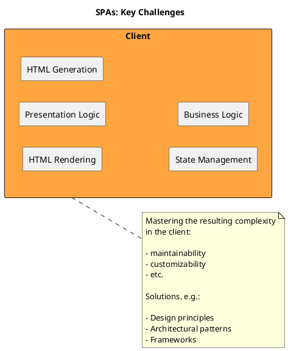
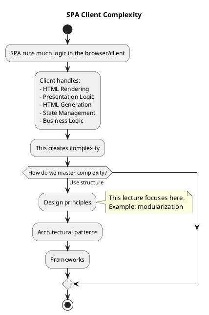

# F03 JavaScript Modularization

[Source chat](https://chatgpt.com/g/g-p-6a295be0712c8191a00e1149bb7206ea-software-architecture-exam-preparation/c/6a4975dd-a334-83eb-8a49-90f4aa88e907)

## 1. How can JavaScript modularization be understood using a clear mental model ❓

# Lecture F-03: JavaScript Modularization - mental model

Think of a **large SPA as a big office building**.

At first, everyone works in one huge open room. Papers, tools, and responsibilities are everywhere. This is like old JavaScript: many variables and functions could easily end up in the global area.

**Modularization** means dividing the office into **separate rooms**:

| Office analogy | JavaScript modularization |
|---|---|
| Each room has its own tools | Each module has its own variables/functions |
| A room hides its private documents | A module hides internal data |
| A room has a door/sign saying what others may use | A module exports selected things |
| Other rooms request only what they need | Other files import selected things |

The lecture’s central idea is: **SPAs become complex because much more work happens in the browser/client. Modularization is one design principle to control this complexity.** `F-03-javascript-modularisierung_en.pdf`
# 1. Why do SPAs need modularization❓

The lecture starts with the key challenge of SPAs: complexity moves into the **client**.

A modern SPA may handle many things inside the browser:

```text
Client
 ├── HTML Rendering
 ├── Presentation Logic
 ├── HTML Generation
 ├── State Management
 └── Business Logic
```

In older server-rendered applications, much of this work happened on the server. In SPAs, the client can become large and complicated.

So the lecture says we need solutions such as:

```text
Solutions:
1. Design principles
2. Architectural patterns
3. Frameworks
```

This lecture focuses on one **design principle**: **modularization**.
# 2. Exam question: What is modularization❓

**Modularization** means structuring a software system into **self-contained building blocks**, called **modules**.

A module should have:

| Feature | Meaning |
|---|---|
| Self-contained code | The module has its own responsibility |
| Hidden internal details | Other code should not directly access everything inside |
| Explicit interface | The module clearly says what other code may use |
| Reusability | The module can be used from different places |

Simple example:

```text
todoService.js
```

could contain logic for todos.

```text
todoView.js
```

could contain logic for showing todos.

```text
app.js
```

could connect everything.

Instead of putting all code into one large file, the application is split into smaller understandable parts.
# 3. Why was modularization difficult in old JavaScript❓

For a long time, before ES6, the ECMAScript standard did **not** provide a real module system.

The lecture gives two main reasons why this became a problem:

1. JavaScript projects became larger.
2. JavaScript mainly had **global scope** and **function scope**, so clean data encapsulation was difficult.

## What does “global scope problem” mean❓

Imagine this old-style JavaScript:

```js
var name = "Todo App";

function add(a, b) {
  return a + b;
}
```

If this code is loaded in the browser, `name` and `add` may become globally visible. That means other scripts can accidentally use or overwrite them.

Example:

```js
var name = "Another App";
```

Now there can be conflicts.

This becomes dangerous in large applications because many developers and libraries may define variables with the same names.
# 4. How did developers imitate modules before ES6❓

The lecture says pure JavaScript could only **imitate** modules to a limited extent, for example using **IIFEs**.

IIFE means **Immediately Invoked Function Expression**.

A simplified example:

```js
const calculator = (function () {
  const secret = "hidden";

  function add(a, b) {
    return a + b;
  }

  return {
    add: add
  };
})();
```

What happens here?

```js
calculator.add(2, 3);
```

This works and returns:

```text
5
```

But this does not work:

```js
calculator.secret;
```

because `secret` is hidden inside the function.

So an IIFE was a workaround for encapsulation before JavaScript had real modules.

Important: the lecture only mentions IIFEs as an example of imitating modules. The deeper details of IIFEs are not the main focus here.
# 5. Alternative module approaches before ES6

Because JavaScript did not originally have built-in modules, alternative approaches were created through libraries or environments.

The lecture names two important ones:

| Approach | Main usage |
|---|---|
| AMD | Mainly client-side/browser use |
| CommonJS | Mainly server-side use, especially Node.js |

## AMD

AMD stands for:

```text
Asynchronous Module Definition
```

The lecture mentions **RequireJS** as the best-known library for AMD.

Mental model: AMD was useful in browsers because browser scripts often needed to be loaded asynchronously.

## CommonJS

CommonJS is associated especially with **server-side JavaScript**, especially **Node.js**.

Mental model: CommonJS became common in Node.js because server-side JavaScript needed a way to split code into files and reuse them.
# 6. Exam question: What changed with ES6 modules❓

With ES6 and later, ECMAScript got its own module system.

The lecture highlights these key rules:

| ES6 module rule | Meaning |
|---|---|
| A module is defined in a separate file | Each file can act as a module |
| Variables inside a module are only visible inside that module | Data encapsulation |
| `export` makes selected things visible outside | Defines the module interface |
| `import` uses exported things elsewhere | Connects modules together |

This is the clean built-in solution that old JavaScript lacked.
# 7. Core mental model: module = private room + public door

A module has two areas:

```text
Module file
 ├── Private area
 │    └── normal variables/functions/classes
 └── Public interface
      └── exported variables/functions/classes
```

Example:

```js
const secret = "only visible inside this file";

export function add(a, b) {
  return a + b;
}
```

Here:

```js
secret
```

is private to the module.

But:

```js
add
```

is public because it is exported.
# 8. Code from the lecture: ECMAScript modules example

The lecture uses two files:

```text
module.js
app.js
```

## File: `module.js`

```js
// Standard export of the module
export default function(a, b) {
  return a / b;
}

// Named export of the module
export function add(a, b) {
  return a + b;
}
```

### What this code means

This file exports two things.

First:

```js
export default function(a, b) {
  return a / b;
}
```

This is the **default export**.

A module can have one default export. It is the main thing the module provides.

Here, the default export is a function that divides two numbers.

Example:

```js
div(42, 2)
```

returns:

```text
21
```

Second:

```js
export function add(a, b) {
  return a + b;
}
```

This is a **named export**.

Its exported name is exactly:

```js
add
```

So other files must import it using that name, unless they rename it.
## File: `app.js`

```js
// Standard import
import div from "./module.js";

// Named import
import {add} from "./module.js";

console.log(div(42, 2));
console.log(add(42, 23));
```

### What this code means

This line imports the default export:

```js
import div from "./module.js";
```

Because it is a default import, the importing file may choose its own name.

The original function in `module.js` has no name, but in `app.js` we call it:

```js
div
```

This line imports the named export:

```js
import {add} from "./module.js";
```

Because `add` is a named export, we use curly braces:

```js
{add}
```

Then the program runs:

```js
console.log(div(42, 2));
```

Output:

```text
21
```

because:

```text
42 / 2 = 21
```

Then:

```js
console.log(add(42, 23));
```

Output:

```text
65
```

because:

```text
42 + 23 = 65
```
# 9. Default export vs named export

This distinction is very important.

## Default export

A default export is like saying:

```text
This is the main thing this module provides.
```

Example:

```js
export default function(a, b) {
  return a / b;
}
```

Import:

```js
import div from "./module.js";
```

You could also write:

```js
import divide from "./module.js";
```

or:

```js
import myFunction from "./module.js";
```

because the name is chosen during import.

## Named export

A named export is like saying:

```text
This module provides this thing with this exact name.
```

Example:

```js
export function add(a, b) {
  return a + b;
}
```

Import:

```js
import {add} from "./module.js";
```

Here the name matters.
# 10. Cheatsheet from the lecture slide

The lecture includes a module cheatsheet. The main patterns are:

## Named export and named import

```js
export const name = "value";
```

```js
import { name } from "...";
```

Meaning: the exported thing has a specific name, and the importer uses that name.
## Default export and default import

```js
export default "value";
```

```js
import anyName from "...";
```

Meaning: default imports can be given any local name.
## Rename export

```js
export { name as newName };
```

```js
import { newName } from "...";
```

Meaning: the module exports `name`, but exposes it publicly as `newName`.
## Export list with rename

```js
export {
  name1,
  name2 as newName2
};
```

Import with rename:

```js
import {
  name1 as newName1,
  newName2
} from "...";
```

Meaning: several things can be exported/imported at once, and names can be changed when needed.
# 11. Small complete example for understanding

Imagine we are building a calculator app.

## File: `math.js`

```js
const secretMessage = "Only math.js can see this";

export default function divide(a, b) {
  return a / b;
}

export function add(a, b) {
  return a + b;
}
```

## File: `app.js`

```js
import divide from "./math.js";
import { add } from "./math.js";

console.log(divide(10, 2));
console.log(add(10, 2));
```

Output:

```text
5
12
```

The important point:

```js
secretMessage
```

is not exported, so `app.js` cannot directly use it.

That is **data encapsulation**.
# 12. Exam question: Why is `export` the module interface❓

The lecture says `export` defines the **interface of the module**.

That means: the module may contain many variables and functions internally, but only exported things are visible to other modules.

Example:

```js
const internalTaxRate = 0.19;

function calculateInternalValue(price) {
  return price * internalTaxRate;
}

export function calculateFinalPrice(price) {
  return price + calculateInternalValue(price);
}
```

Here, another file can use:

```js
calculateFinalPrice
```

but cannot directly use:

```js
internalTaxRate
calculateInternalValue
```

So the module controls what it reveals.
# 13. How this lecture fits into the bigger SPA topic

The lecture begins and ends with the same SPA challenge slide.

That is important.

The message is:

```text
SPAs are complex.
To master complexity, we need design principles.
One central design principle is modularization.
Modern JavaScript supports modularization using ES6 modules.
```

So this lecture is not mainly about advanced JavaScript syntax. It is about **using modules as an architecture tool** to keep client-side applications maintainable.
# 14. Final map of the lecture

```text
SPA complexity
    ↓
Need ways to control complexity
    ↓
Design principle: modularization
    ↓
Module = self-contained building block
    ↓
Old JavaScript problem:
    no built-in modules before ES6
    global/function scope made encapsulation difficult
    ↓
Workarounds and external approaches:
    IIFEs
    AMD / RequireJS
    CommonJS / Node.js
    ↓
Modern solution:
    ES6 modules
    ↓
Separate files
Private internal variables
export = public interface
import = use module elsewhere
```

The exam-relevant core is: **modularization helps control client-side complexity by splitting JavaScript code into self-contained modules with explicit imports and exports.**

## 2. What does the SPA key challenges slide say, and how can it be shown in PlantUML ❓



This slide says: **SPAs put a lot of responsibility inside the browser/client, so the frontend becomes complex.**

In a **Single Page Application**, the browser is not only showing finished HTML. It may also handle:

| Client responsibility | Meaning in simple words |
|---|---|
| **HTML Rendering** | Browser displays the final page on screen |
| **Presentation Logic** | Logic for how the UI behaves, for example showing/hiding sections |
| **HTML Generation** | JavaScript may create or update HTML dynamically |
| **State Management** | The client remembers current data, for example logged-in user, selected todo, shopping cart |
| **Business Logic** | Some application rules may also run in the client |

The problem is: when all these responsibilities move into the client, the frontend can become hard to understand, change, test, and customize.

So the slide says we need ways to master this complexity:

1. **Design principles** — highlighted in red because this lecture focuses on this part, especially **modularization**.
2. **Architectural patterns** — larger structural patterns for organizing frontend code.
3. **Frameworks** — tools like frontend frameworks that help structure the application.

Mental model:

```text
SPA client = not just a “viewer”
SPA client = a small application running inside the browser
```

So we need structure.
## PlantUML version of the slide



A more “cause → problem → solutions” version:


