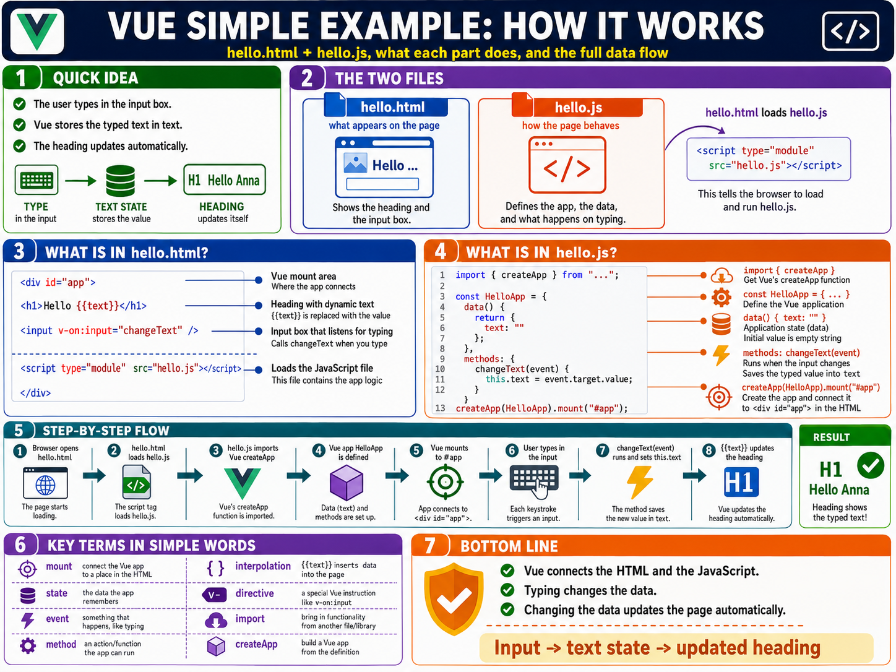
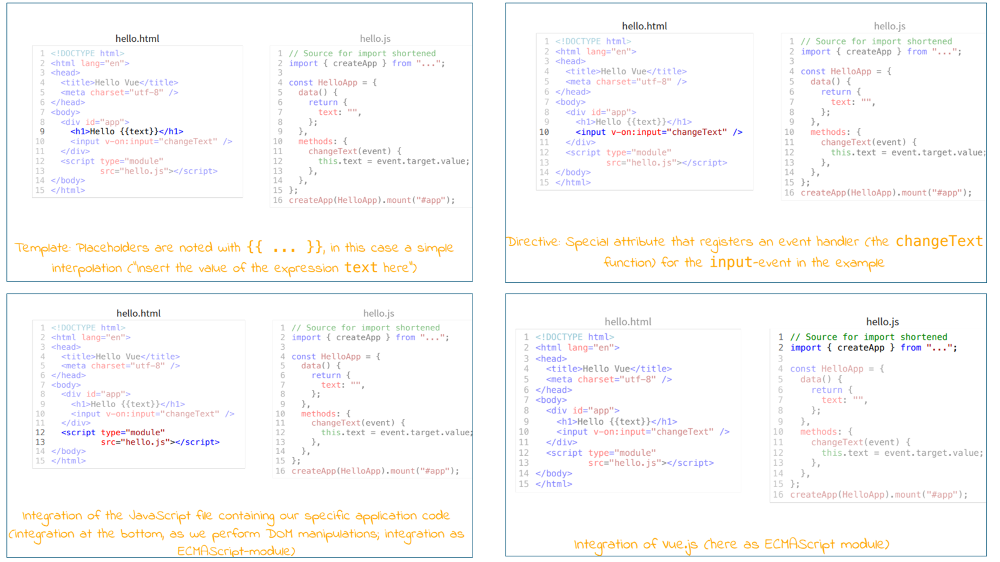
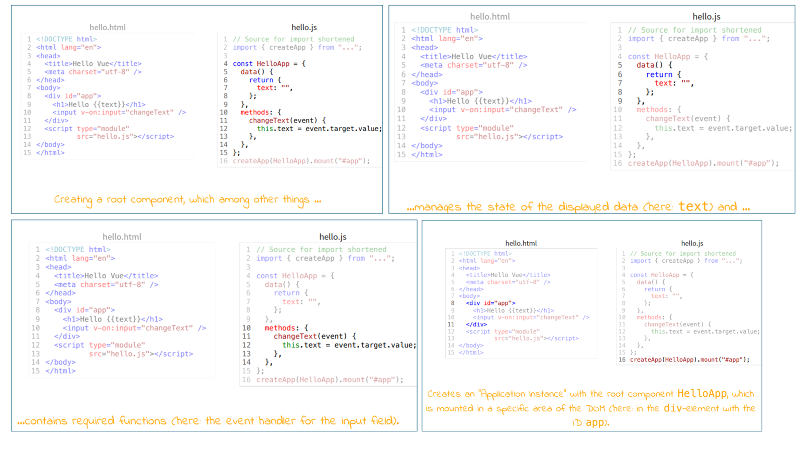

# Vue.js Lecture Summary

### The main mental model: Vue connects **data**, **HTML**, and **user actions**

Think of a Vue application as a small system with three cooperating parts:

```text
Application data
      ↓
Vue updates the HTML
      ↓
User sees the interface
      ↓
User types/clicks
      ↓
Vue runs a JavaScript method
      ↓
Application data changes
      ↺
```

❗ **Key Concept:**

> ❗ You describe the data and how the interface should use it. Vue keeps the displayed page synchronized with that data.

Without Vue, you would normally have to:

1. locate HTML elements manually,
2. register event listeners manually,
3. read values from the page,
4. change the DOM manually.

Vue provides abstractions for these tasks.
## 1. What is Vue.js?

🟧 **Vue.js** is a **JavaScript framework for creating web interfaces**.

It was published in 2014 by Evan You and is open source under the MIT License. The lecture’s learning objective is to understand and apply client-side concepts for web-application development through Vue.js. `G-01-vuejs-introduction.pdf`

▣ **Definition:** A **web interface** means the part of a web application that users see and interact with, such as:

🟢 headings,
🟢 buttons,
🟢 forms,
🟢 menus,
🟢 lists,
🟢 input fields,
🟢 dynamically changing content.

⚠ **Warning:** Vue does not replace HTML, CSS, or JavaScript. It is built on top of them.

```text
❗
HTML       → structure
CSS        → appearance
JavaScript → behaviour
Vue.js     → organizes and simplifies interactive interfaces
```
## 2. Important properties of Vue.js

## Vue is based on HTML, CSS, and JavaScript

You still write ordinary web technologies.

💡 **Example:**

```html
<h1>Hello</h1>
```

is still HTML, and:

```javascript
this.text = event.target.value;
```

is still JavaScript.

Vue adds special syntax and an application structure that connect the two.
## Vue has a modular structure

The core of Vue mainly focuses on creating and managing **views**.

Here, a view means the visible user interface.

Additional functionality can be added through separate libraries when needed, for example:

🟢 routing,
🟢 state management,
🟢 development tools.

This means Vue does not force every project to include a large collection of features.

A small project can use only the Vue core, while a complex application can add more functionality.

### Simple mental model

```text
Vue core
   └── Create interactive views

Optional libraries
   ├── Routing
   ├── State management
   └── Other functionality
```
## Vue can be used in both MPAs and SPAs

Vue is not restricted to building complete Single-Page Applications.

It can be used in:

### Multi-Page Applications

Vue may control only a small interactive section of an otherwise traditional page.

💡 **Example:**

```text
Traditional product page
├── server-rendered content
├── normal page navigation
└── Vue-controlled shopping cart widget
```

### Single-Page Applications

Vue can also control nearly the complete user interface.

💡 **Example:**

```text
Vue application
├── dashboard
├── user profile
├── product list
└── navigation between screens
```

→ **Result:**

> ❗ Vue is progressively adoptable: it can enhance one small area or power an entire frontend.
## Vue uses a component-oriented approach

Vue interfaces are designed using **components**.

▣ **Definition:** A component is a reusable, self-contained part of the user interface.

Examples include:

```text
Application
├── NavigationBar
├── SearchField
├── ProductList
│   ├── ProductCard
│   ├── ProductCard
│   └── ProductCard
└── Footer
```

Each component can manage its own:

- displayed HTML,
- data,
- behaviour.

The lecture introduces this property but does not yet go deeply into creating multiple components.
## Tool and development support

The lecture mentions:

🟢 good performance,
🟢 `create-vue`,
🟢 Vite,
🟢 Vue Devtools,
🟢 support in development environments.

### `create-vue`

A tool that creates a basic Vue project.

### Vite

A development and build tool that supports project templates, development servers, and packaging.

### Vue Devtools

Browser development tools for examining and debugging a running Vue application.
## 3. How can Vue be integrated into a project?

The lecture presents two main approaches.
## Approach 1: Use Vue through a CDN

▣ **Definition:** A **Content Delivery Network**, or CDN, hosts files that the browser can download directly.

The lecture mentions services such as:

🟢 jsDelivr,
🟢 unpkg.

This approach is useful for simple examples and smaller projects because no complete build setup is required.

There are two CDN variants.
## Option 1A: Include Vue using a normal script tag

```html
<!-- Vue available in the global scope -->
<script src="https://cdn.jsdelivr.net/npm/vue@3/dist/vue.global.js">
</script>
```

### Explanation

```html
<script src="...">
```

tells the browser to download and execute an external JavaScript file.

The file:

```text
vue.global.js
```

is a version of Vue that makes Vue available globally.

“Available in the global scope” means that code elsewhere on the page can access the global `Vue` object.

Conceptually:

```javascript
Vue.createApp(...)
```

could then be used.

### Appropriate for

🟢 quick experiments,
🟢 simple pages,
🟢 learning examples,
🟢 projects without JavaScript modules.
## Option 1B: Import Vue as an ECMAScript module

```javascript
/* Vue is only available in the scope of the current module */
import { createApp }
from "https://cdn.jsdelivr.net/npm/vue@3/dist/vue.esm-browser.js";
```

### Explanation of the syntax

```javascript
import { createApp } from "...";
```

means:

>  Load the named export `createApp` from the specified JavaScript module.

The braces:

```javascript
{ createApp }
```

indicate a **named import**.

Only `createApp` is imported, rather than introducing a global `Vue` object.

“Available only in the current module” means other JavaScript files do not automatically gain access to `createApp`.

For this to work in the browser, the importing script must be loaded as a module:

```html
<script type="module" src="hello.js"></script>
```
## Approach 2: Install Vue using npm and create-vue

The lecture gives the following command:

```bash
npm init vue@latest
```

This starts the `create-vue` tool and interactively creates a basic Vue project.

### Breaking down the command

```text
npm
```

The Node Package Manager.

```text
init
```

Start the process of initializing a project.

```text
vue
```

Use Vue’s project creation package.

```text
@latest
```

Use the latest available version of that package.

### Requirement

npm is included with Node.js, so Node.js must be installed.

### What the tool does

It asks questions and generates a prepared project containing the necessary files and configuration.

Conceptually:

```text
npm init vue@latest
        ↓
Interactive setup questions
        ↓
Basic Vue project generated
        ↓
Open project in development environment
```

### When is this approach recommended?

The lecture recommends this second approach for **medium-sized and large projects**.

It requires some basic knowledge of tools such as npm, but it provides a structured development setup.
## 4. First Vue example

The lecture uses two files:

```text
hello.html
hello.js
```

The application behaves as follows:

 1. The user types into an input field.
 2. An input event occurs.
 3. Vue calls the `changeText` method.
 4. The method stores the typed value in `text`.
 5. Vue notices that `text` changed.
 6. Vue immediately updates the heading.

The result is:

```text
Input: Alice
Heading: Hello Alice
```

No page reload is needed.
## 5. Complete source code

## `hello.html`

```html
<!DOCTYPE html>
<html lang="en">
<head>
  <title>Hello Vue</title>
  <meta charset="utf-8" />
</head>
<body>
  <div id="app">
    <h1>Hello {{text}}</h1>
    <input v-on:input="changeText" />
  </div>

  <script
    type="module"
    src="hello.js">
  </script>
</body>
</html>
```

## `hello.js`

```javascript
// Source for import shortened
import { createApp } from "...";

const HelloApp = {
  data() {
    return {
      text: "",
    };
  },

  methods: {
    changeText(event) {
      this.text = event.target.value;
    },
  },
};

createApp(HelloApp).mount("#app");
```

This is the central code example of the lecture. `G-01-vuejs-introduction.pdf`
## 6. Understanding `hello.html`

## Document structure

```html
<!DOCTYPE html>
```

Declares that the document uses modern HTML.

```html
<html lang="en">
```

Starts the HTML document and declares English as its language.

```html
<head>
```

Contains metadata about the page.

```html
<title>Hello Vue</title>
```

Sets the browser-tab title.

```html
<meta charset="utf-8" />
```

Sets UTF-8 as the character encoding.

```html
<body>
```

Contains the visible page content.

These are normal HTML features, not Vue-specific features.
## The Vue-controlled area

```html
<div id="app">
  ...
</div>
```

This element will become the root of the Vue application.

The ID:

```html
id="app"
```

allows JavaScript to identify this element using the CSS selector:

```javascript
"#app"
```

Vue will control the content inside this element after the application is mounted.

```text
Before mounting:
<div id="app"> is normal HTML

After mounting:
<div id="app"> is managed by Vue
```
## 7. What is a Vue template?

The HTML inside the application root acts as a **template**.

```html
<div id="app">
  <h1>Hello {{text}}</h1>
  <input v-on:input="changeText" />
</div>
```

❗ A template describes what Vue should display and how that display relates to the application’s data.

It contains ordinary HTML plus Vue-specific syntax.

In this example, the Vue-specific parts are:

```html
{{text}}
```

and:

```html
v-on:input="changeText"
```
## 8. Interpolation: `{{text}}`

```html
<h1>Hello {{text}}</h1>
```

The double curly braces represent a placeholder.

This is called **interpolation**.

The expression:

```html
{{text}}
```

means:

>  Insert the current value of the `text` property here.

Initially:

```javascript
text: ""
```

Therefore, the heading is initially approximately:

```text
Hello
```

After the user types:

```text
Anna
```

the value becomes:

```javascript
text: "Anna"
```

and Vue displays:

```text
Hello Anna
```

The browser itself does not understand `{{text}}` as ordinary HTML. Vue processes the template and replaces the interpolation with the current data value. `G-01-vuejs-introduction.pdf`
## 9. Vue directives

```html
<input v-on:input="changeText" />
```

`v-on:input` is a Vue **directive**.

❗ ▣ **Definition:** A directive is a special HTML attribute understood by Vue.

Vue directives generally begin with:

```text
v-
```

Here:

```text
v-on
```

means:

> Register an event listener.

The part after the colon identifies the event:

```text
input
```

→ **Result:**

```html
v-on:input
```

means:

> Listen for the input event.

The assigned value:

```html
"changeText"
```

tells Vue which method to run.

Full interpretation:

```html
<input v-on:input="changeText" />
```

means:

> Whenever the content of this input field changes, call the `changeText` method.
## 10. Why use the `input` event?

The `input` event normally occurs whenever the user changes the field’s current value.

For example, typing:

```text
A
```

triggers an event.

Typing:

```text
n
```

triggers another event.

Therefore, the heading can update after every entered character.

```text
Input: A     → Hello A
Input: An    → Hello An
Input: Ann   → Hello Ann
Input: Anna  → Hello Anna
```

This is why the result appears immediately and dynamically.
## 11. Loading the JavaScript file

```html
<script
  type="module"
  src="hello.js">
</script>
```

## `src="hello.js"`

This tells the browser to load the application code from `hello.js`.

## `type="module"`

This tells the browser that `hello.js` is an ECMAScript module.

That is necessary because `hello.js` uses:

```javascript
import { createApp } from "...";
```

Imports are supported within modules.

The script is included near the bottom of the body. In the lecture example, this ensures that the relevant DOM elements have already been parsed before the application manipulates or attaches itself to them. `G-01-vuejs-introduction.pdf`
## 12. Importing Vue

```javascript
import { createApp } from "...";
```

The real URL is shortened on the slide.

This line imports the `createApp` function from Vue’s ECMAScript-module build.

`createApp` is the function used to create a Vue application.

Mental model:

```text
Vue library
    ↓ import
createApp function
    ↓ use
Vue application
```

Because this is a module import, Vue is not placed in the global scope. The imported function is available inside `hello.js`. `G-01-vuejs-introduction.pdf`
## 13. The root component

```javascript
const HelloApp = {
  ...
};
```

This creates a JavaScript object called `HelloApp`.

```javascript
const
```

declares a variable whose reference cannot later be reassigned.

```javascript
HelloApp
```

is the variable name.

```javascript
{
  ...
}
```

creates an object.

This object contains the configuration for the application’s **root component**.

A root component is the top-level component from which the Vue application begins.

Conceptually:

```text
Vue application
└── Root component: HelloApp
```

In larger applications, this root component may contain many child components. In this introductory example, it directly controls the simple heading and input field.
## 14. Application state with `data()`

```javascript
data() {
  return {
    text: "",
  };
},
```

The `data` function defines the component’s state.

## What is state?

▣ ▣ **Definition:** **State** is the information currently stored by the application and used to determine what appears on screen.

In this example, the state contains one property:

```javascript
text
```

Its initial value is an empty string:

```javascript
""
```

So the application state initially looks like:

```javascript
{
  text: ""
}
```
## Why is `data` a function?

```javascript
data() {
  ...
}
```

This is JavaScript’s shortened method syntax.

It is equivalent in broad form to:

```javascript
data: function () {
  ...
}
```

The function returns an object containing the component data:

```javascript
return {
  text: "",
};
```

The lecture describes this root component as managing the state of the displayed data, here the `text` property. `G-01-vuejs-introduction.pdf`
## 15. Methods with `methods`

```javascript
methods: {
  changeText(event) {
    this.text = event.target.value;
  },
},
```

The `methods` property contains functions that belong to the component.

In this example, there is one method:

```javascript
changeText
```

The template refers to this method here:

```html
<input v-on:input="changeText" />
```

So the HTML and JavaScript are connected by the method name.

```text
Template:
v-on:input="changeText"
               │
               ▼
JavaScript:
changeText(event) { ... }
```

The lecture explains that this section contains the required functions, including the event handler for the input field. `G-01-vuejs-introduction.pdf`
## 16. Understanding the event handler

```javascript
changeText(event) {
  this.text = event.target.value;
}
```

## `event`

When the browser detects an input event, it creates an event object.

Vue passes that object to the handler as:

```javascript
event
```

The event object contains information about what happened.
## `event.target`

```javascript
event.target
```

refers to the element that triggered the event.

Here, the triggering element is the input field:

```html
<input ... />
```
## `event.target.value`

```javascript
event.target.value
```

reads the current value of that input field.

For example, when the user has entered:

```text
Maya
```

then approximately:

```javascript
event.target.value === "Maya"
```
## `this.text`

```javascript
this.text
```

refers to the component’s `text` data property.

It was declared here:

```javascript
data() {
  return {
    text: "",
  };
}
```

→ **Result:**

```javascript
this.text = event.target.value;
```

means:

> ❗ Replace the application’s current `text` value with the current value from the input field.
## 17. Creating and mounting the application

```javascript
createApp(HelloApp).mount("#app");
```

This performs two important operations.

## Step 1: Create the Vue application

```javascript
createApp(HelloApp)
```

Vue creates an application using `HelloApp` as its root component.

```text
HelloApp configuration
        ↓
createApp(...)
        ↓
Vue application instance
```

## Step 2: Mount it to the HTML

```javascript
.mount("#app")
```

Mounting connects the Vue application to the DOM element matching:

```css
#app
```

The `#` indicates an ID selector.

It matches:

```html
<div id="app">
```

Full meaning:

```javascript
createApp(HelloApp).mount("#app");
```

> ❗ Create a Vue application whose root component is `HelloApp`, and attach it to the HTML element with the ID `app`.

Once mounted, Vue processes the template inside that element and manages its updates.
## 18. → Result / Flow: Full execution flow

Here is the complete process when the page starts.

## Initial setup

```text
1. Browser loads hello.html
2. Browser creates the DOM
3. Browser loads hello.js as a module
4. hello.js imports createApp from Vue
5. HelloApp component configuration is created
6. Vue application is created
7. Application is mounted to <div id="app">
8. Vue processes {{text}} and v-on:input
9. Initial text value is ""
```

## When the user types

```text
1. User types "A"
2. Browser creates an input event
3. Vue detects the event through v-on:input
4. Vue calls changeText(event)
5. event.target.value is "A"
6. this.text becomes "A"
7. Vue detects that text changed
8. Vue updates {{text}} in the heading
9. Browser displays "Hello A"
```
## 19. What does reactive data mean?

The lecture states that Vue connects the data with the DOM and automatically updates the DOM when the data changes. This is called **reactivity**. `G-01-vuejs-introduction.pdf`

In the example:

```javascript
this.text = event.target.value;
```

changes the application data.

Because `text` is reactive and used here:

```html
<h1>Hello {{text}}</h1>
```

Vue knows that this heading depends on `text`.

It updates the heading automatically.

You do **not** need to write manual DOM code such as:

```javascript
document.querySelector("h1").textContent =
  "Hello " + event.target.value;
```

Instead, you write:

```javascript
this.text = event.target.value;
```

and Vue handles the DOM update.
## 20. What abstraction does Vue provide?

The lecture highlights two tasks that no longer have to be programmed entirely by hand.

## Event handling abstraction

Instead of:

```javascript
const input = document.querySelector("input");

input.addEventListener("input", changeText);
```

the template declares:

```html
<input v-on:input="changeText" />
```

## DOM manipulation abstraction

Instead of:

```javascript
const heading = document.querySelector("h1");
heading.textContent = "Hello " + text;
```

the template declares:

```html
<h1>Hello {{text}}</h1>
```

Vue handles the relationship between the data and DOM.

### Comparison

| Manual JavaScript responsibility | Vue equivalent |
|---|---|
| Find input element | Express event on the template |
| Register event listener | `v-on:input` |
| Find heading element | Use interpolation in the template |
| Change heading text | Change reactive `text` data |
| Keep interface synchronized | Vue handles it automatically |
## 21. Vue and Model-View-ViewModel

The lecture notes that Vue is inspired by the **Model-View-ViewModel**, or MVVM, architectural pattern.

For this example, a simplified mapping is:

```text
Model / state
text property

View
HTML template:
<h1>Hello {{text}}</h1>
<input ... />

ViewModel-like connection
Vue component:
- data()
- methods
- template bindings
- reactivity
```

⚠ **Warning:** Do not interpret this as a perfect one-to-one implementation of every MVVM definition. The important lecture-level idea is:

> ❗ Vue places a reactive connection between application data and the visible interface.

When the data changes, the view is updated.

When a user interacts with the view, methods can change the data.
## 22. Essential concepts to remember

## What is Vue.js?

A JavaScript framework for developing web interfaces.

## What is a template?

HTML containing Vue-specific expressions and directives that describe the user interface.

## What is interpolation?

```html
{{text}}
```

It inserts the value of an expression into the displayed HTML.

## What is a directive?

A special Vue-controlled HTML attribute.

💡 **Example:**

```html
v-on:input="changeText"
```

## What is component state?

Data managed by a component.

💡 **Example:**

```javascript
data() {
  return {
    text: "",
  };
}
```

## What is a method?

A function belonging to the component.

💡 **Example:**

```javascript
changeText(event) {
  this.text = event.target.value;
}
```

## What is mounting?

Connecting a Vue application to a particular DOM element.

```javascript
createApp(HelloApp).mount("#app");
```

## What is reactivity?

When data changes, Vue automatically updates every relevant part of the interface.
## Exam-style questions

## What are the central properties of Vue.js?

Vue.js is based on HTML, CSS, and JavaScript and focuses on building views. It follows a component-oriented approach and has a modular structure, allowing additional features such as routing and state management to be added through libraries. It can be used to enhance parts of an MPA or to build complex SPAs. It also offers good performance and development-tool support.
## What is the difference between integrating Vue globally and importing it as a module?

With the global CDN build:

```html
<script src="https://cdn.jsdelivr.net/npm/vue@3/dist/vue.global.js">
</script>
```

Vue becomes available in the global scope.

With the module build:

```javascript
import { createApp }
from "https://cdn.jsdelivr.net/npm/vue@3/dist/vue.esm-browser.js";
```

only the explicitly imported functionality is available inside the current JavaScript module.
## Explain how the simple Vue example reacts to user input

The `v-on:input` directive registers the `changeText` method as an event handler for the input event. Whenever the user types, Vue calls the method and passes the browser event object. The method reads the input value through `event.target.value` and assigns it to the reactive `text` property. Because the heading uses `{{text}}`, Vue automatically updates the heading.
## What does `createApp(HelloApp).mount("#app")` do?

`createApp(HelloApp)` creates a Vue application using `HelloApp` as the root component. `.mount("#app")` attaches this application to the DOM element whose ID is `app`. Vue then controls and updates the template inside that element.
## Why is the `text` property reactive?

The `text` property is returned from the component’s `data()` function. Vue observes this component data. When the method changes `this.text`, Vue identifies which parts of the template depend on it and updates those parts of the DOM automatically.
## → Result / Flow: Final mental map

```text
Vue.js
│
├── Purpose
│   └── Create interactive web interfaces
│
├── Foundation
│   ├── HTML
│   ├── CSS
│   └── JavaScript
│
├── Properties
│   ├── Modular
│   ├── Component-oriented
│   ├── Suitable for MPA and SPA
│   ├── Reactive
│   └── Good tooling
│
├── Integration
│   ├── CDN
│   │   ├── Global script
│   │   └── ECMAScript module
│   └── npm + create-vue
│
└── First application
    ├── Template
    │   ├── {{text}} → interpolation
    │   └── v-on:input → event directive
    │
    ├── Root component
    │   ├── data() → state
    │   └── methods → behaviour
    │
    ├── createApp() → create application
    ├── mount("#app") → connect to HTML
    └── Reactivity → data change updates DOM
```

❗ 📌 **Remember:**

> ❗ **Vue connects application data with an HTML template and automatically keeps the displayed DOM synchronized when that data changes.**

## What is a View?
7/19/2026, 3:05:30 PM

give me an analogy to understand what is view, i have no knowelegde of software languages etc

## Response:
7/19/2026, 3:05:39 PM

Think of a **view** as the **shop window of a store**.

The store has many things happening behind the scenes:

🟢 products are stored in the warehouse,
🟢 prices are calculated,
🟢 stock is managed,
🟢 employees make decisions.

But the customer does not see all of that.

The customer only sees the **shop window and the sales area**:

🟢 product names,
🟢 prices,
🟢 pictures,
🟢 buttons,
🟢 forms,
🟢 messages.

That visible part is the **view**.

## In a web application

Suppose you open a to-do website.

You see:

```text
My Tasks

[ ] Buy milk
[x] Finish homework

[Add new task]
```

Everything displayed on the screen is the **view**.

The view’s job is mainly:

1. show information to the user,
2. give the user something to interact with.

💡 **Example:**

🟢 a heading,
🟢 a task list,
🟢 a button,
🟢 a text field.

## The view does not usually decide everything

Using the store analogy:

```text
Warehouse and staff   → handle the real work
Shop window           → shows the result
```

In software:

```text
Application data and logic → handle the real work
View                       → displays the result
```

For example, the view may show:

```text
Price: €20
```

But the view usually did not calculate the price. It only displays the value it received.

## In the Vue example

This is the view:

```html
<div id="app">
  <h1>Hello {{text}}</h1>
  <input v-on:input="changeText" />
</div>
```

It describes what the user sees:

🟢 a heading,
🟢 an input field.

When the stored value of `text` is `"Anna"`, the view displays:

```text
Hello Anna
```

📌 **Remember:**

> ❗ **The view is the visible face of the application—the part the user sees and interacts with.**

## What is Vue.js?
7/19/2026, 3:17:56 PM

what is vuejs then

## Response:
7/19/2026, 3:18:03 PM

Using the shop analogy:

- The **view** is the shop window.
- **Vue.js** is the worker who keeps that shop window updated automatically.

Suppose the price of a product changes from €20 to €15.

Without Vue.js, a programmer may have to manually find the price shown on the page and replace it.

With Vue.js, the programmer changes the stored price:

```text
price = 15
```

Vue notices the change and updates the view:

```text
Price: €15
```

So Vue.js is a **JavaScript framework for building and managing interactive views**.

It helps connect:

```text
Data
  ↓
Vue.js
  ↓
View shown to the user
```

And also:

```text
User types or clicks
        ↓
Vue.js reacts
        ↓
Data changes
        ↓
View updates
```

In your lecture example:

```html
<h1>Hello {{text}}</h1>
<input v-on:input="changeText" />
```

The heading and input field are the **view**.

Vue.js does the connecting work:

1. it listens when the user types,
2. it stores the typed text,
3. it updates the heading automatically.

📌 **Remember:**

> ❗ **The view is what the user sees. Vue.js is the tool that builds and keeps that view connected to the application’s data and user actions.**

## Explain the Annotations and Simple Terms
7/19/2026, 3:26:11 PM

i dont understand the annotations you have done, explain what does it mean & also the terms in simple like mounting etc,

## Response:
7/19/2026, 3:26:12 PM

Absolutely. Let us first forget the programming syntax and understand the **story** of the example.

## The whole example in one sentence

The user types something into a box, and Vue automatically shows that text in the heading.

💡 **Example:**

```text
User types: Anna
Page shows: Hello Anna
```

There are two files:

```text
hello.html → describes what appears on the page
hello.js   → describes how the page behaves
```
## 💡 **Example / Analogy:** stage and stage manager

Imagine a theatre.

- `hello.html` is the **stage**: it contains the visible objects.
- `hello.js` contains the instructions.
- Vue.js is the **stage manager** that connects the instructions to the stage.

```text
Stage                         Stage manager
hello.html                    Vue.js

Heading                       Watches the data
Input field                   Listens to user actions
                              Updates the heading
```

The annotations show how Vue connects these two files.
## 1. `hello.html`: what the user sees

The important part is:

```html
<div id="app">
  <h1>Hello {{text}}</h1>
  <input v-on:input="changeText" />
</div>
```

This creates:

```text
Hello

[________________]
```

The heading and input box belong to the **view**, because the user can see and interact with them.
## What is the “Vue mount area”?

The annotation points to:

```html
<div id="app">
```

Think of this as a **reserved workspace for Vue**.

💡 **Example / Analogy:**

> ❗ A store gives one display area to a worker and says, “You are responsible for everything inside this area.”

Here, the browser gives this part of the page to Vue:

```html
<div id="app">
  ...
</div>
```

Vue can then manage everything inside it:

```html
<h1>...</h1>
<input ... />
```

⚠ **Warning:** Vue does not automatically control the entire webpage. It controls the element to which it is connected.
## What does “mounting” mean?

**▣ **Definition:** Mounting means connecting the Vue application to a particular place in the HTML page.**

This happens here:

```javascript
createApp(HelloApp).mount("#app");
```

The word:

```javascript
mount
```

essentially means:

```text
attach
connect
place the Vue application onto the page
```

The value:

```javascript
"#app"
```

means:

> ❗ Find the HTML element whose ID is `app`.

It finds:

```html
<div id="app">
```

So this code:

```javascript
.mount("#app")
```

means:

> ❗ Vue, connect yourself to the HTML area named `app`.

A physical analogy:

```text
Vue application = television
<div id="app"> = wall bracket
mount("#app")   = attach the television to that bracket
```

Before mounting, Vue exists as JavaScript instructions.

After mounting, Vue is connected to the visible page.
## 2. What is `{{text}}`?

The annotation calls this **interpolation**:

```html
<h1>Hello {{text}}</h1>
```

The word interpolation sounds complicated, but the meaning is simple:

> ❗ Put the current value of `text` at this position.

Think of it as a blank space in a sentence:

```text
Hello [insert text here]
```

If:

```javascript
text = "Anna"
```

Vue shows:

```text
Hello Anna
```

If:

```javascript
text = "Tom"
```

Vue shows:

```text
Hello Tom
```

So:

```html
{{text}}
```

is a placeholder whose content can change.
## What does “dynamic text” mean?

Dynamic means **able to change while the page is running**.

Static text does not change:

```html
<h1>Hello Anna</h1>
```

It always says:

```text
Hello Anna
```

Dynamic text uses data:

```html
<h1>Hello {{text}}</h1>
```

It may display:

```text
Hello Anna
Hello Tom
Hello Maria
```

depending on the current value of `text`.
## 3. What is the input directive?

The annotated line is:

```html
<input v-on:input="changeText" />
```

First, this part:

```html
<input />
```

creates a box where the user can type.

The Vue-specific part is:

```html
v-on:input="changeText"
```

It means:

> ❗ When the user changes the input field, run the function called `changeText`.
## What is an event?

▣ **Definition:** An **event** is simply something that happens on the page.

Examples:

```text
User clicks a button        → click event
User types in a box         → input event
User submits a form         → submit event
User moves the mouse        → mouse event
```

Here, we are interested in the `input` event.

It happens when the value inside the text box changes.
## What is an event listener?

▣ **Definition:** An event listener is something that **waits for an event**.

💡 **Example / Analogy:**

> ❗ A doorbell waits for someone to press the button.

```text
Doorbell             → event listener
Button press         → event
Bell rings           → function runs
```

In the Vue example:

```text
v-on:input            → listener
User types            → input event
changeText runs       → reaction
```

→ **Result:**

```html
v-on:input="changeText"
```

means:

> ❗ Listen for typing, and react by calling `changeText`.
## What is a directive?

▣ **Definition:** A **directive** is a special instruction written inside HTML for Vue.

Vue directives usually begin with:

```text
v-
```

Here:

```html
v-on:input
```

is an instruction to Vue:

> ❗ Listen for an input event.

It looks like an HTML attribute, but Vue understands it as a special command.
## 4. What does the script annotation mean?

The annotation points to:

```html
<script type="module" src="hello.js"></script>
```

This tells the browser:

> ❗ Load and run the JavaScript instructions stored in `hello.js`.

💡 **Example / Analogy:**

```text
hello.html = appliance
hello.js   = instruction manual
<script>   = tells the browser where the instructions are
```

✗ **Common Mistake:** Without this line, the HTML page would not load the Vue application code from `hello.js`.
## 5. Understanding `hello.js`

Now look at the JavaScript file.

```javascript
import { createApp } from "...";

const HelloApp = {
  data() {
    return {
      text: "",
    };
  },

  methods: {
    changeText(event) {
      this.text = event.target.value;
    },
  },
};

createApp(HelloApp).mount("#app");
```

✓ **Best Practice:** Do not try to understand it as one big block. It has four main jobs:

```text
1. Get Vue's createApp function
2. Describe the application
3. Describe its data and actions
4. Connect it to the HTML
```
## 6. What does `import { createApp }` mean?

```javascript
import { createApp } from "...";
```

This means:

> ❗ Bring the `createApp` tool from the Vue library into this file.

💡 **Example / Analogy:**

> ❗ Before building furniture, you take a screwdriver from the toolbox.

```text
Vue library         → toolbox
createApp           → required tool
import              → take the tool out
```

Vue contains many capabilities. This example specifically needs `createApp` to create the Vue application.
## 7. What is `HelloApp`?

```javascript
const HelloApp = {
  ...
};
```

This defines the application.

You can think of `HelloApp` as a **description or plan**.

💡 **Example / Analogy:**

```text
Architectural plan → describes a house
HelloApp object    → describes the Vue application
```

It tells Vue:

🟢 which data exists,
🟢 which actions exist,
🟢 how the application should behave.

The name `HelloApp` was selected by the programmer. It could have been named differently, such as:

```javascript
const MyApp = { ... };
```
## 8. What is application state?

The annotation points to:

```javascript
data() {
  return {
    text: "",
  };
}
```

The important part is:

```javascript
text: ""
```

This creates a piece of stored information called `text`.

## What does state mean?

**▣ **Definition:** State means the application's current information at this moment.**

💡 **Example:**

```text
Before typing:
text = ""

After typing A:
text = "A"

After typing Anna:
text = "Anna"
```

Analogy: a whiteboard.

```text
The whiteboard currently says: Anna
```

The whiteboard's current content is its state.

In this application, `text` acts like that whiteboard.
## Why is the initial value `""`?

```javascript
text: ""
```

The two quotation marks with nothing between them mean an **empty piece of text**.

So initially:

```text
text contains nothing
```

That is why the page initially displays only:

```text
Hello
```

After the user types, the empty value is replaced.
## 9. What is `data()`?

```javascript
data() {
  return {
    text: "",
  };
}
```

📌 **Remember:**

> ❗ `data()` tells Vue which information the application needs to remember.

In this case, it needs to remember only one thing:

```javascript
text
```

A larger application may remember:

```text
username
shopping cart
selected product
logged-in status
list of tasks
```
## 10. What are `methods`?

```javascript
methods: {
  changeText(event) {
    ...
  },
}
```

`methods` contains the actions that the application can perform.

💡 **Example / Analogy:**

```text
Data    = what the application knows
Methods = what the application can do
```

💡 **Example:**

```text
Data:
current text = "Anna"

Action:
change the current text
```

In this example, there is one action:

```javascript
changeText
```
## 11. What is a function?

This is a function:

```javascript
changeText(event) {
  this.text = event.target.value;
}
```

▣ **Definition:** A function is a named group of instructions.

💡 **Example / Analogy:**

> ❗ A recipe is a group of instructions with a name.

```text
Recipe name: Make tea
Instructions:
1. Boil water
2. Add tea
3. Pour water
```

Similarly:

```text
Function name: changeText
Instruction:
Take the user's input and store it in text
```

The function does not constantly run. It runs when Vue tells it to run.

Here, it runs whenever the user types because of:

```html
v-on:input="changeText"
```
## 12. What is `event`?

```javascript
changeText(event)
```

When the user types, the browser creates an object containing information about what happened.

That information is passed into the function as:

```javascript
event
```

For this example, the event tells us:

🟢 which input field changed,
🟢 what value it currently contains.

Think of the event as an **information envelope** delivered to the function.

```text
Envelope:
- An input change happened
- It happened in this input box
- The current value is "Anna"
```
## 13. What is `event.target.value`?

```javascript
event.target.value
```

Let us break it down:

```text
event
→ information about what happened

target
→ the element where it happened

value
→ the current content of that element
```

Because the event occurred in the input box:

```javascript
event.target
```

refers to the input box.

If the user typed `Anna`:

```javascript
event.target.value
```

is:

```text
Anna
```
## 14. What is `this.text`?

```javascript
this.text
```

This refers to the application's stored `text` value.

It refers back to:

```javascript
text: ""
```

→ **Result:**

```javascript
this.text = event.target.value;
```

means:

> ❗ Take the text currently inside the input box and store it as the application's `text`.

💡 **Example:**

```text
Input box value: "Anna"

this.text = "Anna"
```

Because the heading uses:

```html
{{text}}
```

Vue then updates the heading to:

```text
Hello Anna
```
## 15. What does `createApp(HelloApp)` mean?

```javascript
createApp(HelloApp)
```

You already created the application description:

```javascript
const HelloApp = { ... };
```

Now `createApp` tells Vue:

> ❗ Use this description to create a real, working Vue application.

💡 **Example / Analogy:**

```text
HelloApp              = blueprint
createApp(HelloApp)   = construct something from the blueprint
```
## 16. What does the complete mounting line mean?

```javascript
createApp(HelloApp).mount("#app");
```

It can be read from left to right:

```text
createApp(HelloApp)
```

Create a Vue application based on the `HelloApp` description.

Then:

```text
.mount("#app")
```

Connect it to the HTML element with the ID `app`.

Full translation:

> ❗ Create the application described by `HelloApp`, and connect it to `<div id="app">` in the HTML page.
## → Result / Flow: Complete process, step by step

## When the page opens

```text
1. The browser loads hello.html.
2. The browser displays a heading and an input field.
3. The browser loads hello.js.
4. hello.js imports the createApp tool from Vue.
5. Vue creates the HelloApp application.
6. Vue mounts it to <div id="app">.
7. Vue sees that {{text}} refers to the stored text value.
8. The stored value is initially empty.
```

The page displays:

```text
Hello

[________________]
```

## When the user types `Anna`

```text
1. The user types into the input field.
2. An input event happens.
3. v-on:input tells Vue to call changeText.
4. changeText receives the event information.
5. event.target.value contains "Anna".
6. Vue stores "Anna" in this.text.
7. Vue sees that {{text}} depends on this value.
8. Vue updates the heading.
```

The page now displays:

```text
Hello Anna

[Anna____________]
```

## → Result / Flow: The most important connection

```text
HTML input
   │
   │ user types
   ▼
changeText(event)
   │
   │ updates
   ▼
text data
   │
   │ Vue automatically updates
   ▼
{{text}} in the heading
```

❗ 📌 **Remember:**

> ❗ **The input changes the data, and Vue uses the changed data to update the visible page.**

## Which Files Call Which File?
7/19/2026, 3:34:24 PM

so which files calls which file?

## Response:
7/19/2026, 3:34:38 PM

`hello.html` loads `hello.js`.

This line inside `hello.html` does that:

```html
<script type="module" src="hello.js"></script>
```

So the direction is:

```text
hello.html
   ↓ loads
hello.js
```

Then `hello.js` imports Vue’s `createApp` function:

```javascript
import { createApp } from "...";
```

So:

```text
hello.js
   ↓ imports
Vue library
```

After that, `hello.js` connects the Vue application back to the HTML element:

```javascript
createApp(HelloApp).mount("#app");
```

It finds this element in `hello.html`:

```html
<div id="app">
```

So the full relationship is:

```text
Browser opens hello.html
        ↓
hello.html loads hello.js
        ↓
hello.js imports Vue
        ↓
hello.js creates the Vue application
        ↓
Vue connects to <div id="app"> in hello.html
```

❗ Important distinction:

> ❗ **Key Concept:** `hello.html` loads `hello.js`, but `hello.js` does not load the entire HTML file. It connects to an element that is already present in the loaded HTML page.

💡 **Example / Analogy:**

```text
hello.html = room
hello.js   = worker instructions
Vue        = worker
<div id="app"> = the area assigned to the worker
```

The room opens first, then it brings in the worker instructions, and Vue manages the assigned area.



