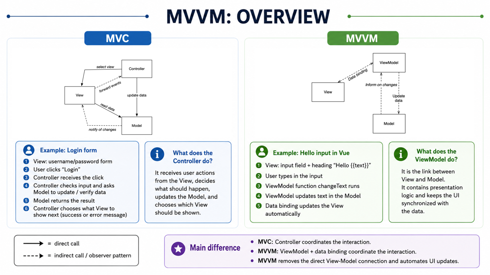

# Vue.js Lecture Summary

## Lecture map: from MVC to MVVM in Vue.js

## The main mental model

Imagine a **smart information screen** at a train station:

- **Model** = the stored train information: destination, time, delay.
- **View** = the screen passengers can see.
- **ViewModel** = the translator and coordinator between the stored information and the screen.
- **Data binding** = the automatic connection that keeps the screen and ViewModel synchronized.

The most important MVVM rule is:

> **The View does not communicate directly with the Model. The ViewModel stands between them.**

This lecture first reminds you of MVC, moves MVC from the server to the browser, and then introduces **MVVM as an MVC variant used to explain Vue.js**. 
## 1. Reminder: what is MVC?

MVC divides the user-interface part of an application into:

```text
Model + View + Controller
```

### View — what the user sees

The View displays the user interface and forwards user actions.

Examples:

- a heading,
- an input field,
- a button,
- a list.

### Model — the data needed by the interface

The Model stores or represents the information the View needs.

Example:

```text
text = "Anna"
```

### Controller — decides what to do

The Controller receives events from the View and performs the corresponding action.

For example:

```text
User clicks a button
        ↓
View forwards the click
        ↓
Controller decides what to do
        ↓
Controller updates the Model
```

## How should the MVC arrows be read?

In the page 2 diagram:

```text
View ──forward events──▶ Controller
Controller ──update data──▶ Model
Controller ──select view──▶ View
View ──read data──▶ Model
Model - -notify changes- -▶ View
```

A **solid arrow** means a direct call.

A **dashed arrow** means indirect communication through the **observer pattern**.

### Observer pattern in simple words

One part says:

> “Tell me whenever something changes.”

It does not repeatedly ask whether something changed. It waits to be notified.

Analogy:

- repeatedly checking the door = direct checking,
- a doorbell informing you = observer pattern.
## 2. What is server-side MVC?

In traditional server-side MVC, the important MVC parts are mainly on the **server**:

```text
Browser / client
      ↓
Server-side presentation layer
   ├── View
   ├── Controller
   └── Model
      ↓
Business logic
      ↓
Persistence
```

The browser primarily shows the result sent by the server.

The server contains:

- the server-side MVC presentation logic,
- business logic,
- persistence or database access.

This is what page 3 illustrates.
## 3. What changes with JavaScript frameworks?

With JavaScript frameworks, an MVC-like presentation structure can exist inside the **browser**:

```text
Browser / client
   └── View + Controller + Model

Server
   ├── server presentation interface
   ├── business logic
   └── persistence
```

This does **not** mean the server disappears.

It means the browser now performs more user-interface work.

For example, the browser can:

- react to typing,
- update visible content,
- store temporary interface state,
- change parts of the page without requesting a completely new page.

The lecture emphasizes that JavaScript frameworks rarely implement MVC in a perfectly pure form. Instead, they normally use **variants** of MVC. These variants are collectively called **MV\***. 

## What does `MV*` mean?

`MV*` is a general label:

```text
MV + some third part
```

Examples could include MVC or MVVM.

The `*` means that different frameworks organize the remaining responsibilities differently.
## 4. What is MVVM?

MVVM stands for:

```text
Model–View–ViewModel
```

It is a variant of MVC.

The Controller is no longer shown as a separate central element. Instead, the View communicates with a **ViewModel** through data binding.

```text
View ⇄ ViewModel ⇄ Model
```

But remember:

```text
View ✕ Model
```

There is no direct View-to-Model connection.

## Why was MVVM introduced?

The lecture gives these goals:

- stronger separation between View and Model,
- easier testing of presentation logic,
- less manual implementation work,
- no separate Controller,
- automatic data binding through a binder component.
## 5. What is data binding?

**Data binding is a connection between displayed interface elements and application data.**

Suppose the View contains:

```html
<h1>Hello {{text}}</h1>
```

and the stored value is:

```text
text = "Anna"
```

The displayed heading becomes:

```text
Hello Anna
```

When the value changes, the display can be updated automatically.

## What is bidirectional data binding?

Bidirectional means the connection can work in both directions:

```text
Data changes
    ↓
View updates
```

and:

```text
User changes the View
    ↓
Data updates
```

A useful analogy is a shared document:

- changing the original updates what others see,
- editing through the interface updates the stored content.

The lecture describes a **binder component** as the mechanism responsible for this connection. The developer does not have to manually update every screen element.
## 6. The three parts of MVVM

## What is the Model in MVVM?

The Model is broadly similar to the Model in MVC.

It contains or represents the application data.

Its important responsibilities in this lecture are:

- hold the data,
- inform the ViewModel when the data changes,
- remain independent of the View.

```text
Model - -change notification- -> ViewModel
```

### Critical rule

> **The Model has no connection to the View.**

This improves separation because the data does not need to know how it will be displayed.

The same Model could therefore potentially be used with a different interface.
## What is the ViewModel?

The ViewModel is the central connecting element.

It:

- links the View and Model,
- contains presentation logic,
- listens for changes,
- exposes data and functions to which the View can bind.

### What is presentation logic?

Presentation logic means decisions related to what and how the interface displays.

Examples:

- which text should be displayed,
- whether a button should be enabled,
- what should happen when the user types,
- how data should be prepared for the screen.

It is not the visual HTML itself, and it is not the complete business logic of the application.

### Is a ViewModel simply a renamed Controller?

Not exactly.

A Controller normally receives events and explicitly coordinates actions.

A ViewModel exposes data and operations, while the binding mechanism keeps it connected to the View.

```text
MVC:
View → Controller → Model

MVVM:
View ⇄ binding ⇄ ViewModel ⇄ Model
```
## What is the View in MVVM?

The View is the visible user interface.

It:

- represents what the user sees,
- binds to properties of the ViewModel,
- binds to functions of the ViewModel,
- listens for ViewModel changes through the observer mechanism.

A **property** is a stored value such as:

```text
text
username
completed
```

A **function** is an action such as:

```text
changeText
saveTodo
login
```

The View does not directly manipulate the Model.
## 7. MVC versus MVVM

| Question | MVC | MVVM |
|---|---|---|
| What handles user actions? | Controller | ViewModel functions through binding |
| What links the interface and data? | Controller and explicit interactions | ViewModel plus binder |
| Does the View access the Model? | It may read it | No direct connection |
| How is the interface updated? | Controller/Model notification | Data binding |
| Main middle element | Controller | ViewModel |

The most important conceptual change is:

```text
MVC:  Controller coordinates the interaction

MVVM: ViewModel exposes data/actions, and binding synchronizes the View
```
## 8. How does the lecture map MVVM to Vue.js?

Page 11 maps the Vue example like this:

```text
View       → HTML template
ViewModel  → root Vue component
Model      → reactive data
```

## View: the template

```html
<div id="app">
  <h1>Hallo {{text}}</h1>
  <input v-on:input="changeText">
</div>
```

This is the visible interface.

- `{{text}}` displays a value.
- The input field receives user input.
- `v-on:input` connects the input event to a function.

## ViewModel: the root component

```javascript
const MyApp = {
  data() { /* ... */ },
  methods: { /* ... */ }
};
```

The component links the template with the application data and actions.

It contains:

- the available data through `data()`,
- interface-related actions through `methods`.

## Model: reactive data

```javascript
data() {
  return {
    text: "WEB2"
  };
}
```

The lecture treats this reactive data as the Model.

Reactive means:

> When the value changes, Vue can detect that change and update the connected View.
## 9. Complete Vue flow using MVVM

Suppose the user types `Anna`.

```text
1. The user types in the View.
2. The View detects an input event.
3. The bound ViewModel method runs.
4. The method changes the reactive text data.
5. The changed Model data is known to the ViewModel.
6. Vue's binding mechanism updates {{text}}.
7. The View displays “Hello Anna”.
```

In compact form:

```text
User input
   ↓
View
   ↓ binding/event
ViewModel
   ↓ updates
Model: text = "Anna"
   ↓ change is observed
ViewModel
   ↓ binding
View: Hello Anna
```
## 10. Why is MVVM useful?

## Stronger decoupling

The View and Model do not know each other directly.

This makes it easier to change one without rewriting the other.

## Improved testability

Presentation logic is placed in the ViewModel rather than being buried inside visual interface code.

That logic can therefore be tested more independently.

## Reduced manual work

The binding mechanism performs synchronization that developers would otherwise have to program themselves.

Without binding, a programmer might manually:

1. find an HTML element,
2. read its value,
3. find another element,
4. replace its text,
5. repeat this whenever the data changes.

MVVM frameworks automate much of this connection.
## Exam-style questions

## Explain the difference between server-side MVC and MVC in JavaScript frameworks

In server-side MVC, View, Controller, and Model are mainly part of the server-side presentation layer, while the browser displays the generated result. With JavaScript frameworks, an MVC-like or MV\*-based presentation structure is implemented in the browser. The server still provides backend presentation interfaces, business logic, and persistence.

## What is MVVM, and what are its goals?

MVVM is a variant of MVC consisting of Model, View, and ViewModel. Its central mechanism is bidirectional data binding through a binder. Its goals include stronger separation between View and Model, improved testability of presentation logic, and reduced manual implementation effort.

## What are the responsibilities of the Model, View, and ViewModel?

The Model represents data and informs the ViewModel about changes. The View represents the interface and binds to properties and functions of the ViewModel. The ViewModel links View and Model and contains presentation logic. The View has no direct connection to the Model.

## How is MVVM represented in the Vue.js example?

The HTML template is the View, the root Vue component containing `data()` and `methods` acts as the ViewModel, and the reactive data returned by `data()` acts as the Model.
## Final mental map

```text
MVC reminder
├── View shows the interface
├── Controller reacts to events
└── Model contains data
        ↓
Server-side MVC
├── MVC mainly on server
└── browser displays result
        ↓
JavaScript frameworks
├── presentation structure moves to browser
└── frameworks use MVC variants: MV*
        ↓
MVVM
├── View
├── ViewModel
├── Model
└── automatic data binding
        ↓
Vue.js mapping
├── Template = View
├── Root component = ViewModel
└── Reactive data = Model
```

**The sentence to remember is:**

> **In MVVM, the ViewModel stands between the View and Model, while data binding keeps the visible interface synchronized with the data.** 

Below are annotated versions of the two most important diagrams: the **MVC-to-MVVM transition** and the **movement of presentation responsibilities from server to browser**.

## Vue.js Lecture Summary: MVC to MVVM

## The mental model: a restaurant ordering screen

Imagine a restaurant with a digital ordering screen.

- **View** = what the customer sees: menu, buttons, selected items.
- **Model** = the stored information: products, prices, selected order.
- **Controller** in MVC = the waiter who receives actions and updates the order.
- **ViewModel** in MVVM = a smart connection between screen and data that keeps both synchronized.

The lecture moves through this path:

```text
MVC
↓
MVC on the server
↓
MVC-like patterns in JavaScript frameworks
↓
MVVM
↓
MVVM in Vue.js
```

The central idea is:

> **MVVM separates the visible interface from the data and connects them through a ViewModel and data binding.**
## 1. Reminder: what is MVC?

MVC stands for:

```text
Model-View-Controller
```

It is an architectural pattern used to separate responsibilities.

## View

The View is what the user sees and interacts with.

Examples:

- heading,
- button,
- form,
- list,
- text field.

## Model

The Model contains the data used by the interface.

Examples:

```text
username = "Anna"
price = 20
todoDone = false
```

## Controller

The Controller receives user actions and decides what should happen.

Example:

```text
User clicks “Save”
        ↓
View forwards the event
        ↓
Controller handles the event
        ↓
Controller updates the Model
```

The diagram on page 2 shows these relationships:

```text
View → Controller
Controller → Model
Controller → View
View → Model
Model → View
```

The Controller may select a View, the View may read Model data, and the Model may notify the View when something changes. `G-02-vuejs-mvvm_en.pdf`
## 2. Direct and indirect communication

The lecture distinguishes two kinds of arrows.

## Direct call

A solid arrow means one part directly calls another.

Example:

```text
Controller directly updates Model
```

## Indirect call

A dashed arrow means indirect communication, usually through the **observer pattern**.

## What is the observer pattern?

The observer pattern means:

> One part registers interest in another part and is informed when something changes.

Simple analogy:

- You subscribe to a delivery notification.
- You do not continuously ask whether the package arrived.
- The system notifies you when the status changes.

In software:

```text
Model changes
      ↓
Observer is notified
      ↓
View updates
```
## 3. MVC on the server

In traditional server-side MVC, most MVC parts are located on the server.

The page 3 diagram shows:

```text
Client / browser
        ↓
Server-side presentation layer
   ├── View
   ├── Controller
   └── Model
        ↓
Business logic layer
        ↓
Persistence layer
```

The browser mainly displays the result sent by the server.

## What are these layers?

### Presentation layer

Responsible for interaction with the user.

It includes:

- View,
- Controller,
- Model used for presentation.

### Business logic layer

Contains application rules.

Example:

```text
A customer may cancel an order only before shipping.
```

### Persistence layer

Stores and loads data.

Example:

```text
Save an order in a database.
```

So in server-side MVC:

> The browser is the client, but the main MVC work happens on the server.
## 4. MVC in JavaScript frameworks

JavaScript frameworks can apply MVC-like patterns inside the browser.

The page 4 diagram shows that:

```text
Browser / client
   ├── View
   ├── Controller
   └── Model

Server
   ├── presentation interface
   ├── business logic
   └── persistence
```

This means the browser now handles more interface behaviour.

For example:

- responding to clicks,
- reacting to typing,
- changing visible text,
- showing and hiding elements,
- storing temporary interface state.

The server still exists and may provide data and business logic.
## 5. Why do JavaScript frameworks use MVC-like patterns?

The goals are the same as on the server:

- separation of concerns,
- customizability,
- extensibility,
- reusability.

## Separation of concerns

Different parts have different responsibilities.

Example:

```text
View        → display
Model       → data
Controller  → coordinate actions
```

This is easier to maintain than putting everything in one large block.

## Customizability

One part can be changed without rewriting everything.

Example:

- change the View design,
- keep the Model unchanged.

## Extensibility

New functionality can be added more easily.

## Reusability

The same data or logic can be reused in another View.
## 6. What does MV* mean?

JavaScript frameworks rarely use MVC in a completely pure form.

Instead, they use variations.

The lecture uses the term:

```text
MV*
```

This is a general term for patterns based on Model and View.

The `*` means:

> The remaining part may be organized differently depending on the framework.

Examples:

```text
MVC
MVVM
other MVC-inspired variants
```
## 7. What is MVVM?

MVVM stands for:

```text
Model-View-ViewModel
```

It is a variant of MVC.

Instead of a Controller, MVVM introduces a **ViewModel**.

The basic structure is:

```text
View ⇄ ViewModel ⇄ Model
```

A critical rule is:

```text
View ✕ Model
```

The View does not directly communicate with the Model.

The ViewModel is placed between them.
## 8. Why does MVVM exist?

The lecture gives four main reasons.

## Stronger separation between View and Model

The View and Model do not know each other directly.

This reduces coupling.

### What is coupling?

Coupling means how strongly two parts depend on each other.

High coupling:

```text
Changing the View requires changing the Model.
```

Lower coupling:

```text
The View can change while the Model remains the same.
```
## Better testability

Presentation logic is placed in the ViewModel.

Because it is separated from the visual interface, it can be tested more easily.

Example:

Instead of testing a button visually, you can test:

```text
When the user enters "Anna",
does the ViewModel store "Anna" correctly?
```
## Reduced implementation effort

The framework handles much of the synchronization between View and data.

Without such support, developers might manually:

- find HTML elements,
- listen for changes,
- update text,
- keep different values synchronized.

MVVM reduces this manual work.
## No separate Controller

The ViewModel takes over presentation-related coordination.

The lecture therefore shows:

```text
MVC:
View + Controller + Model

MVVM:
View + ViewModel + Model
```
## 9. What is data binding?

Data binding is the connection between data and the visible user interface.

Example:

```html
<h1>Hello {{text}}</h1>
```

Suppose:

```text
text = "Anna"
```

Then the View shows:

```text
Hello Anna
```

If `text` changes, the View can update automatically.

## Bidirectional data binding

The lecture identifies bidirectional data binding as a central element of MVVM.

Bidirectional means two directions:

```text
Model/ViewModel data changes
        ↓
View updates
```

and:

```text
User changes something in the View
        ↓
ViewModel data updates
```

A binder component manages this connection.
## 10. What is the binder?

The binder is the mechanism that keeps the View and ViewModel synchronized.

Think of it as a translator and messenger.

```text
View changes
   ↓
Binder informs ViewModel

ViewModel changes
   ↓
Binder updates View
```

In Vue.js, the framework provides this binding and reactivity mechanism.

You normally do not create a separate visible binder object yourself.
## 11. MVVM compared with MVC

The page 7 diagram compares the two patterns.

## MVC

```text
View → Controller
Controller → Model
View reads Model
Model notifies View
```

## MVVM

```text
View ⇄ ViewModel
ViewModel ⇄ Model
```

The important difference is:

> MVC coordinates mainly through a Controller, while MVVM connects View and data through a ViewModel and data binding.
## 12. The Model in MVVM

The Model is broadly similar to the Model in MVC.

It represents data.

Its responsibilities are:

- store or represent data,
- allow the ViewModel to update the data,
- inform the ViewModel when data changes.

The lecture emphasizes:

> **The Model has no direct connection to the View.**

This is shown clearly on page 8.

```text
View ✕ Model
View ⇄ ViewModel ⇄ Model
```

## Simple example

Suppose the Model contains:

```text
text = "WEB2"
```

The Model does not know whether that text is shown:

- in a heading,
- in a text field,
- in a popup,
- or somewhere else.

That is the responsibility of the View and ViewModel.
## 13. The ViewModel in MVVM

The ViewModel is the link between View and Model.

Its main responsibilities are:

- connect the View with the Model,
- contain presentation logic,
- react to changes,
- expose properties and functions to the View.

## What is presentation logic?

Presentation logic means logic related to how data is presented or how the interface behaves.

Examples:

- what text should appear,
- whether a button should be disabled,
- what should happen after typing,
- whether an error message should be shown.

It is not necessarily the deep business logic of the application.

For example:

```text
“Show the Save button only when the form is valid”
```

is presentation logic.
## 14. The View in MVVM

The View is the visible user interface.

Its responsibilities are:

- represent the user interface,
- bind to ViewModel properties,
- bind to ViewModel functions,
- update when the ViewModel changes.

## What does binding to a property mean?

Suppose the View contains:

```html
<h1>{{text}}</h1>
```

The View is bound to the property:

```text
text
```

## What does binding to a function mean?

Suppose the View contains:

```html
<input v-on:input="changeText">
```

The View is connected to the function:

```text
changeText
```

When the user types, the function runs.
## 15. How does MVVM map to Vue.js?

The page 11 diagram gives this mapping:

```text
View       = template
ViewModel  = root Vue component
Model      = reactive data
```

This is the most important Vue-related part of the lecture.
## View in Vue.js: the template

```html
<div id="app">
  <h1>Hallo {{text}}</h1>
  <input v-on:input="changeText">
</div>
```

The template describes what appears on the page.

It includes:

- visible HTML,
- interpolation,
- event bindings.
## ViewModel in Vue.js: the root component

```javascript
const MyApp = {
  data() { /* ... */ },
  methods: { /* ... */ }
};
```

The root component connects the template with data and behaviour.

It contains:

```text
data     → values
methods  → actions
```

The lecture treats this component as the ViewModel.
## Model in Vue.js: reactive data

```javascript
data() {
  return {
    text: "WEB2"
  };
}
```

The reactive data represents the Model.

Reactive means:

> Vue notices when the value changes and updates the connected View.
## 16. Complete Vue.js example flow

Suppose the user types `Anna`.

```text
1. The user types in the input field.
2. The View detects an input event.
3. v-on:input calls changeText.
4. changeText reads the input value.
5. The reactive text property changes.
6. Vue detects the change.
7. {{text}} is updated.
8. The View displays “Hello Anna”.
```

The mental flow is:

```text
User
 ↓
View
 ↓ event binding
ViewModel method
 ↓
Reactive Model data
 ↓ change notification
ViewModel / Vue binding
 ↓
Updated View
```
## 17. MVC and MVVM side by side

| Aspect | MVC | MVVM |
|---|---|---|
| Main parts | Model, View, Controller | Model, View, ViewModel |
| Handles user actions | Controller | ViewModel through binding |
| View-Model connection | May be direct | No direct connection |
| Synchronization | Explicit calls and notifications | Data binding |
| Main goal | Separate responsibilities | Stronger separation and automatic synchronization |
## 18. Important terms in simple language

## Architecture pattern

A general way of organizing software responsibilities.

It is not a specific programming language.

## Client

The user's browser or device.

## Server

The remote system that provides data and application functionality.

## Model

The data used by the application.

## View

What the user sees.

## Controller

Handles events and coordinates actions in MVC.

## ViewModel

Connects View and Model and contains presentation logic in MVVM.

## Observer pattern

A mechanism where one part is automatically informed when another part changes.

## Data binding

A connection between interface elements and data.

## Reactive data

Data whose changes are detected automatically by the framework.

## Presentation logic

Rules about how information is shown and how the interface behaves.
## Exam-style questions

## What are the responsibilities of Model, View, and Controller in MVC?

The View displays the user interface and forwards user events. The Controller processes those events, updates data, and selects the relevant View. The Model represents the data and may notify the View when that data changes.

## How does server-side MVC differ from MVC in JavaScript frameworks?

In server-side MVC, View, Controller, and Model are mainly located on the server. In JavaScript frameworks, MVC-like presentation responsibilities may be located in the browser. The server still contains backend presentation interfaces, business logic, and persistence.

## What is MVVM?

MVVM is a variant of MVC consisting of Model, View, and ViewModel. It uses data binding to connect the View and ViewModel while keeping the View separate from the Model.

## What are the main goals of MVVM?

The main goals are stronger separation between View and Model, improved testability of presentation logic, and reduced manual implementation effort through data binding.

## What is the role of the ViewModel?

The ViewModel links the View and Model, contains presentation logic, reacts to changes, and provides properties and functions to which the View binds.

## How is MVVM represented in Vue.js?

The HTML template acts as the View, the root Vue component acts as the ViewModel, and the reactive data returned by `data()` acts as the Model.
## Final lecture map

```text
1. MVC reminder
   ├── View
   ├── Controller
   └── Model

2. Server-side MVC
   ├── MVC on server
   ├── business logic below
   └── persistence below

3. JavaScript frameworks
   ├── MVC-like structure in browser
   └── many frameworks use MVC variants

4. MV*
   └── general term for MVC-related variants

5. MVVM
   ├── View
   ├── ViewModel
   ├── Model
   └── data binding

6. MVVM in Vue.js
   ├── Template = View
   ├── Root component = ViewModel
   └── Reactive data = Model
```

The most important sentence to remember is:

> **In Vue.js, the template is the View, the component connects behaviour and data like a ViewModel, and reactive data acts as the Model; Vue’s binding system keeps them synchronized.** `G-02-vuejs-mvvm_en.pdf`

