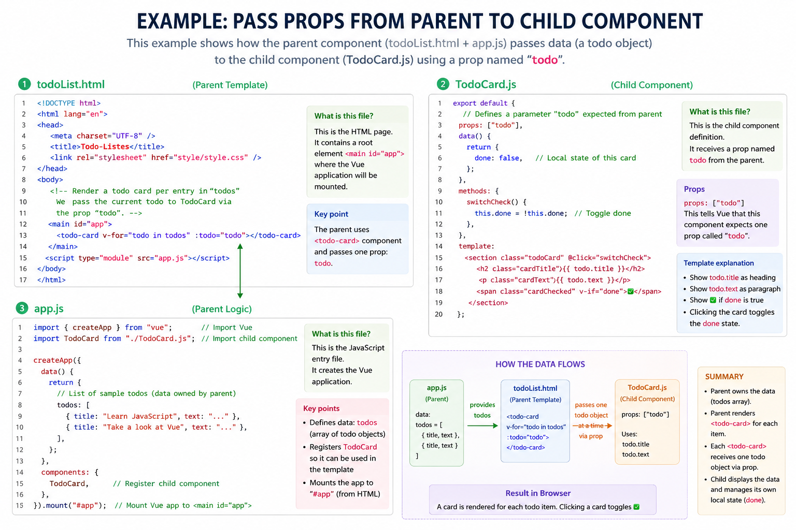
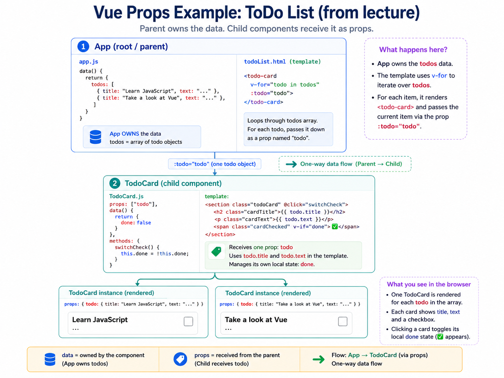
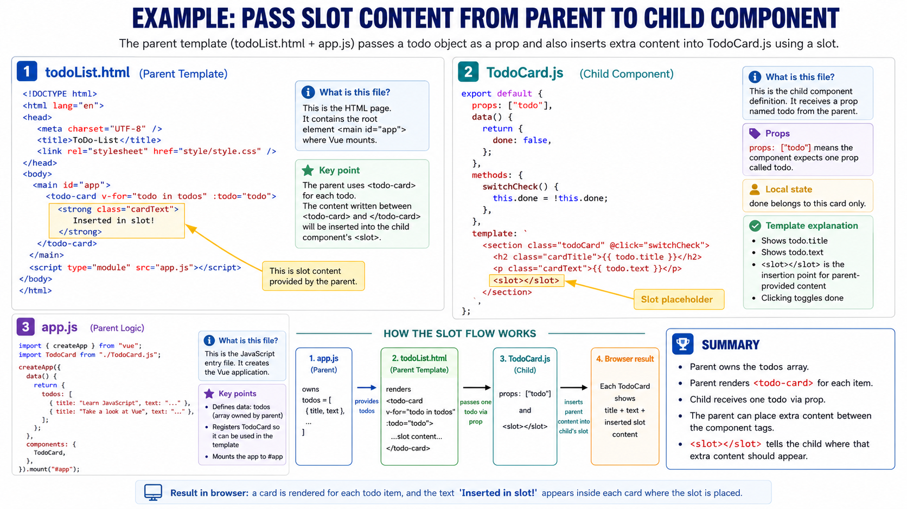
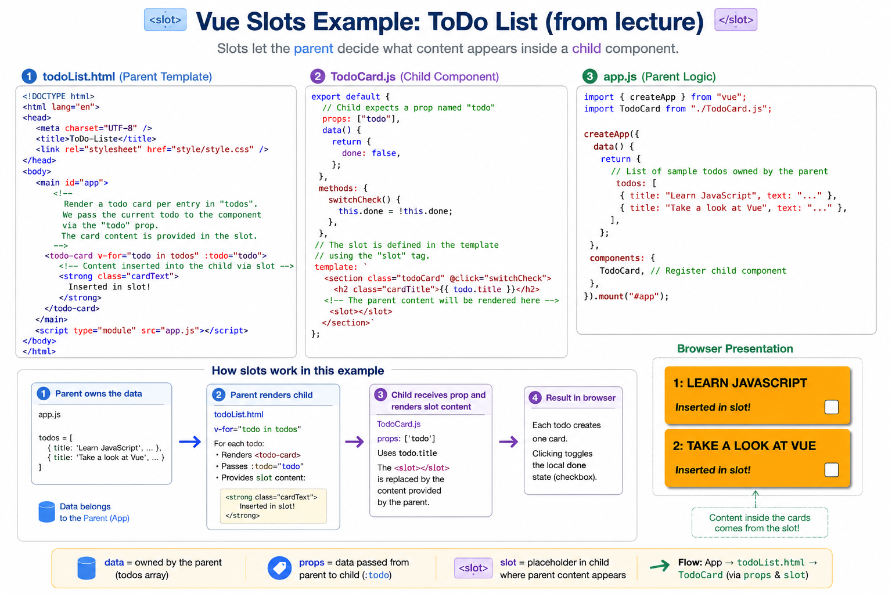

## Lecture Summary Request

# G-05 - Vue.js Components: Overview

This lecture explains how a large Vue interface can be divided into **small, reusable, self-contained parts called components**. `G-05-vuejs-components-overview.pdf`
## 1. Mental model: build the interface like a LEGO structure

Think of a complex website such as Amazon.

The complete page contains many smaller areas:

- header
- search field
- shopping cart
- login area
- product cards
- footer

Trying to control the entire page using one enormous Vue component would be like building a complete house from **one giant LEGO piece**.

Instead, Vue lets us build it from smaller pieces:

```text
Application
│
├── Header
│   ├── Search
│   ├── Login
│   └── ShoppingCart
│
├── ProductList
│   ├── ProductCard
│   ├── ProductCard
│   └── ProductCard
│
└── Footer
```

The diagram on page 5 represents exactly this idea: the interface is divided into components, and those components form a **tree structure**.

▣ **Component tree**

A hierarchical structure in which components can contain other components.

❗A component can therefore be both:

- a child of another component
- a parent of further components
## 2. Why are components needed?

Web interfaces usually have the following properties:

1. They contain many different interface areas.
2. Some areas are repeated.
3. Some areas maintain their own state.
4. The states of different areas may depend on each other.

💡 **Example: shopping cart**

A shopping cart component may maintain its own state:

```text
numberOfProducts = 3
```

A product component may contain an **Add to cart** button.

When the button is clicked, the shopping cart state changes.

Without components, all this logic would need to be managed inside one large root component.
## Exam question: Why should a complex interface not be managed by only one ViewModel?

Managing a complex interface using only one ViewModel-or one Vue component instance-would make the code difficult to:

- understand
- maintain
- extend
- reuse
- scale

▣ **Scalability**

The ability of the application structure to remain manageable as the application becomes larger.

▣ **Reusability**

The ability to use the same component multiple times or in multiple places without rewriting it.

→ Result: Components improve both **scalability** and **reusability**.
## 3. What is a component?

▣ **Vue component**

A self-contained and reusable building block from which a web interface is assembled.

A component can contain:

- its own template
- its own data/state
- its own methods
- computed properties
- props
- other components

💡 A `TodoCard` component could contain:

```text
Template: How the card looks
Data: Whether the todo is completed
Methods: A method for changing its completion state
Props: The todo that should be displayed
```
## Component definition versus component instance

A useful distinction is:

- **Component definition** = blueprint
- **Component instance** = one concrete component created from that blueprint

💡 Analogy:

```text
TodoCard definition = cookie cutter
TodoCard instance   = one cookie
```

When this is written twice:

```html
<todo-card></todo-card>
<todo-card></todo-card>
```

Vue creates two component instances from the same definition.

Each instance can have its own state.
## 4. Registering a component in Vue

A component can be registered through the `components` property of the root component.

```javascript
createApp({
  components: {
    name: { /* Options */ }
  },
}).mount("#app");
```

### Meaning

```javascript
createApp({
```

Creates the Vue application.

```javascript
components: {
```

Lists the child components that can be used by this component.

```javascript
name: { /* Options */ }
```

- `name` is the name under which the component is registered.
- `{ /* Options */ }` is the component’s Options API object.

```javascript
.mount("#app");
```

Mounts the application in the HTML element with `id="app"`.
## 5. The component options object

A component uses an options object similar to the root component.

Central properties mentioned in the lecture are:

| Property | Purpose |
|---|---|
| `data` | Stores the component’s reactive state |
| `methods` | Contains functions belonging to the component |
| `computed` | Contains calculated values |
| `template` | Specifies the HTML structure rendered by the component |
| `props` | Defines data parameters received from another component |

▣ **`template`**

The HTML-like structure that Vue renders for the component.

▣ **`props`**

Parameters through which data is transferred into a component.

❗`data`, `methods`, and `computed` work in a child component in the same general way as in the root component.
## 6. How is a component used?

## Component registration

```javascript
// [...]
components: {
  MyComponent: { /* Options */ }
}
// [...]
```

The component is registered with the JavaScript name:

```javascript
MyComponent
```

## Component usage

```html
<!-- Component name in kebab case -->
<my-component></my-component>
```

▣ **Custom element**

An HTML-like element representing a Vue component rather than a built-in HTML element.

`<my-component>` is not an ordinary HTML element such as `<p>` or `<section>`. Vue recognizes it and replaces it with the component’s template.
## PascalCase and kebab-case

The JavaScript component name may use PascalCase:

```javascript
MyComponent
```

In an HTML template, it is written in kebab-case:

```html
<my-component></my-component>
```

Another example:

```text
TodoCard     → <todo-card>
SearchField  → <search-field>
BaseLayout   → <base-layout>
```
## Important prerequisite

❗A custom component element can only be used inside an HTML area managed by a Vue application instance.

```html
<main id="app">
  <my-component></my-component>
</main>
```

Here, Vue manages the `<main>` element because the application is mounted using:

```javascript
.mount("#app");
```

This would be outside Vue’s managed area:

```html
<my-component></my-component>

<main id="app">
</main>
```

Vue would not process the first `<my-component>` because it is outside `#app`.
## 7. Basic `todo-card` component

The example consists of three files:

```text
todoList.html
app.js
TodoCard.js
```

The responsibility is divided as follows:

```text
todoList.html → provides the mounting area and uses the component
app.js        → creates the application and registers the component
TodoCard.js   → defines the component itself
```
## 7.1 `todoList.html`

```html
<!DOCTYPE html>
<html lang="en">
<head>
  <meta charset="UTF-8" />
  <title>ToDo-List</title>
  <link rel="stylesheet" href="style/style.css" />
</head>
<body>

  <!-- "main" is the area that is managed by the
       application instance. -->
  <main id="app">

    <!-- Custom element which is replaced by the template
         of the component during rendering -->
    <todo-card></todo-card>

  </main>

  <script type="module" src="app.js"></script>
</body>
</html>
```

### Meaning

```html
<main id="app">
```

Defines the HTML area managed by Vue.

```html
<todo-card></todo-card>
```

Requests one instance of the `TodoCard` component.

```html
<script type="module" src="app.js"></script>
```

Loads `app.js` as an ECMAScript module.
## 7.2 `app.js`

```javascript
import { createApp } from "...";

// Outsourcing of the component code to an ECMAScript module
// (better readability and reusability)
import TodoCard from "./TodoCard.js";

createApp({
  components: {
    // Registration of the component (shorthand
    // for "TodoCard: TodoCard")
    TodoCard
  }
}).mount("#app");
```

### Meaning

```javascript
import TodoCard from "./TodoCard.js";
```

Imports the default export from `TodoCard.js`.

```javascript
components: {
  TodoCard
}
```

Registers the imported component.

This is JavaScript shorthand for:

```javascript
components: {
  TodoCard: TodoCard
}
```

The first `TodoCard` is the registration name.  
The second `TodoCard` is the imported component object.

Because both names are identical, the shorter form can be used.
## 7.3 `TodoCard.js`

```javascript
export default {
  data() {
    return {
      // Component state: Is the ToDo done?
      done: false,
    };
  },

  methods: {
    // Switches between "done" and "not done"
    switchCheck() {
      this.done = !this.done;
    },
  },

  // "template" specifies how the component should
  // be rendered - clicking on the component calls
  // "switchCheck"
  template: `
    <section class="todoCard" @click="switchCheck">
      <h2 class="cardTitle">JavaScript lernen</h2>
      <p class="cardText">Wichtig: async/await</p>
      <span class="cardChecked" v-if="done">✅</span>
    </section>
  `,
};
```

### Component state

```javascript
data() {
  return {
    done: false,
  };
}
```

Each `TodoCard` instance receives a `done` property.

Initially:

```javascript
done === false
```
### Component method

```javascript
switchCheck() {
  this.done = !this.done;
}
```

The `!` operator reverses a Boolean value:

```text
false → true
true  → false
```

Therefore, every click switches between completed and not completed.
### Click handling

```html
<section class="todoCard" @click="switchCheck">
```

`@click` is the abbreviation for:

```html
v-on:click
```

When the section is clicked, Vue calls:

```javascript
switchCheck()
```
### Conditional rendering

```html
<span class="cardChecked" v-if="done">✅</span>
```

The checkmark is rendered only when:

```javascript
done === true
```

When `done` is false, the element is not rendered.

→ Result:

```text
Before clicking: no checkmark
After clicking:  checkmark appears
Next click:       checkmark disappears
```

The before-and-after images on page 12 illustrate this state change.
## 8. Making components reusable

Vue offers two mechanisms in this lecture:

1. **Props** transfer data.
2. **Slots** transfer template content.

A good mental model is:

```text
Props = values passed through labelled inputs
Slots = content inserted into prepared openings
```

💡 Analogy: configurable greeting card

```text
Prop:
recipientName = "Sara"

Slot:
<strong>Happy Birthday!</strong>
```

The prop supplies a value.  
The slot supplies markup or content.
## 9. Props: transferring data into a component

▣ **Prop**

A parameter through which a parent component transfers data to a child component.

Props are declared using the `props` property.

```javascript
createApp({
  components: {
    MyComponent: {
      props: [
        "attribute1",
        "attribute2"
      ]
    }
  },
}).mount("#app");
```

The component accepts two parameters:

```text
attribute1
attribute2
```

They are supplied as attributes of the custom element:

```html
<my-component
  attribute1="[...]"
  attribute2="[...]">
</my-component>
```

Mental flow:

```text
Parent template
     │
     │ supplies attributes
     ▼
<my-component attribute1="..." attribute2="...">
     │
     │ Vue maps attributes to props
     ▼
Child component
props: ["attribute1", "attribute2"]
```
## Static and dynamic prop values

```html
<my-component
  attribute1="A value"
  v-bind:attribute2="value">
</my-component>
```

### Static value

```html
attribute1="A value"
```

The literal text `"A value"` is passed.

### Dynamic value

```html
v-bind:attribute2="value"
```

Vue evaluates the JavaScript expression:

```javascript
value
```

The shorthand is:

```html
:attribute2="value"
```

❗Compare:

```html
attribute2="value"
```

This passes the text `"value"`.

```html
:attribute2="value"
```

This evaluates the variable named `value` and passes its current value.
## Accessing props inside a component

Inside a method:

```javascript
this.attribute1
```

Inside the template:

```html
{{ attribute1 }}
```

Props can therefore be read similarly to values returned by `data()`.
## 10. `todo-card` with a prop

The root component now owns a list of todos.

A separate `TodoCard` component is created for each todo.

Mental model:

```text
Root component
│
│ owns todos[]
│
├── TodoCard ← receives todos[0] as prop
└── TodoCard ← receives todos[1] as prop
```
## 10.1 `todoList.html`

```html
<!DOCTYPE html>
<html lang="en">
<head>
  <meta charset="UTF-8" />
  <title>ToDo-Liste</title>
  <link rel="stylesheet" href="style/style.css" />
</head>
<body>

  <!-- Render a todo card per entry in "todos"
       via v-for, the current todo is transferred
       to the component via the "todo" parameter -->
  <main id="app">
    <todo-card
      v-for="todo in todos"
      :todo="todo">
    </todo-card>
  </main>

  <script type="module" src="app.js"></script>
</body>
</html>
```

### Meaning of `v-for`

```html
v-for="todo in todos"
```

Vue loops through the `todos` array.

For every array element, the current element is temporarily available as:

```javascript
todo
```

### Meaning of `:todo="todo"`

The two occurrences of `todo` have different roles:

```html
:todo="todo"
```

```text
Left todo  → name of the child component prop
Right todo → current value from the v-for loop
```

A more explicit imaginary example would be:

```html
:child-prop="current-loop-item"
```
## 10.2 `app.js`

```javascript
import { createApp } from "...";
import TodoCard from "./TodoCard.js";

createApp({
  data() {
    return {
      // List of sample todos
      todos: [
        { title: "Learn JavaScript", text: "..." },
        { title: "Take a look at Vue", text: "..." },
      ],
    };
  },

  components: {
    TodoCard,
  },
}).mount("#app");
```

The root component owns the shared todo list:

```javascript
todos: [
  { title: "Learn JavaScript", text: "..." },
  { title: "Take a look at Vue", text: "..." },
]
```

Each object contains:

```text
title
text
```
## 10.3 `TodoCard.js`

```javascript
export default {
  // Defines a parameter "todo"
  props: ["todo"],

  data() {
    return {
      done: false,
    };
  },

  methods: {
    switchCheck() {
      this.done = !this.done;
    },
  },

  // The value of the parameter
  // "todo" can be accessed directly in the template
  template: `
    <section class="todoCard" @click="switchCheck">
      <h2 class="cardTitle">{{todo.title}}</h2>
      <p class="cardText">{{todo.text}}</p>
      <span class="cardChecked" v-if="done">✅</span>
    </section>
  `,
};
```

### Prop declaration

```javascript
props: ["todo"]
```

This tells Vue:

> The component expects an input named `todo`.

### Reading the prop

```html
{{todo.title}}
```

Displays the title property of the received todo object.

```html
{{todo.text}}
```

Displays its text property.
## Where does each value live?

This distinction is important:

```javascript
props: ["todo"]
```

The `todo` comes from the parent.

```javascript
data() {
  return {
    done: false
  };
}
```

The `done` state belongs to the individual `TodoCard` instance.

Therefore:

```text
Parent owns: todos array
Child receives: one todo
Each child owns: its own done state
```

💡 Clicking the second card changes the `done` state of the second component instance, not the first one.




→ Result: The same component definition displays multiple different todos. The result on page 17 shows two cards generated from the same `TodoCard` definition.
## 11. Slots: transferring content into a component

By default, content written inside a custom component element is ignored unless the component defines a slot.

```html
<todo-card v-for="todo in todos" :todo="todo">
  This content is not displayed by Vue.
</todo-card>
```

The child component controls its own template. It must explicitly provide a place where external content may be inserted.

▣ **Slot**

A placeholder in a component template into which the user of the component can insert template content.

The transferred content may include:

- plain text
- HTML
- Vue template code
- other components

❗Slots can contain other components. This is one of the ways component hierarchies are constructed.
## Defining a slot

Inside the component template:

```html
<slot></slot>
```

The `<slot>` element means:

> Insert the content provided between the opening and closing component tags here.
## Basic transformation

Component template:

```html
<section>
  <h2>Todo</h2>
  <slot></slot>
</section>
```

Component usage:

```html
<todo-card>
  <strong>Important!</strong>
</todo-card>
```

Rendered result:

```html
<section>
  <h2>Todo</h2>
  <strong>Important!</strong>
</section>
```

The `<slot>` element is replaced by:

```html
<strong>Important!</strong>
```




## Multiple unnamed slot elements

The lecture notes that if the component template contains several identical unnamed `<slot>` elements, the supplied content is inserted at each slot position.

For example:

```html
<div>
  <slot></slot>
  <hr>
  <slot></slot>
</div>
```

Usage:

```html
<my-component>
  <p>Hello</p>
</my-component>
```

Conceptual result:

```html
<div>
  <p>Hello</p>
  <hr>
  <p>Hello</p>
</div>
```
## 12. `todo-card` with a slot

## 12.1 `todoList.html`

```html
<!DOCTYPE html>
<html lang="en">
<head>
  <meta charset="UTF-8" />
  <title>ToDo-List</title>
  <link rel="stylesheet" href="style/style.css" />
</head>
<body>

  <main id="app">
    <todo-card
      v-for="todo in todos"
      :todo="todo">

      <!-- Content is inserted instead of the "slot" tag -->
      <strong class="cardText">
        Inserted in slot!
      </strong>

    </todo-card>
  </main>

  <script type="module" src="app.js"></script>
</body>
</html>
```

The content supplied to every card is:

```html
<strong class="cardText">
  Inserted in slot!
</strong>
```

Because the component is created with `v-for`, the slot content is inserted into every generated card.
## 12.2 `app.js`

```javascript
import { createApp } from "...";
import TodoCard from "./TodoCard.js";

createApp({
  data() {
    return {
      todos: [
        { title: "Learn JavaScript", text: "..." },
        { title: "Take a look at Vue", text: "..." },
      ],
    };
  },

  components: {
    TodoCard,
  },
}).mount("#app");
```

This part remains responsible for:

- owning the todos
- registering `TodoCard`
- mounting the application
## 12.3 `TodoCard.js`

```javascript
export default {
  props: ["todo"],

  data() {
    return {
      done: false,
    };
  },

  methods: {
    switchCheck() {
      this.done = !this.done;
    },
  },

  // Slot is defined in the template using the "slot" tag
  template: `
    <section class="todoCard" @click="switchCheck">
      <h2 class="cardTitle">{{todo.title}}</h2>
      <p class="cardText">{{todo.text}}</p>
      <slot></slot>
    </section>
  `,
};
```

The insertion position is:

```html
<slot></slot>
```

Vue conceptually performs this replacement:

```html
<slot></slot>
```

becomes:

```html
<strong class="cardText">
  Inserted in slot!
</strong>
```

→ Result:

```html
<section class="todoCard">
  <h2>...</h2>
  <p>...</p>
  <strong>Inserted in slot!</strong>
</section>
```

Page 22 shows the inserted text appearing in both generated todo cards.

❗In this version of the slide’s template, `done` and `switchCheck()` still exist, but the checkmark element from the earlier example is no longer present in the template.
## 13. Props versus slots

## Exam question: What is the difference between props and slots?

| Props | Slots |
|---|---|
| Transfer data | Transfer template content |
| Declared using `props` | Declared using `<slot>` |
| Passed as component attributes | Passed between opening and closing component tags |
| Often strings, numbers, objects or arrays | Often HTML, text or other components |
| Child decides how the value is displayed | Parent supplies the actual content structure |

### Prop example

```html
<todo-card :todo="todo"></todo-card>
```

The child receives a data object.

### Slot example

```html
<todo-card>
  <strong>Important!</strong>
</todo-card>
```

The child receives template content.

### Both together

```html
<todo-card :todo="todo">
  <strong>Important!</strong>
</todo-card>
```

Here:

```text
:todo="todo"                  → prop
<strong>Important!</strong>  → slot content
```
## 14. Named slots

A component may require content for several different locations.

For example, a page layout may contain:

```text
Header
Main content
Footer
```

Using only one unnamed slot would not tell Vue where each piece of content belongs.

▣ **Named slot**

A slot identified by a name so that content can be assigned to a particular position in a component template.
## 14.1 Defining named slots

Template of the `base-layout` component:

```html
<div class="container">
  <header>
    <!-- Slot is named via the "name" attribute -->
    <slot name="header"></slot>
  </header>

  <main>
    <!-- An unnamed slot has the name "default" by default -->
    <slot></slot>
  </main>

  <footer>
    <slot name="footer"></slot>
  </footer>
</div>
```

The component contains three slots:

```text
header  → named slot
default → unnamed slot
footer  → named slot
```

### Header slot

```html
<slot name="header"></slot>
```

### Default slot

```html
<slot></slot>
```

An unnamed slot automatically has the name:

```text
default
```

### Footer slot

```html
<slot name="footer"></slot>
```
## 14.2 Supplying content to named slots

```html
<base-layout>

  <!-- "v-slot" can only be applied to "template" elements -->
  <template v-slot:header>
    <h1>Here might be a page title</h1>
  </template>

  <!-- Any content that is not wrapped in a "template" element with
       "v-slot" directive will be assigned to the default
       "default" slot -->
  <p>A paragraph for the main content.</p>
  <p>And another one.</p>

  <!-- Abbreviate the directive with "#" -->
  <template #footer>
    <p>Here's some contact info</p>
  </template>

</base-layout>
```
## Understanding `v-slot`

```html
<template v-slot:header>
```

Assigns the enclosed content to:

```html
<slot name="header"></slot>
```

The shorthand is:

```html
<template #header>
```

Similarly:

```html
<template #footer>
```

is shorthand for:

```html
<template v-slot:footer>
```

❗According to the lecture example, `v-slot` is applied to a `<template>` element.
## Default slot content

These paragraphs are not wrapped in a named-slot template:

```html
<p>A paragraph for the main content.</p>
<p>And another one.</p>
```

Therefore, they are assigned to the unnamed/default slot:

```html
<slot></slot>
```
## 14.3 Resulting HTML

```html
<div class="container">
  <header>
    <h1>Here might be a page title</h1>
  </header>

  <main>
    <p>A paragraph for the main content.</p>
    <p>And another one.</p>
  </main>

  <footer>
    <p>Here's some contact info</p>
  </footer>
</div>
```

The mapping is:

```text
#header content → <slot name="header">
unassigned content → default <slot>
#footer content → <slot name="footer">
```
## 15. Complete component communication model

The lecture’s complete mental model is:

```text
Parent component
│
├── owns shared data
│
├── creates child components
│
├── passes data using props
│
└── passes template content using slots
        │
        ▼
Child component
│
├── receives props
├── provides slot positions
├── owns its own local state
├── contains methods
└── renders its template
```

For the todo example:

```text
Root application
│
│ data:
│ todos[]
│
│ v-for + :todo
│
├── TodoCard instance 1
│   ├── prop: todo object 1
│   ├── local state: done
│   └── slot content
│
└── TodoCard instance 2
    ├── prop: todo object 2
    ├── local state: done
    └── slot content
```
## 16. Important exam-ready points

## What is a Vue component?

▣ A Vue component is a self-contained, reusable building block used to assemble a web interface.
## Why do components form a tree?

Components can be placed inside other components. This produces parent-child relationships and therefore a tree-shaped interface structure.
## How is a component registered?

Through the `components` property:

```javascript
components: {
  TodoCard
}
```
## How is a registered component used?

As a custom HTML-like element:

```html
<todo-card></todo-card>
```
## Where can a custom component element be used?

Only within an area managed by the Vue application instance:

```javascript
.mount("#app");
```

```html
<main id="app">
  <todo-card></todo-card>
</main>
```
## What does Vue do with a custom component element?

Vue replaces the custom element with the component’s rendered template.
## How are data and content transferred to a child component?

```text
Props → transfer data
Slots → transfer template content
```
## How is a prop declared?

```javascript
props: ["todo"]
```
## How is a dynamic prop supplied?

```html
<todo-card :todo="todo"></todo-card>
```
## How is a slot declared?

```html
<slot></slot>
```
## What happens to component content when no slot exists?

The content between the component’s opening and closing tags is ignored.
## What is the default slot?

An unnamed slot:

```html
<slot></slot>
```

It implicitly has the name:

```text
default
```
## How is content assigned to a named slot?

```html
<template v-slot:header>
  ...
</template>
```

or:

```html
<template #header>
  ...
</template>
```
## 17. Final map of the lecture

```text
Complex interface
      │
      ▼
Divide into reusable components
      │
      ├── Each component has its own options
      │     ├── data
      │     ├── methods
      │     ├── computed
      │     ├── template
      │     └── props
      │
      ├── Register through components
      │
      ├── Use as custom elements
      │
      └── Nest components into a tree
             │
             ├── Props transfer data
             │
             └── Slots transfer content
                    │
                    ├── default slot
                    └── named slots
```

The central idea to remember is:

> **A component provides a reusable structure and behavior. Props configure it with data, while slots customize it with content.**

## Five Easy Examples of Component Registration

## Example 1: `HelloMessage`

## JavaScript

```javascript
import { createApp } from "vue";

createApp({
  components: {
    HelloMessage: {
      template: `
        <p>Hello from my component!</p>
      `,
    },
  },
}).mount("#app");
```

## HTML

```html
<div id="app">
  <hello-message></hello-message>
</div>
```

## Meaning

```text
HelloMessage     = JavaScript component name
<hello-message>  = component usage in HTML
template         = normal HTML rendered by the component
```

→ Result:

```text
Hello from my component!
```
## Example 2: `WelcomeBox`

This component has its own data.

## JavaScript

```javascript
import { createApp } from "vue";

createApp({
  components: {
    WelcomeBox: {
      data() {
        return {
          name: "Maya",
        };
      },

      template: `
        <section>
          <h2>Welcome, {{ name }}</h2>
        </section>
      `,
    },
  },
}).mount("#app");
```

## HTML

```html
<div id="app">
  <welcome-box></welcome-box>
</div>
```

## Meaning

```text
WelcomeBox       = component definition
<welcome-box>    = one component instance
data()           = component's own state
name             = value used in the template
```

→ Result:

```text
Welcome, Maya
```
## Example 3: `ClickCounter`

This component has data and a method.

## JavaScript

```javascript
import { createApp } from "vue";

createApp({
  components: {
    ClickCounter: {
      data() {
        return {
          count: 0,
        };
      },

      methods: {
        increase() {
          this.count++;
        },
      },

      template: `
        <div>
          <p>Count: {{ count }}</p>
          <button @click="increase">Increase</button>
        </div>
      `,
    },
  },
}).mount("#app");
```

## HTML

```html
<div id="app">
  <click-counter></click-counter>
</div>
```

## Meaning

```text
count: 0              = initial state
increase()            = component method
@click="increase"     = call method when button is clicked
```

→ Result:

```text
Count: 0
```

After clicking:

```text
Count: 1
```
## Example 4: `UserCard` with props

This component receives data through attributes.

## JavaScript

```javascript
import { createApp } from "vue";

createApp({
  components: {
    UserCard: {
      props: ["name", "job"],

      template: `
        <article>
          <h2>{{ name }}</h2>
          <p>{{ job }}</p>
        </article>
      `,
    },
  },
}).mount("#app");
```

## HTML

```html
<div id="app">
  <user-card
    name="Maya"
    job="Frontend student">
  </user-card>

  <user-card
    name="Leo"
    job="UX student">
  </user-card>
</div>
```

## Meaning

```text
UserCard          = reusable component
name and job      = props
name="Maya"       = attribute value passed to the prop
```

The first component receives:

```text
name = Maya
job = Frontend student
```

The second receives:

```text
name = Leo
job = UX student
```

→ Result:

```text
Maya
Frontend student

Leo
UX student
```
## Example 5: `TodoItem` with prop and local state

This combines props, data, methods, and template.

## JavaScript

```javascript
import { createApp } from "vue";

createApp({
  components: {
    TodoItem: {
      props: ["title"],

      data() {
        return {
          done: false,
        };
      },

      methods: {
        toggleDone() {
          this.done = !this.done;
        },
      },

      template: `
        <article>
          <h2>{{ title }}</h2>

          <p v-if="done">Completed ✅</p>
          <p v-else>Not completed ❌</p>

          <button @click="toggleDone">
            Change status
          </button>
        </article>
      `,
    },
  },
}).mount("#app");
```

## HTML

```html
<div id="app">
  <todo-item title="Learn Vue"></todo-item>

  <todo-item title="Practice components"></todo-item>
</div>
```

## Meaning

```text
title        = comes from the parent as a prop
done         = local state of each TodoItem
toggleDone() = changes only that component instance
```

❗Each component has separate local data.

At the beginning:

```text
Learn Vue               → done = false
Practice components     → done = false
```

After clicking only the first component:

```text
Learn Vue               → done = true
Practice components     → done = false
```
## All five registrations compared

## 1. Only a template

```javascript
components: {
  HelloMessage: {
    template: `<p>Hello!</p>`
  }
}
```

## 2. Template and data

```javascript
components: {
  WelcomeBox: {
    data() {
      return {
        name: "Maya"
      };
    },

    template: `<h2>{{ name }}</h2>`
  }
}
```

## 3. Data and method

```javascript
components: {
  ClickCounter: {
    data() {
      return {
        count: 0
      };
    },

    methods: {
      increase() {
        this.count++;
      }
    },

    template: `
      <button @click="increase">
        {{ count }}
      </button>
    `
  }
}
```

## 4. Props

```javascript
components: {
  UserCard: {
    props: ["name"],

    template: `<h2>{{ name }}</h2>`
  }
}
```

## 5. Props, data, and methods

```javascript
components: {
  TodoItem: {
    props: ["title"],

    data() {
      return {
        done: false
      };
    },

    methods: {
      toggleDone() {
        this.done = !this.done;
      }
    },

    template: `
      <button @click="toggleDone">
        {{ title }} - {{ done }}
      </button>
    `
  }
}
```

## Final pattern to memorize

```javascript
createApp({
  components: {
    MyComponent: {
      props: [],
      data() {
        return {};
      },
      methods: {},
      template: ``
    }
  }
}).mount("#app");
```

And in HTML:

```html
<div id="app">
  <my-component></my-component>
</div>
```

The key idea is:

```text
MyComponent        = JavaScript registration name
<my-component>     = custom element in HTML
props              = input from outside
data               = private component state
methods            = component actions
template           = normal HTML rendered by the component
```

## Vue.js Syntax Cheat Sheet

## Vue.js syntax cheat sheet — everything covered so far

Use this as a “code-reading map.”
## 1. Import Vue

```javascript
import { createApp } from "vue";
```

Meaning:

```text
import        = bring something into this file
createApp     = Vue function used to create an application
from "vue"    = take it from the Vue package
```
## 2. Import a component

```javascript
import ContactUs from "./components/ContactUs.vue";
```

Meaning:

```text
ContactUs                    = local JavaScript name
"./components/ContactUs.vue" = file location
```

You can choose another local name:

```javascript
import MyContactComponent from "./components/ContactUs.vue";
```

Now the imported name is:

```text
MyContactComponent
```
## 3. Create a Vue application

```javascript
const app = createApp(App);
```

Meaning:

```text
App = root component
app = Vue application instance
```

Analogy:

```text
App = blueprint of the main application
app = actual running application
```
## 4. Mount the application

```javascript
app.mount("#app");
```

or:

```javascript
createApp(App).mount("#app");
```

Meaning:

> Let Vue control the HTML element whose id is `app`.

HTML:

```html
<div id="app"></div>
```
## 5. Root component written directly

```javascript
createApp({
  data() {
    return {
      message: "Hello",
    };
  },
}).mount("#app");
```

The object inside `createApp(...)` is the root component definition.
## 6. Register a component locally

```javascript
createApp({
  components: {
    HelloMessage: {
      template: `<p>Hello!</p>`,
    },
  },
}).mount("#app");
```

Meaning:

```text
components       = local component registration area
HelloMessage     = component name in JavaScript
{ ... }          = component options
```

Use it in HTML:

```html
<hello-message></hello-message>
```

Mapping:

```text
HelloMessage     → <hello-message>
TodoCard         → <todo-card>
ClickCounter     → <click-counter>
```
## 7. Register an imported component locally

```javascript
import TodoCard from "./TodoCard.js";

createApp({
  components: {
    TodoCard,
  },
}).mount("#app");
```

This:

```javascript
components: {
  TodoCard,
}
```

is shorthand for:

```javascript
components: {
  TodoCard: TodoCard,
}
```

Meaning:

```text
left TodoCard  = registration name
right TodoCard = imported component definition
```
## 8. Register a component globally

```javascript
const app = createApp(App);

app.component("contact-us", ContactUs);

app.mount("#app");
```

Meaning:

```text
"contact-us" = name used in template
ContactUs    = imported component definition
```

Use:

```html
<contact-us></contact-us>
```

Difference:

```text
components: { ContactUs }        = local registration
app.component("contact-us", ...) = global registration
```
## 9. Component definition

```javascript
const ClickCounter = {
  data() {
    return {
      count: 0,
    };
  },

  methods: {
    increase() {
      this.count++;
    },
  },

  template: `
    <button @click="increase">
      {{ count }}
    </button>
  `,
};
```

A component may contain:

```text
data      = local state
methods   = actions/functions
template  = HTML structure
props     = data received from parent
computed  = calculated values
```
## 10. `data()`

```javascript
data() {
  return {
    count: 0,
  };
}
```

Meaning:

> This component owns a reactive value named `count`.

Important:

```text
count = property name
0     = starting value
```

Each component instance gets its own data.
## 11. Access data inside JavaScript

```javascript
this.count
```

Inside component methods, use `this`.

Example:

```javascript
increase() {
  this.count++;
}
```

Meaning:

```text
this.count = this count belonging to this component instance
```
## 12. Increase a number

```javascript
this.count++;
```

Same as:

```javascript
this.count = this.count + 1;
```
## 13. Methods

```javascript
methods: {
  increase() {
    this.count++;
  },
}
```

Meaning:

```text
methods    = collection of component actions
increase   = method name
()         = function parameters
{ ... }    = code executed
```
## 14. Template

```javascript
template: `
  <div>
    <p>Hello</p>
  </div>
`
```

The backticks:

```javascript
` ... `
```

create a template literal.

They allow multiline strings.

The template contains normal HTML elements.
## 15. Custom component element

```html
<click-counter></click-counter>
```

This is not built-in HTML.

It represents a Vue component.

Vue replaces it with the component’s template.

Example:

```html
<click-counter></click-counter>
```

may become:

```html
<div>
  <p>Count: 0</p>
  <button>Increase</button>
</div>
```
## 16. Built-in HTML element versus Vue component

Built-in HTML:

```html
<p>Hello</p>
<button>Click</button>
<header>Header</header>
```

Vue custom component:

```html
<todo-card></todo-card>
<click-counter></click-counter>
<contact-us></contact-us>
```
## 17. Attribute

```html
<user-card name="Maya"></user-card>
```

Here:

```text
user-card = component
name      = attribute
"Maya"    = attribute value
```
## 18. Props

Component definition:

```javascript
props: ["name"]
```

Component usage:

```html
<user-card name="Maya"></user-card>
```

Meaning:

```text
HTML attribute name="Maya"
        ↓
component prop name
        ↓
available inside component as name
```

Use inside template:

```html
<h2>{{ name }}</h2>
```
## 19. Multiple props

```javascript
props: ["name", "job"]
```

Usage:

```html
<user-card
  name="Maya"
  job="Frontend student">
</user-card>
```

Inside template:

```html
<h2>{{ name }}</h2>
<p>{{ job }}</p>
```
## 20. Static attribute value

```html
<user-card name="Maya"></user-card>
```

This passes the literal string:

```text
"Maya"
```
## 21. Dynamic prop binding

```html
<user-card :name="studentName"></user-card>
```

The colon is shorthand for:

```html
<user-card v-bind:name="studentName"></user-card>
```

Meaning:

> Evaluate the JavaScript variable `studentName` and pass its value.

Compare:

```html
name="studentName"
```

passes the text:

```text
studentName
```

But:

```html
:name="studentName"
```

passes the value stored inside the variable.
## 22. Template interpolation

```html
<p>{{ count }}</p>
```

Meaning:

> Display the current value of `count`.

Example:

```html
<h2>{{ name }}</h2>
```

If:

```javascript
name = "Maya"
```

Result:

```html
<h2>Maya</h2>
```
## 23. Event listener

```html
<button @click="increase">Increase</button>
```

Meaning:

> When the button is clicked, call the `increase` method.

Full syntax:

```html
<button v-on:click="increase">Increase</button>
```

Shorthand:

```html
<button @click="increase">Increase</button>
```
## 24. Event listener with parentheses

Both often work:

```html
<button @click="increase">Increase</button>
```

```html
<button @click="increase()">Increase</button>
```

Use parentheses when passing arguments:

```html
<button @click="increaseBy(5)">
  Add 5
</button>
```

Method:

```javascript
methods: {
  increaseBy(amount) {
    this.count = this.count + amount;
  },
}
```
## 25. Event object

```html
<input @input="changeText">
```

Method:

```javascript
changeText(event) {
  this.text = event.target.value;
}
```

Meaning:

```text
event              = information about the browser event
event.target       = element that caused the event
event.target.value = current input value
```
## 26. Conditional rendering with `v-if`

```html
<p v-if="done">Completed</p>
```

Meaning:

> Render this element only when `done` is true.
## 27. `v-else`

```html
<p v-if="done">Completed ✅</p>
<p v-else>Not completed ❌</p>
```

Meaning:

```text
done === true  → first paragraph
done === false → second paragraph
```
## 28. Toggle a Boolean

```javascript
this.done = !this.done;
```

Meaning:

```text
false → true
true  → false
```

Useful for:

```text
open/closed
done/not done
visible/hidden
followed/not followed
```
## 29. Conditional expression in template

```html
{{ followed ? "Following ✓" : "Follow" }}
```

This is a ternary expression.

Pattern:

```javascript
condition ? valueIfTrue : valueIfFalse
```

Meaning:

```text
followed is true  → "Following ✓"
followed is false → "Follow"
```
## 30. Loop with `v-for`

```html
<todo-card
  v-for="todo in todos"
  :todo="todo">
</todo-card>
```

Meaning:

```text
todos = array
todo  = current item during each loop
```

For every item in `todos`, Vue creates one `todo-card`.
## 31. Understanding `:todo="todo"`

```html
:todo="todo"
```

The two words have different roles:

```text
left todo  = prop name of child component
right todo = current loop item
```

Mental replacement:

```html
:child-prop="current-item"
```
## 32. Slot

Inside component template:

```html
<slot></slot>
```

Usage:

```html
<todo-card>
  <strong>Important!</strong>
</todo-card>
```

Meaning:

> Insert the supplied content where `<slot>` appears.
## 33. Named slot

Component template:

```html
<slot name="header"></slot>
```

Usage:

```html
<template #header>
  <h1>Page title</h1>
</template>
```

Full syntax:

```html
<template v-slot:header>
```

Short syntax:

```html
<template #header>
```
## 34. Root component

```javascript
createApp({
  data() {
    return {
      message: "Hello",
    };
  },
}).mount("#app");
```

The object passed to `createApp` is the root component.

With `.vue` files:

```javascript
import App from "./App.vue";

createApp(App).mount("#app");
```

Here `App.vue` is the root component.
## 35. Application instance

```javascript
const app = createApp(App);
```

```text
App = root component definition
app = application instance
```

Then:

```javascript
app.component(...);
app.mount(...);
```

The application instance performs application-level tasks.
## 36. Typical Options API structure

```javascript
export default {
  props: ["title"],

  data() {
    return {
      done: false,
    };
  },

  methods: {
    toggleDone() {
      this.done = !this.done;
    },
  },

  template: `
    <article>
      <h2>{{ title }}</h2>

      <p v-if="done">Completed</p>
      <p v-else>Open</p>

      <button @click="toggleDone">
        Change status
      </button>
    </article>
  `,
};
```

Read it as:

```text
props    = what comes in
data     = what the component owns
methods  = what the component can do
template = what the component displays
```
## 37. `.vue` single-file component

```vue
<script>
export default {
  data() {
    return {
      count: 0,
    };
  },
};
</script>

<template>
  <p>{{ count }}</p>
</template>

<style>
p {
  font-weight: bold;
}
</style>
```

Parts:

```text
<script>   = JavaScript behavior
<template> = HTML structure
<style>    = CSS
```
## 38. Local registration inside `.vue`

```vue
<script>
import ContactUs from "./components/ContactUs.vue";

export default {
  components: {
    ContactUs,
  },
};
</script>

<template>
  <ContactUs />
</template>
```
## 39. Self-closing component syntax

These are commonly equivalent in Vue templates:

```html
<ContactUs></ContactUs>
```

```html
<ContactUs />
```

For browser-written HTML, kebab-case is common:

```html
<contact-us></contact-us>
```
## 40. `<script setup>`

```vue
<script setup>
import ContactUs from "./components/ContactUs.vue";
</script>

<template>
  <ContactUs />
</template>
```

The import automatically makes the component available in that file’s template.

No explicit:

```javascript
components: {
  ContactUs
}
```

is required.
## Master reading example

```javascript
import { createApp } from "vue";

createApp({
  components: {
    ClickCounter: {
      data() {
        return {
          count: 0,
        };
      },

      methods: {
        increase() {
          this.count++;
        },
      },

      template: `
        <div>
          <p>Count: {{ count }}</p>
          <button @click="increase">
            Increase
          </button>
        </div>
      `,
    },
  },
}).mount("#app");
```

Read it line by line:

```text
import createApp from Vue

create a Vue application

register a local component named ClickCounter

ClickCounter owns count, starting at 0

ClickCounter has a method called increase

increase adds 1 to count

the component renders a div

{{ count }} displays count

@click="increase" calls increase when clicked

mount the application inside #app
```

HTML:

```html
<div id="app">
  <click-counter></click-counter>
</div>
```

Read it as:

```text
#app          = area controlled by Vue
click-counter = one instance of the ClickCounter component
```
## Final one-page memory map

```text
createApp(...)          create Vue application
.mount("#app")          attach application to HTML

components: {}          register local components
app.component(...)      register global component

props                    values received from parent
data()                   component's own state
methods                  component actions
template                 HTML rendered by component

{{ value }}              display a value
:value="x"               bind dynamic value
@click="method"          run method on click
v-if                     render when condition is true
v-else                   alternative content
v-for                    repeat content
<slot>                   insertion point for parent content

MyComponent              JavaScript component name
<my-component>           custom element/component usage
name="Maya"              static attribute
:name="studentName"      dynamic prop binding
```

## Is There Already a Component in This Example?

> **Image placeholder:** image(10).png

## What is happening?

```text
HelloApp
   ↓
root component definition

createApp(HelloApp)
   ↓
creates the Vue application using HelloApp

.mount("#app")
   ↓
connects that root component to <div id="app">
```

So this code is not working “without a component.”

It is working with **one single root component**, but there are no separate child components yet.
## Why does it not have a `template` option?

Because the template is already written directly in `hello.html`:

```html
<div id="app">
  <h1>Hello {{ text }}</h1>
  <input v-on:input="changeText" />
</div>
```

Vue treats the HTML inside `#app` as the root component’s template.

So these two ideas are connected:

```text
hello.js
contains:
- data
- methods

hello.html inside #app
contains:
- template
```

Together they make the root component.
## Visual mapping

## JavaScript

```javascript
const HelloApp = {
  data() {
    return {
      text: "",
    };
  },

  methods: {
    changeText(event) {
      this.text = event.target.value;
    },
  },
};
```

This defines the root component’s behavior.

## HTML

```html
<div id="app">
  <h1>Hello {{ text }}</h1>
  <input v-on:input="changeText" />
</div>
```

This defines the root component’s visible template.

## Connection

```javascript
createApp(HelloApp).mount("#app");
```

This joins them together.
## How the input works

Initially:

```javascript
text = ""
```

So this:

```html
<h1>Hello {{ text }}</h1>
```

shows:

```text
Hello
```

When the user types:

```html
<input v-on:input="changeText" />
```

Vue calls:

```javascript
changeText(event) {
  this.text = event.target.value;
}
```

Then `text` changes.

For example, typing:

```text
Maya
```

makes:

```javascript
text = "Maya"
```

and Vue updates:

```html
<h1>Hello Maya</h1>
```
## Root component versus child component

At this stage:

```text
Application
└── HelloApp root component
```

Later, with reusable components:

```text
Application
└── HelloApp root component
    ├── WelcomeBox
    ├── ClickCounter
    └── TodoCard
```

So:

- `HelloApp` is already a component.
- It is the root component.
- The lecture later introduces additional reusable child components.

The sentence to remember is:

> Every Vue app starts with a root component. Separate child components are optional and are added when the interface becomes larger or reusable.

## Why Is the Root Component Not Registered Inside `components`?

## Complete example

## Parent component

```javascript
const ParentComponent = {
  data() {
    return {
      // This value belongs to the parent.
      value: "Hello from parent",
    };
  },

  components: {
    MyComponent: {
      // The child declares which values it expects.
      props: ["attribute1", "attribute2"],

      template: `
        <section>
          <p>First: {{ attribute1 }}</p>
          <p>Second: {{ attribute2 }}</p>
        </section>
      `,
    },
  },
};
```

## Parent template

```html
<div id="app">
  <my-component
    attribute1="A value"
    v-bind:attribute2="value">
  </my-component>
</div>
```
## Data flow

```text
Parent data:
value = "Hello from parent"
        ↓
v-bind:attribute2="value"
        ↓
Child prop:
attribute2 = "Hello from parent"
```

And:

```text
attribute1="A value"
        ↓
Child prop:
attribute1 = "A value"
```
## What the child displays

```text
First: A value
Second: Hello from parent
```
## Important difference

```html
attribute2="value"
```

passes the literal text:

```text
"value"
```

But:

```html
v-bind:attribute2="value"
```

passes the content of the JavaScript variable `value`.

The shorthand for `v-bind` is:

```html
<my-component
  attribute1="A value"
  :attribute2="value">
</my-component>
```

So these are equivalent:

```html
v-bind:attribute2="value"
```

```html
:attribute2="value"
```