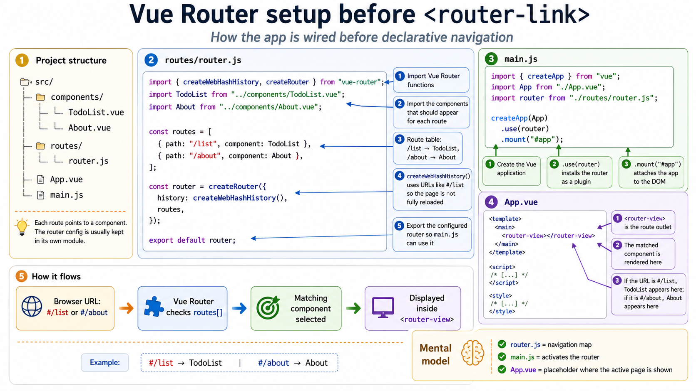
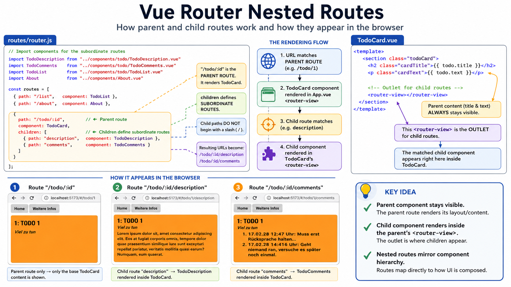
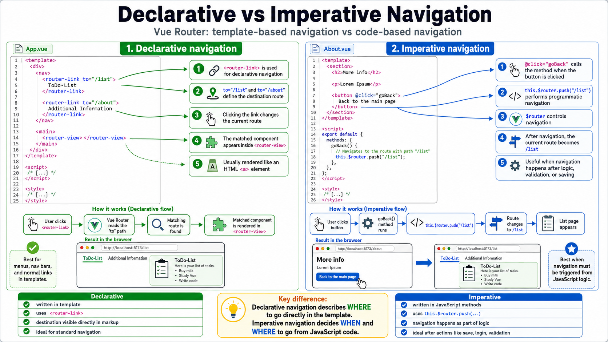

## Lecture Summary Request

# G-07 - Vue.js Routing

## 1. Mental model: a SPA is one building with many rooms

A **Single-Page Application** loads one main HTML page. However, the user still expects it to behave like a normal multi-page website:

- clicking links changes the visible page,
- the Back and Forward buttons work,
- a specific screen can be bookmarked,
- different screens have different URLs.

Think of the SPA as **one building**:

- the loaded HTML page is the building,
- Vue components are the different rooms,
- the URL is the room number,
- Vue Router reads the room number and decides which component should be displayed,
- `<router-view>` is the space where the selected room appears.

```text
URL changes
    ↓
Vue Router checks the route configuration
    ↓
A matching component is selected
    ↓
The component is displayed inside <router-view>
```

→ Result: The user experiences navigation between “pages,” although the browser has not loaded a completely new HTML document.
## 2. Why does an SPA need a router?

SPAs initially caused problems for native browser functions:

- Back and Forward navigation
- bookmarks
- meaningful URLs
- Search Engine Optimization
- expensive initial loading because the complete application may be loaded initially

▣ **Client-side routing** means that navigation inside the application is handled in the browser through JavaScript rather than by requesting an entirely new HTML page from the server.

❗The router does not turn the SPA into multiple real HTML pages. It creates the experience of multiple pages by associating URLs with Vue components.
## 3. The conflict: one real page, but many expected URLs

A traditional website may have separate resources:

```text
/list.html
/about.html
/contact.html
```

In an SPA, there may be only one actual HTML document:

```text
index.html
```

But the user still expects URLs for different application screens.

The lecture introduces the URL fragment as one solution:

```text
http://example.com:8080/index.html#fragment
```

The part after `#` is the fragment.
## 4. How does routing with a URL fragment work?

▣ **URL fragment**: The part of a URL introduced by the `#` character.

Example:

```text
http://example.com:8080/index.html#fragment
```

Fragments were traditionally used to reference a particular section inside a document.

For example:

```html
<a href="#contact">Go to contact section</a>

<section id="contact">
  Contact information
</section>
```

The important property for SPA routing is:

❗Changing the URL fragment does **not** normally reload the complete page.

JavaScript can read the fragment and decide which content to display.

```text
http://example.com/index.html#/list
                                 └── route handled in browser
```

💡 Imagine that the browser has already opened a large book. Changing the fragment is like moving to another bookmark inside the same book rather than requesting a new book.

→ Result: The URL changes, browser history can be maintained, and another component can be shown without a full-page reload.
## 5. What is Vue Router?

▣ **Vue Router** is the official library for implementing client-side routing in Vue.js.

It is not automatically included in Vue itself. It must be installed and activated separately when routing is required.

Alternative router libraries can also be used, such as:

- Page.js
- vue-routisan

However, the lecture uses Vue Router. `G-07-vuejs-routing_en.pdf`
## 6. Installing Vue Router

There are two presented installation methods.

## 6.1 Installation using a script element

```html
<script src="https://unpkg.com/vue-router@4"></script>
```

This loads Vue Router directly into an HTML page.
## 6.2 Installation using npm

```bash
npm install vue-router@4
```

Explanation:

```text
npm install        install a package in the project
vue-router         package name
@4                 major version 4
```

❗The remaining lecture examples use the Vite-based project structure created with `create-vue` and Single-File Components.
## 7. The complete routing workflow

The router requires four main things:

```text
1. Route components
2. Route configuration
3. Router activation
4. A route outlet
```

A useful map is:

```text
Component files
TodoList.vue, About.vue
          │
          ▼
Route table
/list  → TodoList
/about → About
          │
          ▼
Router object
createRouter(...)
          │
          ▼
Vue application
createApp(...).use(router)
          │
          ▼
Display position
<router-view>
```

Navigation is then performed using:

```text
<router-link>          declarative navigation
this.$router.push()    imperative navigation
```
## 8. Creating and configuring the Router object

For larger applications, the lecture recommends placing router configuration in a separate module.

Example project structure:

```text
src/
├── components/
│   ├── TodoList.vue
│   └── About.vue
├── routes/
│   └── router.js
├── App.vue
└── main.js
```

## `routes/router.js`

```javascript
// Import router functions
import { createWebHashHistory, createRouter } from "vue-router";

import TodoList from "../components/TodoList.vue";
import About from "../components/About.vue";

// Configure routes
const routes = [
  { path: "/list", component: TodoList },
  { path: "/about", component: About },
];

// Initialize Router object
const router = createRouter({
  history: createWebHashHistory(),
  routes,
});

// Export Router object
export default router;
```

## Line-by-line meaning

### Import the router functions

```javascript
import {
  createWebHashHistory,
  createRouter
} from "vue-router";
```

- `createRouter` creates the Router object.
- `createWebHashHistory` configures fragment-based routing.
- Fragment-based URLs contain `#`.

Example:

```text
http://localhost:5173/#/list
```
### Import the components used as route destinations

```javascript
import TodoList from "../components/TodoList.vue";
import About from "../components/About.vue";
```

The router must know which component belongs to each path.
### Define the route table

```javascript
const routes = [
  { path: "/list", component: TodoList },
  { path: "/about", component: About },
];
```

Each object represents one route configuration:

```javascript
{
  path: "/list",
  component: TodoList
}
```

Meaning:

```text
When current route = /list
display component = TodoList
```

Similarly:

```javascript
{
  path: "/about",
  component: About
}
```

Meaning:

```text
When current route = /about
display component = About
```

▣ **Route configuration**: An object that associates a route path with the component that should be activated for that path.
### Create the Router object

```javascript
const router = createRouter({
  history: createWebHashHistory(),
  routes,
});
```

The configuration object has two important properties here:

```text
history → determines how the URL and browser history are handled
routes  → contains the route configurations
```

This shorter syntax:

```javascript
routes,
```

means the same as:

```javascript
routes: routes,
```

because the property and variable have the same name.
### Export the Router object

```javascript
export default router;
```

This allows another module, normally `main.js`, to import and activate the configured router.
## 9. Activating Vue Router in the application

The lecture shows the general mechanism:

```javascript
createApp(rootComponent).use(router);
```

A typical `main.js` would therefore look like:

```javascript
import { createApp } from "vue";
import App from "./App.vue";
import router from "./routes/router.js";

createApp(App)
  .use(router)
  .mount("#app");
```

## What does `.use(router)` do?

▣ **`use()`** is the Vue application instance’s mechanism for installing and activating plugins or extensions.

```javascript
createApp(App)
```

creates the Vue application instance.

```javascript
.use(router)
```

installs the Router object into that application.

```javascript
.mount("#app")
```

mounts the application into the HTML element with `id="app"`.

💡 Analogy:

```text
createApp(App)  → create a car
.use(router)    → install the navigation system
.mount("#app")  → place the car on the road
```

❗Without `.use(router)`, router features such as `<router-link>`, `<router-view>`, `$router`, and `$route` are not activated for the application.

The lecture notes that this activation normally happens in `main.js` because that file creates the application instance.
## 10. What is `<router-view>`?

▣ **Route outlet / route view**: The position in a template where the component belonging to the current route is displayed.

It is declared using:

```html
<router-view></router-view>
```

## `App.vue`

```vue
<template>
  <main>
    <!--
      Route outlet:
      replaced by the component assigned
      to the currently active route
    -->
    <router-view></router-view>
  </main>
</template>

<script>
/* [...] */
</script>

<style>
/* [...] */
</style>
```

Suppose the router configuration is:

```javascript
const routes = [
  { path: "/list", component: TodoList },
  { path: "/about", component: About },
];
```

Then:

```text
Current route: /list
<router-view> displays TodoList
```

```text
Current route: /about
<router-view> displays About
```

A more visual mental model:

```html
<main>
  <router-view></router-view>
</main>
```

At `/list`, Vue effectively produces:

```html
<main>
  <!-- TodoList component appears here -->
</main>
```

At `/about`, Vue effectively produces:

```html
<main>
  <!-- About component appears here -->
</main>
```

❗`<router-view>` itself is not the page component. It is the **placeholder** into which the selected page component is rendered.
## 11. Declarative navigation with `<router-link>`

▣ **Declarative navigation** means describing the destination directly in the template.

Vue Router provides the `<router-link>` component:

```vue
<router-link to="/list">ToDo-List</router-link>
```

The `to` attribute identifies the route path.

## Complete lecture example: `App.vue`

```vue
<template>
  <div>
    <nav>
      <!--
        Router links are used for navigation.
        They are rendered as HTML <a> elements.
      -->
      <router-link to="/list">
        ToDo-List
      </router-link>

      <router-link to="/about">
        Additional Information
      </router-link>
    </nav>

    <main>
      <router-view></router-view>
    </main>
  </div>
</template>

<script>
/* [...] */
</script>

<style>
/* [...] */
</style>
```

## What happens when the first link is clicked?

```html
<router-link to="/list">
  ToDo-List
</router-link>
```

Flow:

```text
User clicks “ToDo-List”
        ↓
Vue Router changes current route to /list
        ↓
Router searches the routes array
        ↓
It finds:
{ path: "/list", component: TodoList }
        ↓
TodoList is displayed inside <router-view>
```

→ Result: The visible component changes without reloading the entire application.

## What is rendered in the browser?

`<router-link>` is a Vue component, but it is normally rendered as an HTML anchor element:

```html
<a href="#/list">ToDo-List</a>
```

❗Use `<router-link>` instead of writing ordinary anchor navigation for internal Vue Router destinations because Vue Router can manage the navigation without a full page reload.
## 12. Resulting URLs with hash history

Because the router uses:

```javascript
history: createWebHashHistory()
```

the route appears after `#`.

Examples:

```text
http://localhost:5173/#/list
```

```text
http://localhost:5173/#/about
```

The lecture’s browser screenshots on page 13 show that selecting the two navigation links changes both the active component and the fragment-based URL.

```text
/list  → Todo list screen
/about → Additional information screen
```

❗The route path is still written as:

```javascript
"/list"
```

not:

```javascript
"#/list"
```

Vue Router’s history implementation adds and manages the `#` part.
## 13. Imperative navigation with `this.$router.push()`

▣ **Imperative navigation** means triggering navigation through JavaScript code.

Vue Router provides:

```javascript
this.$router.push(...)
```

## Lecture example: `About.vue`

```vue
<template>
  <section>
    <h2>More info</h2>

    <p>Lorem Ipsum</p>

    <button @click="goBack">
      Back to the main page
    </button>
  </section>
</template>

<script>
export default {
  methods: {
    goBack() {
      // Navigates to the route with path "/list"
      this.$router.push("/list");
    },
  },
};
</script>

<style>
/* [...] */
</style>
```

## Flow

```html
<button @click="goBack">
```

means:

```text
When the button is clicked,
call the goBack method.
```

The method executes:

```javascript
this.$router.push("/list");
```

This tells the router to navigate to `/list`.

```text
Button click
    ↓
goBack()
    ↓
this.$router.push("/list")
    ↓
Current route becomes /list
    ↓
TodoList appears in <router-view>
```

## Declarative versus imperative navigation

| Approach | Used when | Example |
|---|---|---|
| Declarative | The destination can be written directly in the template | `<router-link to="/list">` |
| Imperative | Navigation should happen as a result of program logic | `this.$router.push("/list")` |

💡 Use declarative navigation for a normal navigation menu. Use imperative navigation when the application must first perform an action and then navigate.

Example:

```javascript
saveTodo() {
  // Save todo first
  // [...]

  // Navigate after saving
  this.$router.push("/list");
}
```
## 14. `$router` versus `$route`

This distinction is extremely important.

## ▣ `$router`

`this.$router` is the Router object used to **perform navigation**.

Example:

```javascript
this.$router.push("/list");
```

Think:

```text
$router = navigation controller
```
## ▣ `$route`

`this.$route` describes the **currently active route**.

It contains information such as:

```text
$route.params → path parameter values
$route.query  → query parameter values
$route.hash   → fragment content
```

Think:

```text
$route = information about where I currently am
```

A simple analogy:

```text
$router = the driver who can take you somewhere
$route  = the current location shown on the map
```

❗Remember the singular and the final letter:

```javascript
this.$router.push(...)  // navigate
this.$route.params      // read current route
```
## 15. What are dynamic routes?

Static routes always have the same structure:

```text
/list
/about
```

However, applications frequently need routes containing changing values:

```text
/todo/12
/todo/45
/todo/test
```

▣ **Dynamic route**: A route containing one or more variable parts.

The lecture connects this to two familiar URL mechanisms:

## Path parameter

```text
http://example.com:8080/todo/12
```

Here, `12` is part of the path.

## Query parameter

```text
http://example.com:8080/todos/search?owner=Horst
```

Here:

```text
owner = parameter name
Horst = parameter value
```

Vue Router supports routes with both kinds of dynamic information.
## 16. Path parameters

A dynamic path segment is declared using:

```text
:parameterName
```

Example:

```javascript
{
  path: "/todo/:id",
  component: TodoDetailCard
}
```

Here:

```text
/todo/   → fixed part
:id      → dynamic part
```

This route can match:

```text
/todo/12
/todo/42
/todo/test
```

The matched value is stored under the parameter name `id`.

```text
/todo/12   → id = "12"
/todo/test → id = "test"
```

❗The colon is used only in the route configuration:

```javascript
path: "/todo/:id"
```

The actual URL does not contain the colon:

```text
/todo/12
```

not:

```text
/todo/:12
```
## 17. Complete path-parameter example

## Router configuration

The lecture labels the router configuration as `main.js`, although the same configuration can be placed in a separate `router.js` module.

```javascript
// [...]

const routes = [
  { path: "/list", component: TodoList },
  { path: "/about", component: About },

  // Captures paths such as "/todo/12" and "/todo/test"
  {
    path: "/todo/:id",
    component: TodoDetailCard,
  },
];

// [...]
```

The dynamic route is:

```javascript
{
  path: "/todo/:id",
  component: TodoDetailCard
}
```
## `TodoDetailCard.vue`

```vue
<template>
  <!-- [...] -->
</template>

<script>
export default {
  data() {
    return {
      todo: {},

      // Access the value of the path parameter
      id: this.$route.params.id,
    };
  },

  // [...]
};
</script>

<style>
/* [...] */
</style>
```

## What does this mean?

For this URL:

```text
/todo/12
```

the route definition:

```javascript
path: "/todo/:id"
```

captures:

```text
id = "12"
```

The component accesses it with:

```javascript
this.$route.params.id
```

Therefore:

```javascript
id: this.$route.params.id
```

initializes the component’s local `id` data property with `"12"`.

→ Result:

```text
URL: /todo/12
this.$route.params.id: "12"
component data property id: "12"
```

For:

```text
/todo/test
```

the result is:

```text
this.$route.params.id: "test"
```
## 18. Accessing path parameters in script and template

## Inside the `<script>`

Use:

```javascript
this.$route.params.id
```

Example:

```javascript
export default {
  data() {
    return {
      id: this.$route.params.id,
    };
  },
};
```
## Inside the `<template>`

Use:

```vue
{{ $route.params.id }}
```

Example:

```vue
<template>
  <p>Todo ID: {{ $route.params.id }}</p>
</template>
```

Notice that `this` is not written in Vue template expressions.

```text
Script   → this.$route.params.id
Template → $route.params.id
```
## 19. Multiple path parameters

The lecture states that one path can contain several dynamic segments.

Example:

```javascript
{
  path: "/users/:userId/todos/:todoId",
  component: TodoDetail
}
```

Possible URL:

```text
/users/7/todos/42
```

Available values:

```javascript
this.$route.params.userId // "7"
this.$route.params.todoId // "42"
```

Mental mapping:

```text
/users/:userId/todos/:todoId
        │             │
        7             42
```

❗Parameter names come from the names following the colons in the route configuration.
## 20. Query parameters and fragments

The current route object also gives access to other URL parts.

## Query parameters

Given:

```text
/todos/search?owner=Horst&status=open
```

access the values using:

```javascript
this.$route.query
```

For individual values:

```javascript
this.$route.query.owner
this.$route.query.status
```

→ Result:

```javascript
this.$route.query.owner  // "Horst"
this.$route.query.status // "open"
```

In a template:

```vue
<p>Owner: {{ $route.query.owner }}</p>
```
## Fragment content

Given:

```text
/about#contact
```

access the fragment using:

```javascript
this.$route.hash
```

→ Result:

```javascript
this.$route.hash // "#contact"
```

❗Do not confuse this fragment with the hash used by hash-history routing. Conceptually, `$route.hash` refers to the fragment represented by the resolved route.
## Route-object overview

```text
Current URL
/todo/12?mode=edit#notes
```

The route object provides:

```javascript
this.$route.params.id  // "12"
this.$route.query.mode // "edit"
this.$route.hash       // "#notes"
```

Vue Router also supports more detailed path matching through regular expressions, but the lecture only mentions this possibility and refers to the route-matching documentation rather than developing it further. `G-07-vuejs-routing_en.pdf`
## 21. What are nested routes?

Large applications frequently have component hierarchies.

For example:

```text
TodoCard
├── TodoDescription
└── TodoComments
```

The parent Todo component should remain visible, while a child area changes between:

```text
description
comments
```

▣ **Nested route**: A route defined as a child of another route, reflecting a hierarchy of routes and components.

Vue Router allows arbitrary nesting through the `children` property.

```javascript
{
  path: "/todo/:id",
  component: TodoCard,
  children: [
    // child routes
  ]
}
```

❗A child route requires a second `<router-view>` inside the parent component. The application-level `<router-view>` displays the parent; the parent’s `<router-view>` displays the child.
## 22. Complete nested-route configuration

## `routes/router.js`

```javascript
// Import components for the subordinate routes
import TodoDescription
  from "./components/todo/TodoDescription.vue";

import TodoComments
  from "./components/todo/TodoComments.vue";

// [...]

const routes = [
  {
    path: "/list",
    component: TodoList,
  },

  {
    path: "/about",
    component: About,
  },

  // Parent route
  {
    path: "/todo/:id",
    component: TodoCard,

    // Configure subordinate routes
    // through "children"
    children: [
      {
        path: "description",
        component: TodoDescription,
      },
      {
        path: "comments",
        component: TodoComments,
      },
    ],
  },
];

// [...]
```

The parent route is:

```javascript
{
  path: "/todo/:id",
  component: TodoCard
}
```

Its child routes are:

```javascript
{
  path: "description",
  component: TodoDescription
}
```

and:

```javascript
{
  path: "comments",
  component: TodoComments
}
```

❗The child paths do not begin with `/`:

```javascript
path: "description"
```

This causes them to be appended to the parent path.

```text
Parent: /todo/:id
Child:  description
Result: /todo/:id/description
```

Similarly:

```text
Parent: /todo/:id
Child:  comments
Result: /todo/:id/comments
```
## 23. Parent component with a nested route outlet

## `TodoCard.vue`

```vue
<!-- [...] -->

<template>
  <section class="todoCard">
    <h2 class="cardTitle">
      {{ todo.title }}
    </h2>

    <p class="cardText">
      {{ todo.text }}
    </p>

    <!--
      Route outlet for the subordinate components
    -->
    <router-view></router-view>
  </section>
</template>

<!-- [...] -->
```

The parent content remains visible:

```vue
<h2 class="cardTitle">
  {{ todo.title }}
</h2>

<p class="cardText">
  {{ todo.text }}
</p>
```

The child component appears here:

```vue
<router-view></router-view>
```

## What appears for each URL?

### Parent route only

```text
/todo/12
```

Displays:

```text
TodoCard
```

### Description child route

```text
/todo/12/description
```

Displays:

```text
TodoCard
└── TodoDescription inside TodoCard's <router-view>
```

### Comments child route

```text
/todo/12/comments
```

Displays:

```text
TodoCard
└── TodoComments inside TodoCard's <router-view>
```

The screenshots on page 22 illustrate these three results side by side: the base todo route, the description child route, and the comments child route. `G-07-vuejs-routing_en.pdf`
## 24. Why are two `<router-view>` elements needed for nested routes?

Suppose `App.vue` contains:

```vue
<router-view></router-view>
```

and `TodoCard.vue` also contains:

```vue
<router-view></router-view>
```

They have different responsibilities.

```text
App.vue router-view
    ↓
Displays TodoCard for /todo/12/comments
    ↓
TodoCard.vue router-view
    ↓
Displays TodoComments
```

Visual hierarchy:

```text
App.vue
└── <router-view>
    └── TodoCard.vue
        ├── todo title
        ├── todo text
        └── <router-view>
            └── TodoComments.vue
```

❗The child component does not replace the parent component. It is rendered inside the parent component’s route outlet.
## 25. Full mental execution of the application

Consider this URL:

```text
http://localhost:5173/#/todo/12/comments
```

## Step 1: Hash history reads the route

```text
/todo/12/comments
```

## Step 2: Router matches the parent route

```javascript
{
  path: "/todo/:id",
  component: TodoCard
}
```

It captures:

```text
id = "12"
```

## Step 3: Router matches the child route

```javascript
{
  path: "comments",
  component: TodoComments
}
```

## Step 4: Parent component is displayed

`TodoCard` is placed in the `<router-view>` of `App.vue`.

## Step 5: Child component is displayed

`TodoComments` is placed in the `<router-view>` inside `TodoCard.vue`.

→ Result:

```text
App.vue
└── TodoCard
    └── TodoComments
```
## 26. Important exam distinctions

## What problem does client-side routing solve in an SPA?

An SPA normally has only one real HTML page, while native browser features expect distinguishable URLs. Client-side routing associates URL paths with components and enables page-like navigation without full-page reloads.
## What is the role of the `routes` array?

It is the central route table. Each route configuration associates a path with the component that should be activated.

```javascript
const routes = [
  { path: "/list", component: TodoList },
];
```
## What is the role of `<router-view>`?

It defines the location where the component belonging to the active route is rendered.

```vue
<router-view></router-view>
```
## What is the role of `<router-link>`?

It provides declarative navigation to a route.

```vue
<router-link to="/about">
  About
</router-link>
```

It is normally rendered as an HTML anchor element.
## What is the difference between declarative and imperative navigation?

Declarative navigation specifies the destination in the template:

```vue
<router-link to="/list">
  List
</router-link>
```

Imperative navigation triggers navigation through JavaScript:

```javascript
this.$router.push("/list");
```
## What is the difference between `$router` and `$route`?

```javascript
this.$router
```

is used to control navigation.

```javascript
this.$route
```

contains information about the current route.
## How is a dynamic path segment declared and accessed?

Declaration:

```javascript
{
  path: "/todo/:id",
  component: TodoDetailCard
}
```

Access in script:

```javascript
this.$route.params.id
```

Access in template:

```vue
{{ $route.params.id }}
```
## How are query parameters accessed?

For:

```text
/search?owner=Horst
```

use:

```javascript
this.$route.query.owner
```
## How are nested routes configured?

Use the `children` property:

```javascript
{
  path: "/todo/:id",
  component: TodoCard,
  children: [
    {
      path: "comments",
      component: TodoComments
    }
  ]
}
```

The parent component must contain another:

```vue
<router-view></router-view>
```
## 27. Final lecture map

```text
SPA routing problem
│
├── One real HTML page
├── Need browser-like URLs
└── Need Back, Forward and bookmarks
        │
        ▼
URL fragment
│
├── Begins with #
├── Does not trigger a full-page reload
└── Can be evaluated by JavaScript
        │
        ▼
Vue Router
│
├── Install
│   ├── <script src="...vue-router@4">
│   └── npm install vue-router@4
│
├── Configure
│   ├── createRouter(...)
│   ├── createWebHashHistory()
│   └── routes: [
│         { path, component }
│       ]
│
├── Activate
│   └── createApp(App).use(router)
│
├── Display
│   └── <router-view>
│
├── Navigate
│   ├── Declarative: <router-link>
│   └── Imperative: this.$router.push()
│
├── Dynamic information
│   ├── Path:  $route.params
│   ├── Query: $route.query
│   └── Hash:  $route.hash
│
└── Nested routes
    ├── children: [...]
    └── Child <router-view> in parent component
```

## The central sentence to remember

❗**Vue Router watches the URL, matches it against the route configuration, and renders the associated component inside the appropriate `<router-view>` without reloading the complete SPA.**

## Annotated Image Placeholder: Vue Router Setup Before `<router-link>`

> **Image placeholder:** Vue Router setup cheat sheet

> **Image placeholder:** Vue Router setup cheat sheet

## Difference Between `main.js` and `App.vue`

## `main.js` aur `App.vue` mein difference

Simple mental model:

```text
main.js = app ko start karta hai
App.vue = app ka main/root UI define karta hai
```

### `main.js` kya karta hai?

`main.js` application ka **entry point** hota hai.

Example:

```javascript
import { createApp } from "vue";
import App from "./App.vue";
import router from "./routes/router.js";

createApp(App)
  .use(router)
  .mount("#app");
```

Iska kaam:

```text
1. Vue ko import karna
2. App.vue ko import karna
3. Router jaise plugins ko activate karna
4. Application ko HTML page ke #app element mein mount karna
```

💡 Analogy:

`main.js` ek **manager** hai jo bolta hai:

> “App.vue ko start karo, router install karo, aur browser ke `#app` area mein dikhao.”
### `App.vue` kya karta hai?

`App.vue` application ka **root component** hota hai.

Example:

```vue
<template>
  <main>
    <router-view></router-view>
  </main>
</template>

<script>
export default {
  // component logic
};
</script>

<style>
/* component styling */
</style>
```

Iska kaam:

```text
1. Main UI structure define karna
2. Child components ko contain karna
3. Template, logic aur style rakhna
4. Router ke case mein <router-view> dena
```

💡 Analogy:

`App.vue` building ka **main structure** hai.

`main.js` contractor hai jo building ko open karta hai aur correct jagah par install karta hai.
## Dono ka flow

```text
index.html
   │
   │ contains <div id="app"></div>
   ▼
main.js
   │
   │ createApp(App)
   │ .use(router)
   │ .mount("#app")
   ▼
App.vue
   │
   │ defines visible application structure
   ▼
Browser UI
```

### Step-by-step

`main.js` mein:

```javascript
import App from "./App.vue";
```

Matlab:

> `App.vue` root component ko lao.

Phir:

```javascript
createApp(App)
```

Matlab:

> `App.vue` ko root component bana kar Vue application create karo.

Phir:

```javascript
.use(router)
```

Matlab:

> Router plugin ko application mein activate karo.

Phir:

```javascript
.mount("#app");
```

Matlab:

> Is complete Vue application ko HTML ke `id="app"` wale element ke andar render karo.
## Important difference

| `main.js` | `App.vue` |
|---|---|
| Application start karta hai | Application ka UI define karta hai |
| Entry point hai | Root component hai |
| Plugins install karta hai | Components aur layout contain karta hai |
| DOM mein mount karta hai | Browser mein kya dikhna chahiye batata hai |
| Usually ek normal JavaScript file | Vue Single-File Component hai |
## Ek easy analogy

Imagine ek theatre show:

```text
main.js = show organizer
App.vue = main stage
components = actors
router = scene selector
#app = theatre ke andar stage ki fixed jagah
```

`main.js` bolta hai:

```text
Stage App.vue use karo
Router install karo
Aur stage ko #app location par laga do
```

`App.vue` batata hai:

```text
Stage ka layout kya hai
Kahan navigation hogi
Kahan active component show hoga
```

❗Main difference:

```text
main.js khud UI nahi hota.
App.vue application ka visible root UI hota hai.
```

## Annotated Image Placeholder: Nested Routes in the Browser


## Annotated Image Placeholder: Declarative versus Imperative Navigation

