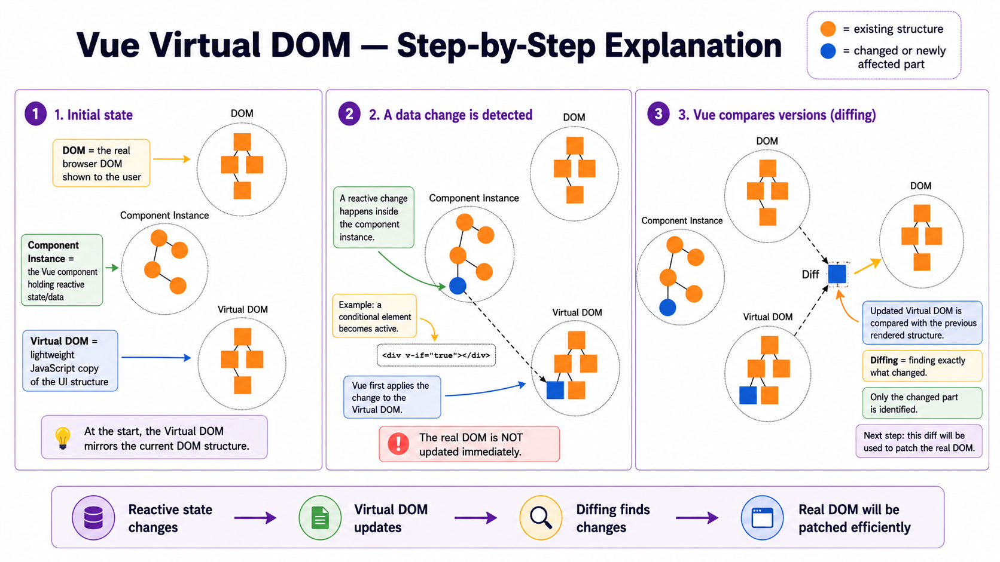
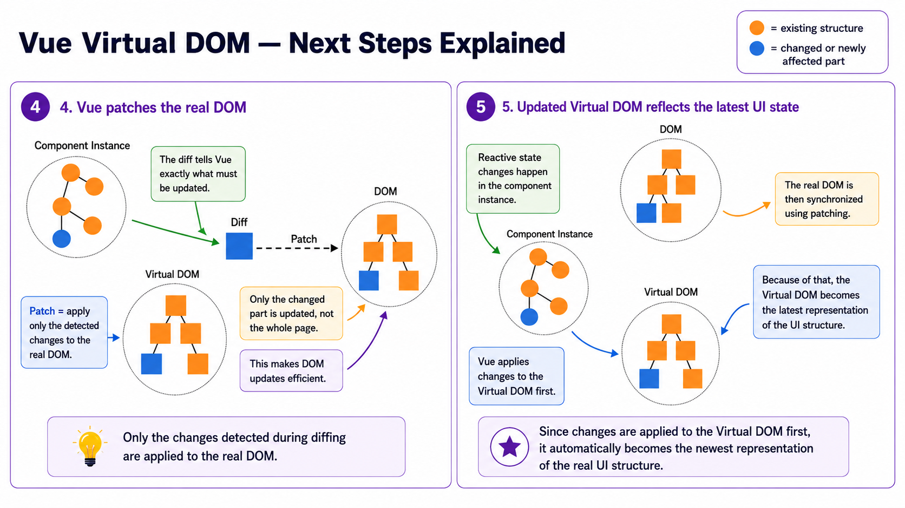

# G-08 - Vue.js Virtual DOM

## Mental model: Vue uses a lightweight “draft” before touching the real webpage

Think of updating a webpage like renovating a house:

- **Component instance** = the person deciding what should change
- **Virtual DOM** = a lightweight blueprint of the house
- **Real DOM** = the actual house shown in the browser
- **Diffing** = comparing the old blueprint with the new blueprint
- **Patching** = changing only the necessary part of the real house

The main flow is:

```text
Reactive data changes
        ↓
Vue creates an updated Virtual DOM
        ↓
Vue compares old and new Virtual DOM
        ↓
Vue identifies the differences
        ↓
Only those differences are applied to the real DOM
```

→ Result: Vue avoids unnecessary direct manipulation of the browser’s DOM.
## 1. Why is the Virtual DOM needed?

## Reminder: reactivity in Vue.js

A Vue component instance observes changes to properties defined in its `data` area.

For example:

```javascript
const app = {
  data() {
    return {
      message: "Hello",
    };
  },
};
```

A template may use this property:

```html
<p>{{ message }}</p>
```

When `message` changes:

```javascript
this.message = "Welcome";
```

Vue updates the displayed content.

→ Result:

```html
<p>Welcome</p>
```

▣ **Reactivity** means that when the application’s data changes, Vue automatically updates the corresponding user interface.
## The problem with direct DOM updates

The DOM represents the HTML document currently displayed by the browser.

For example:

```html
<body>
  <div>
    <h1>Todo List</h1>
    <p>Buy milk</p>
  </div>
</body>
```

The browser represents this as a tree:

```text
body
└── div
    ├── h1
    │   └── "Todo List"
    └── p
        └── "Buy milk"
```

Changing this real DOM can be relatively expensive.

In a complex application, many reactive values may change:

```text
data change 1 → DOM operation
data change 2 → DOM operation
data change 3 → DOM operation
data change 4 → DOM operation
```

❗ If Vue directly manipulated the real DOM for every detected change, many slow or unnecessary DOM operations could occur.

An operation may even be unnecessary when the final content is unchanged.

💡 Example:

```javascript
this.message = "Hello";
```

Suppose `message` already contains `"Hello"`.

The browser does not need to update the text node because nothing visible has changed.

The lecture therefore identifies two challenges:

1. Many dynamic changes may cause many DOM manipulations.
2. Some of these operations may be unnecessary.
## 2. What is the Virtual DOM?

▣ **Virtual DOM** is an intermediate JavaScript data structure that represents the real DOM using lightweight JavaScript objects.

It replicates the structure of the real DOM, but it is not the actual browser DOM.

For example, the real DOM:

```html
<div>
  <h1>Hello</h1>
  <p>Welcome</p>
</div>
```

may conceptually be represented by JavaScript objects like this:

```javascript
{
  type: "div",
  children: [
    {
      type: "h1",
      children: "Hello",
    },
    {
      type: "p",
      children: "Welcome",
    },
  ],
}
```

This is only a simplified conceptual representation. The lecture does not require the exact internal Vue object format.

❗ The Virtual DOM is a **lightweight copy of the DOM structure**, not another visible webpage.
## Real DOM versus Virtual DOM

| Real DOM | Virtual DOM |
|---|---|
| Managed by the browser | Managed by Vue in JavaScript |
| Represents the actual displayed page | Represents what the page should look like |
| DOM manipulation can be relatively expensive | JavaScript object comparison is lightweight |
| Visible to the user | Not directly visible |
| Updated through patching | Recreated or updated after state changes |

The diagram on page 4 shows three separate structures:

```text
Component Instance

Real DOM

Virtual DOM
```

They are related, but they are not the same object. `G-08-vuejs-virtual-dom_en.pdf`
## 3. The complete Virtual DOM update process

The lecture explains the process across pages 5-8.

## Step 1: A reactive change is detected

Suppose a component contains a conditional element:

```html
<div v-if="true"></div>
```

▣ `v-if` is a Vue directive that conditionally includes or removes an element.

Here:

```html
v-if="true"
```

means that the condition is true, so the `<div>` should exist.

A more realistic example would be:

```html
<div v-if="showMessage">
  Hello
</div>
```

with:

```javascript
data() {
  return {
    showMessage: false,
  };
}
```

Later:

```javascript
this.showMessage = true;
```

Vue detects that `showMessage` changed.
## Step 2: The change is first applied to the Virtual DOM

❗ Vue does not immediately perform the corresponding change directly on the real DOM.

Instead, it calculates an updated Virtual DOM.

Before the change:

```text
Virtual DOM

div
└── h1
```

After the change:

```text
Updated Virtual DOM

div
├── h1
└── message div
```

The page 5 diagram represents the newly introduced node in blue and states that detected changes are first applied to the Virtual DOM. `G-08-vuejs-virtual-dom_en.pdf`

→ Result: Vue now has a description of what the updated user interface should look like.
## Step 3: Vue compares the old and new structures

Vue compares:

```text
Previous Virtual DOM
          with
Updated Virtual DOM
```

▣ **Diffing** is the process of comparing the previous representation with the updated Virtual DOM to identify what changed.

Conceptually:

```text
Old Virtual DOM                 New Virtual DOM

div                             div
├── h1                          ├── h1
└── p                           ├── p
                                └── button
```

Vue detects:

```text
Difference: one button was added
```

It does not treat the entire tree as completely new.

The page 6 diagram labels the comparison result as `Diff`. `G-08-vuejs-virtual-dom_en.pdf`
## Step 4: Vue creates the minimum required DOM update

After diffing, Vue knows exactly which DOM changes are necessary.

For example:

```text
Diff:
+ Add one button below the paragraph
```

Vue does not need to recreate:

- the parent `<div>`
- the existing `<h1>`
- the existing `<p>`

Only the missing button needs to be added.
## Step 5: Vue patches the real DOM

▣ **Patching** means applying only the differences detected during diffing to the real DOM.

```text
Detected difference
        ↓
Patch
        ↓
Real DOM
```

For example:

```javascript
// Conceptual DOM operation
parentElement.appendChild(newButton);
```

❗ Vue normally performs this DOM operation internally. The application developer does not manually write it.

The page 7 diagram shows the detected difference being patched into the real DOM. `G-08-vuejs-virtual-dom_en.pdf`

→ Result: The real DOM now matches the updated Virtual DOM.
## 4. Complete example

Consider this component:

```html
<div id="app">
  <h1>{{ title }}</h1>

  <p>{{ message }}</p>

  <button v-if="showButton">
    Continue
  </button>
</div>
```

```javascript
import { createApp } from "vue";

const app = {
  data() {
    return {
      title: "Welcome",
      message: "Please read the instructions.",
      showButton: false,
    };
  },

  methods: {
    displayButton() {
      this.showButton = true;
    },
  },
};

createApp(app).mount("#app");
```

Initially, the browser displays:

```html
<div id="app">
  <h1>Welcome</h1>
  <p>Please read the instructions.</p>
</div>
```

The button is missing because:

```javascript
showButton: false
```

Later, the method executes:

```javascript
displayButton() {
  this.showButton = true;
}
```

## What happens internally?

```text
1. showButton changes from false to true
                    ↓
2. Vue’s reactivity system detects the change
                    ↓
3. Vue produces an updated Virtual DOM
                    ↓
4. Old and updated Virtual DOMs are compared
                    ↓
5. Vue detects that one button must be added
                    ↓
6. Vue patches only that part of the real DOM
```

The final browser DOM becomes:

```html
<div id="app">
  <h1>Welcome</h1>
  <p>Please read the instructions.</p>
  <button>Continue</button>
</div>
```

❗ Vue does not need to recreate the heading or paragraph.
## 5. Another example: changing only text

Template:

```html
<div id="app">
  <h1>{{ title }}</h1>
  <p>{{ message }}</p>
</div>
```

Initial state:

```javascript
data() {
  return {
    title: "Todo App",
    message: "No todos",
  };
}
```

Later:

```javascript
this.message = "3 todos";
```

Old Virtual DOM:

```text
div
├── h1 → "Todo App"
└── p  → "No todos"
```

New Virtual DOM:

```text
div
├── h1 → "Todo App"
└── p  → "3 todos"
```

Diff:

```text
The h1 is unchanged.
The div is unchanged.
Only the text inside p changed.
```

Patch:

```text
Replace "No todos" with "3 todos"
```

→ Result: Only the paragraph text node is updated.
## 6. What are the advantages of the Virtual DOM?

## Advantage 1: It can prevent unnecessary DOM operations

Diffing allows Vue to determine which parts actually changed.

For example:

```text
Old tree: 100 nodes
New tree: 100 nodes
Changed: 1 text node
```

Vue can update only that one node.

❗ The entire page is not automatically rebuilt simply because one reactive property changed.
## Advantage 2: The view state is easier to track

The Virtual DOM provides a JavaScript representation of the desired user interface.

Instead of reasoning only about individual DOM commands:

```javascript
element.remove();
element.appendChild(...);
element.textContent = ...;
```

Vue can reason about the complete desired structure:

```text
“This is what the interface should look like now.”
```

💡 Analogy:

Instead of telling a builder every movement:

```text
Move this chair.
Remove that shelf.
Repaint this wall.
```

you provide an updated blueprint. The builder compares it with the previous blueprint and performs the necessary changes.
## Advantage 3: Developers are shielded from direct DOM API usage

Without a framework, a developer may manually write:

```javascript
const paragraph = document.querySelector("#message");
paragraph.textContent = "Updated";
```

or:

```javascript
const button = document.createElement("button");
button.textContent = "Save";
document.querySelector("#app").appendChild(button);
```

With Vue, the developer describes the intended interface:

```html
<p>{{ message }}</p>

<button v-if="showButton">
  Save
</button>
```

and changes the state:

```javascript
this.message = "Updated";
this.showButton = true;
```

Vue handles the required DOM operations.

→ Result: Application code focuses on state and templates rather than manually synchronizing the DOM.
## 7. Does the Virtual DOM always make an application faster?

No.

❗ **A Virtual DOM does not provide a performance advantage in every situation.**

There is additional work involved:

```text
Create updated Virtual DOM
        ↓
Compare old and new versions
        ↓
Calculate differences
        ↓
Patch the real DOM
```

For very small or simple updates, directly changing the DOM might theoretically require less total work.

💡 Example:

A plain JavaScript application only needs to update one known element:

```javascript
counterElement.textContent = count;
```

A Virtual DOM framework may also need to:

1. produce a new virtual representation,
2. compare it,
3. find the changed text,
4. update the DOM.

Therefore, Virtual DOM should not be understood as:

```text
Virtual DOM = always faster
```

A better understanding is:

```text
Virtual DOM = structured and optimized update mechanism
```

It is particularly useful for managing complex, dynamic user interfaces, but it still has processing overhead.
## 8. Important distinction: reactivity and Virtual DOM

These concepts are connected but not identical.

## Reactivity

Reactivity detects that data changed.

```javascript
this.showButton = true;
```

```text
Reactivity asks:
“What data changed?”
```

## Virtual DOM

The Virtual DOM helps Vue determine the required user-interface update.

```text
Virtual DOM asks:
“What part of the rendered interface must change?”
```

Together:

```text
Data changes
    ↓
Reactivity detects the change
    ↓
Vue produces an updated Virtual DOM
    ↓
Diffing identifies UI differences
    ↓
Patching updates the real DOM
```

❗ Reactivity starts the update process; Virtual DOM helps perform the rendering update efficiently.
## 9. Important distinction: component instance, Virtual DOM and real DOM

## Component instance

Contains the component’s state and behavior.

```javascript
{
  data() {
    return {
      message: "Hello",
    };
  },

  methods: {
    changeMessage() {
      this.message = "Welcome";
    },
  },
}
```

It answers:

```text
What is the current application state?
How can the component behave?
```

## Virtual DOM

Represents what the rendered component should look like.

It answers:

```text
What should the UI structure look like now?
```

## Real DOM

The browser’s actual document structure.

It answers:

```text
What is currently displayed in the browser?
```

The diagrams on pages 4-7 show these as distinct structures connected through the update process. `G-08-vuejs-virtual-dom_en.pdf`
## 10. Exam question: Explain the Virtual DOM update lifecycle

A good exam answer would be:

▣ The Virtual DOM is a lightweight JavaScript representation of the real DOM. When reactive component data changes, Vue creates an updated Virtual DOM. It compares the updated representation with the previous one through a process called diffing. Only the identified differences are then applied to the real DOM through patching. This can prevent unnecessary DOM operations and shields developers from direct use of the DOM API. However, a Virtual DOM does not guarantee better performance in every case.

Flow:

```text
Component state change
        ↓
Updated Virtual DOM
        ↓
Diffing
        ↓
Detected changes
        ↓
Patching
        ↓
Updated real DOM
```
## 11. Exam question: What are diffing and patching?

▣ **Diffing** is the comparison between the previous and updated Virtual DOM to determine which parts differ.

▣ **Patching** is applying only those detected differences to the real DOM.

Example:

```text
Old Virtual DOM:
<ul>
  <li>A</li>
  <li>B</li>
</ul>

New Virtual DOM:
<ul>
  <li>A</li>
  <li>C</li>
</ul>
```

Diff:

```text
Second list item changed from B to C.
```

Patch:

```text
Update only the text of the second list item.
```
## 12. Exam question: What are the advantages and limitations of the Virtual DOM?

## Advantages

- Diffing can prevent unnecessary DOM operations.
- The current desired state of the view can be represented and tracked.
- Developers are protected from poor or performance-damaging direct DOM API usage.
- Complex dynamic interfaces become easier to manage.

## Limitation

- Creating and comparing Virtual DOM structures also requires processing.
- Therefore, it does not guarantee a performance advantage in every situation.
## Final lecture map

```text
Vue component instance
│
│ reactive data changes
▼
Updated Virtual DOM
│
│ compare with previous version
▼
Diffing
│
│ determine minimum required changes
▼
Patch
│
│ apply only those changes
▼
Real DOM
│
▼
Updated browser display
```

## The one sentence to remember

❗ **Vue first calculates the new interface in the Virtual DOM, compares it with the previous interface, and then updates only the necessary parts of the real DOM.** `G-08-vuejs-virtual-dom_en.pdf`


