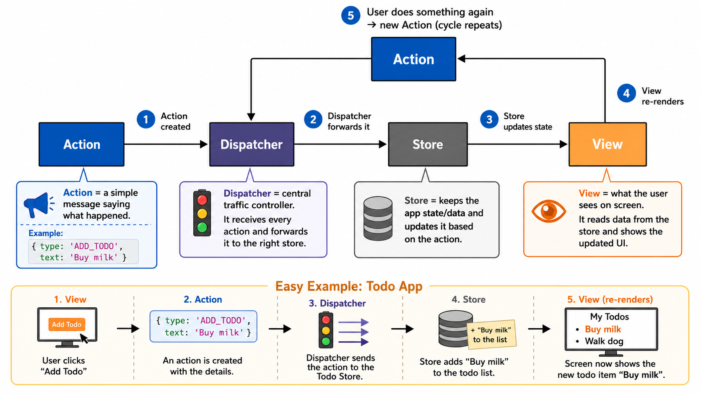
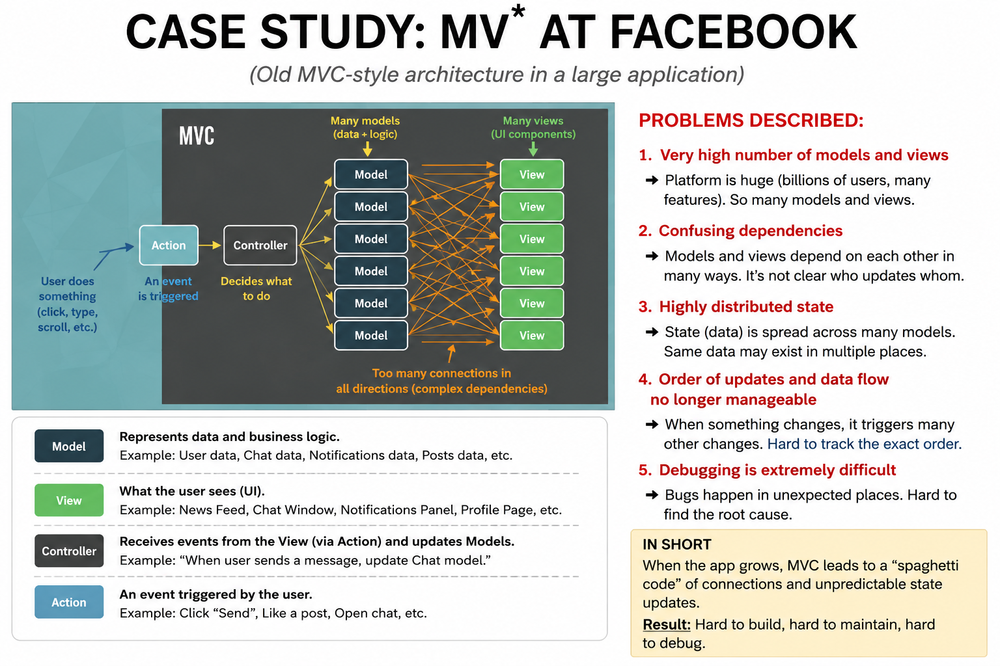

## Lecture Summary Request

# G-09 - Vue.js State Management

This lecture answers one central question:

> **Where should application state live when many components need to read or change it?**

The lecture first explains why state becomes difficult in large single-page applications, introduces **Flux** as the architectural solution, and then shows how **Pinia** implements similar ideas for Vue.js. `G-09-vuejs-state-management_en.pdf`
## Mental model: a controlled shared notebook

Imagine several employees working in one company.

- Each employee is a **Vue component**.
- The company’s shared notebook is the **store**.
- The values written in the notebook are the **state**.
- Calculated information derived from the notebook is provided through **getters**.
- Approved operations that change the notebook are **actions**.
- **Pinia** supervises access to the notebook and informs everyone when something changes.

Without a shared notebook, each employee may keep their own copy of the information.

That creates problems:

- copies become inconsistent;
- nobody knows which copy is correct;
- changes travel through many components;
- debugging becomes difficult.

The core flow in this lecture is:

```text
Component
   │
   │ reads state/getters
   │ calls actions
   ▼
Pinia Store
   │
   │ state changes reactively
   ▼
All dependent components update
```
## Module 1 - What is state?

## ▣ State

**State is information that describes the current condition of an application at a particular moment.**

For example:

```text
User is logged in
Shopping cart contains 3 products
Selected tab is "Settings"
Counter currently contains 5
```

The lecture distinguishes three kinds of state. `G-09-vuejs-state-management_en.pdf`

## 1. Data and resource state

This is application data, often stored outside the frontend.

Examples:

- data managed in a database;
- todos received from a REST API;
- products available from a server.

💡 Example:

```text
Database:
Todo ID 42
Title: "Study Pinia"
Done: false
```

This information exists as an application resource.
## 2. Session state

## ▣ Session state

Information belonging to the current browser session or user session.

Examples:

- whether the user is logged in;
- which user is logged in;
- a shopping cart containing three items.

💡 Example:

```js
{
  loggedIn: true,
  username: "Anna",
  cartItems: 3
}
```

When another user opens the application, their session state may be different.
## 3. UI state

## ▣ UI state

Information describing the current condition of the user interface.

Examples:

- whether the navigation bar is open;
- which tab is active;
- whether a dialog is visible;
- whether an icon displays “3 new messages”.

💡 Example:

```js
data() {
  return {
    activeTab: "profile",
    menuVisible: true
  };
}
```

❗ Until this lecture, such state was typically placed inside the component’s `data()` section.

That works well when the state belongs only to that component.

The problem appears when several components need the same state.
## Module 2 - Why does shared state become difficult?

## What state problem appeared in large MVC/MVVM applications?

The lecture uses Facebook as a case study.

As the platform grew, it had:

- a very large number of models;
- a very large number of views;
- confusing dependencies;
- state distributed throughout the application;
- an unclear order of updates;
- data flows that were difficult to follow.

→ Result: debugging became extremely difficult. `G-09-vuejs-state-management_en.pdf`

A simplified problematic structure may look like this:

```text
Model A ─────► View 1
   │           │
   ├────────► View 2
   │           │
   ▼           ▼
Model B ◄──── View 3
   │
   └────────► View 4
```

When one value changes, it may trigger several other updates.

The developer then has to answer:

```text
Who changed the value?
Which component received the change first?
Did another model change it again?
Which value is the current correct value?
```

❗ The lecture also gives an alternative perspective:

> The difficulty may not come from MVC or MVVM themselves. Incorrect or inconsistent usage of these patterns may also cause the described problems.

So the lecture is not saying:

```text
MVC is always bad.
```

It is saying:

```text
Complex and uncontrolled dependencies make state difficult to trace.
```
## Module 3 - Flux

## What is Flux?

## ▣ Flux

**Flux is an architectural pattern for managing client-side state in complex web applications.**

It was proposed by Facebook in 2013 in the context of React. `G-09-vuejs-state-management_en.pdf`

Its goals are:

- clearly defined responsibilities;
- unidirectional data flow;
- separation of state from views;
- a single source of truth;
- better traceability of state changes.

## ▣ Unidirectional data flow

Information moves through the application in one controlled direction.

```text
Action → Dispatcher → Store → View
   ▲                            │
   └────────────────────────────┘
```

The view may create a new action, but it does not directly change the store.
## The Flux loop

```text
1. Something happens.
2. An action describes what happened.
3. The dispatcher distributes the action.
4. A store decides whether to process it.
5. The store changes its state.
6. Views receive the changed state.
7. The user may trigger another action.
```

💡 Todo example:

```text
User clicks "Add todo"
        ↓
Action: addTodo
        ↓
Dispatcher receives it
        ↓
Todo store adds the todo
        ↓
Todo list view updates
```
## Module 4 - Flux actions

## ▣ Action in Flux

An action is a simple object that describes something that happened.

Lecture example:

```js
{
  type: "addTodo",
  text: "Understand flux"
}
```

Meaning:

```text
type
└─ identifies the event or requested operation

text
└─ payload containing the relevant information
```

The action can originate from:

- a view;
- user interaction;
- a server push event;
- another external source.

💡 Another example:

```js
{
  type: "removeTodo",
  id: 42
}
```

This does not necessarily remove the todo itself.

It only describes the request:

```text
"Remove the todo with ID 42."
```

❗ In Flux, an action is data describing what happened. It is not the store-changing function itself.
## Module 5 - Flux dispatcher

## ▣ Dispatcher

The dispatcher is the central place through which all Flux actions flow.

Its responsibilities are:

- receive every action;
- distribute the action to registered stores;
- process actions sequentially;
- make the order of changes traceable.

It is normally a singleton.

## ▣ Singleton

A singleton means that only one central instance exists for the application.

Mental model:

```text
Every internal letter must pass through one central mailroom.
```

```text
Action
   │
   ▼
Dispatcher
   ├────────► TodoStore
   ├────────► UserStore
   └────────► CartStore
```

The dispatcher may send the action to all stores.

Each store then decides whether that action concerns it.
## Module 6 - Flux stores

## ▣ Store in Flux

A store manages application state for a particular domain or functional area.

Examples:

```text
TodoStore
UserStore
CartStore
NotificationStore
```

A store:

- owns state;
- registers a callback with the dispatcher;
- receives dispatched actions;
- checks the action’s `type`;
- decides whether to handle it;
- updates itself;
- may emit a change event.

Example reasoning:

```js
{
  type: "addTodo",
  text: "Understand flux"
}
```

```text
TodoStore:
"addTodo concerns me, so I will process it."

UserStore:
"addTodo does not concern me, so I ignore it."
```

❗ State belongs to the store, not to the view.

That is the meaning of a **single source of truth**.

There may be several stores for different domains, but each piece of shared state should have one authoritative owner.
## Module 7 - Flux views

## ▣ View in Flux

A view displays state and listens for store changes.

When a store changes:

```text
Store emits change
      ↓
View receives the change
      ↓
View displays the new state
```

In a component hierarchy, the new information may be propagated through child components.

Example:

```text
App
└── TodoPage
    ├── TodoCounter
    └── TodoList
        └── TodoItem
```

A store change can cause the relevant parts of this hierarchy to update.
## Flux summary

The complete controlled loop is:

```text
View
 │
 │ creates action
 ▼
Action
 │
 ▼
Dispatcher
 │
 ▼
Store
 │ changes state
 ▼
View updates
```

❗ Important Flux rules:

- all actions pass through the dispatcher;
- only stores manage state;
- views do not directly modify store data;
- state changes happen explicitly through actions;
- the order of changes can be traced. `G-09-vuejs-state-management_en.pdf`

→ Result: The application becomes easier to understand and debug.
## Module 8 - State-management libraries

Flux is an architectural idea. Libraries implement or adapt that idea.

The lecture mentions:

- Redux;
- MobX;
- State;
- Recoil for React;
- Pinia for Vue.js. `G-09-vuejs-state-management_en.pdf`

This lecture focuses on **Pinia**.
## Module 9 - Pinia

## What is Pinia?

## ▣ Pinia

**Pinia is the official state-management library for Vue.js.**

It:

- integrates with Vue;
- integrates with Vue Devtools;
- works with the Options API;
- works with the Composition API.

The lecture continues using the **Options API**. `G-09-vuejs-state-management_en.pdf`

❗ Vue is not technically restricted to Pinia. Other libraries such as Redux or MobX can also be combined with Vue.
## Pinia compared with Flux

| Pinia concept | Flux concept |
|---|---|
| Store | Store |
| Vue component | View |
| Pinia | Dispatcher-like role |
| Pinia action | Not exactly the same as a Flux action |

The action difference is explained later.
## Module 10 - Installing and integrating Pinia

The lecture assumes a Vite project created through `create-vue` and using single-file components.

## Step 1: install Pinia

```bash
npm install pinia
```

Meaning:

```text
npm
└─ downloads Pinia and adds it as a project dependency
```
## Step 2: integrate Pinia into the Vue application

### `main.js`

```js
import { createApp } from "vue";
import { createPinia } from "pinia";
import App from "./App.vue";

createApp(App).use(createPinia()).mount("#app");
```

This is the full integration code from the lecture. `G-09-vuejs-state-management_en.pdf`

## Code flow

```js
import { createApp } from "vue";
```

Imports the function used to create a Vue application instance.

```js
import { createPinia } from "pinia";
```

Imports the function that creates the Pinia instance.

```js
import App from "./App.vue";
```

Imports the root component.

```js
createApp(App)
```

Creates the Vue application with `App` as the root component.

```js
.use(createPinia())
```

Creates Pinia and installs it as a Vue plugin.

```js
.mount("#app");
```

Mounts the application to the HTML element whose ID is `app`.

The flow is:

```text
create App
   ↓
install Pinia
   ↓
mount App
```

❗ `use(...)` must occur before `mount(...)`, because Pinia must be installed before components begin using stores.
## Module 11 - What is a Pinia store?

## ▣ Pinia store

A Pinia store is a centrally managed unit that contains shared state and store-related logic.

An application may contain several stores:

```text
stores/
├── counter.js
├── user.js
├── cart.js
└── notifications.js
```

Each store should normally manage one domain.

💡 Example:

```text
Counter store
└─ count and increment logic

User store
└─ logged-in user and authentication state

Cart store
└─ selected products and total price
```

The structure of a Pinia store resembles a Vue Options API component:

| Vue component | Pinia store |
|---|---|
| `data()` | `state()` |
| `computed` | `getters` |
| `methods` | `actions` |
## Module 12 - Defining a store

### `stores/counter.js`

```js
import { defineStore } from "pinia";

// Best practice: name export with
// "use" + name + "Store"
export const useCounterStore =
  defineStore("counter", {
    /* Store options */
  });
```

This is the lecture’s initial store definition. `G-09-vuejs-state-management_en.pdf`

## Explanation

```js
import { defineStore } from "pinia";
```

Imports Pinia’s store-definition function.

```js
defineStore("counter", {
  /* Store options */
});
```

Creates a store definition.

It receives two arguments:

```text
1. "counter"
   └─ application-wide unique store name

2. { ... }
   └─ store options
```

```js
export const useCounterStore = ...
```

Exports the store so components can import it.

## Naming convention

The lecture recommends:

```text
use + StoreName + Store
```

Examples:

```js
useCounterStore
useUserStore
useCartStore
```

❗ Each store should preferably be placed in a separate module or file.
## Module 13 - The three store options

A Pinia store has three main concepts:

```text
Store
├── state
├── getters
└── actions
```

These correspond roughly to:

```text
Vue component
├── data
├── computed
└── methods
```
## Module 14 - State in Pinia

## ▣ Pinia state

The state contains the data managed by a store.

### Full lecture code

```js
import { defineStore } from "pinia";

export const useCounterStore =
  defineStore("counter", {
    // alternative notation:
    // state: () => ({ count: 0, step: 1 })
    state() {
      return {
        count: 0,
        step: 1
      };
    }
  });
```

`G-09-vuejs-state-management_en.pdf`

The state contains:

```js
count: 0
```

The current counter value begins at zero.

```js
step: 1
```

Each increment should initially increase the counter by one.

## Why is `state` a function?

```js
state() {
  return {
    count: 0,
    step: 1
  };
}
```

The function returns the initial state object.

This resembles Vue’s `data()` function:

```js
data() {
  return {
    count: 0,
    step: 1
  };
}
```

## Alternative syntax

```js
state: () => ({
  count: 0,
  step: 1
})
```

Both forms return the same kind of object.

→ Result:

```js
{
  count: 0,
  step: 1
}
```
## Module 15 - Getters

## ▣ Getter

A getter is a calculated value derived from store state.

It is comparable to a Vue computed property.

### Full lecture code

```js
import { defineStore } from "pinia";

export const useCounterStore =
  defineStore("counter", {
    state() {
      return {
        count: 0,
        step: 1
      };
    },

    // alternative notation:
    // double(state) { return state.count * 2 }
    getters: {
      double: (state) => state.count * 2
    }
  });
```

`G-09-vuejs-state-management_en.pdf`

## Explanation

```js
getters: {
```

Creates the object containing calculated store properties.

```js
double: (state) => state.count * 2
```

The getter receives the current state.

It returns:

```text
count × 2
```

Examples:

```text
count = 0 → double = 0
count = 3 → double = 6
count = 10 → double = 20
```

The getter does not store a second independent value.

It derives the value from `count`.

That avoids inconsistent data such as:

```js
{
  count: 4,
  double: 6 // incorrect
}
```

With a getter:

```js
double = count * 2
```

it always reflects the current `count`.

## Alternative getter notation

```js
getters: {
  double(state) {
    return state.count * 2;
  }
}
```

❗ Getter functions receive the state as their first argument. This is why the arrow-function form is possible.
## Module 16 - Actions

## ▣ Pinia action

A Pinia action is a function containing store logic.

It is comparable to a Vue component method.

### Synchronous action

```js
import { defineStore } from "pinia";

export const useCounterStore =
  defineStore("counter", {
    state() {
      return {
        count: 0,
        step: 1
      };
    },

    getters: {
      double: (state) => state.count * 2
    },

    actions: {
      increment() {
        this.count = this.count + this.step;
      }
    }
  });
```

`G-09-vuejs-state-management_en.pdf`

## What happens inside `increment()`?

```js
this.count = this.count + this.step;
```

Suppose:

```js
count = 5
step = 2
```

Then:

```js
this.count = 5 + 2;
```

→ Result:

```js
count = 7
```

Because `double` is a getter:

```js
double = 14
```
## Why does the action use `this`?

Inside a Pinia action:

```js
this.count
this.step
this.double
```

can access store state, getters and other actions.

```js
actions: {
  increment() {
    this.count = this.count + this.step;
  }
}
```

Here:

```text
this
└─ refers to the active store instance
```
## Why must the action not be an arrow function?

The lecture explicitly warns against this:

```js
actions: {
  // Attention, not possible as arrow function!
  increment() {
    this.count = this.count + this.step;
  }
}
```

Do not write:

```js
actions: {
  increment: () => {
    this.count = this.count + this.step;
  }
}
```

Arrow functions do not establish their own `this`.

Therefore, `this` would not reliably refer to the Pinia store.

❗ Use normal method syntax when the action accesses the store through `this`.
## Module 17 - Asynchronous actions

Unlike getters, actions may contain asynchronous code.

### Lecture example

```js
import { defineStore } from "pinia";

export const useCounterStore =
  defineStore("counter", {
    state() {
      return {
        count: 0,
        step: 1
      };
    },

    getters: {
      double: (state) => state.count * 2
    },

    actions: {
      async increment() {
        // Build promise for the function
        // "setTimeout"
        const timeout = (delay) =>
          new Promise((resolve) =>
            setTimeout(resolve, delay));

        // Simulate asynchrony by "artificial
        // delay"
        await timeout(1000).then(() => (
          this.count = this.count + this.step
        ));
      }
    }
  });
```

`G-09-vuejs-state-management_en.pdf`

## Code flow

```js
async increment()
```

Marks the action as asynchronous.

```js
const timeout = (delay) =>
  new Promise((resolve) =>
    setTimeout(resolve, delay));
```

Creates a helper function that returns a promise.

The promise resolves after the requested delay.

```js
await timeout(1000)
```

Waits approximately one second.

```js
.then(() => (
  this.count = this.count + this.step
));
```

After the wait, the state is changed.

Flow:

```text
User clicks button
      ↓
increment() begins
      ↓
wait 1000 ms
      ↓
count increases
      ↓
components update
```

💡 The artificial delay represents operations such as:

- AJAX requests;
- REST API calls;
- saving data;
- loading data from a backend.

❗ Getters should calculate values. Actions may perform asynchronous work and then update state.
## Module 18 - Reactivity between stores and components

## ▣ Reactive store

A reactive store automatically notifies dependent components when its state changes.

```text
Action changes count
        ↓
Pinia detects the change
        ↓
Getter is recalculated when needed
        ↓
Components using count or double update
```

This is where Pinia takes on a role comparable to the Flux dispatcher.

Pinia:

- manages store instances;
- controls access;
- observes changes;
- propagates changes to components. `G-09-vuejs-state-management_en.pdf`
## Module 19 - Using a store inside a component

The lecture combines the following store and component.

## `stores/counter.js`

```js
import { defineStore } from "pinia";

export const useCounterStore =
  defineStore("counter", {
    state() {
      return {
        count: 0,
        step: 1
      };
    },

    getters: {
      double: (state) => state.count * 2
    },

    actions: {
      // Attention, not possible as
      // arrow function!
      increment() {
        this.count = this.count + this.step;
      }
    }
  });
```

## `components/Counter.vue`

```vue
<template>
  <main>
    <p>Count: {{ count }}</p>
    <p>Double Count: {{ double }}</p>

    <button @click="increment">
      Increment!
    </button>
    by

    <input v-model.number="step">
  </main>
</template>

<script>
import { useCounterStore } from "./stores/counter.js";

import {
  mapState,
  mapWritableState,
  mapActions
} from "pinia";

export default {
  computed: {
    ...mapState(useCounterStore, ["count", "double"]),
    ...mapWritableState(useCounterStore, ["step"])
  },

  methods: {
    ...mapActions(useCounterStore, ["increment"])
  }
};
</script>
```

This is the principal complete example in the lecture. `G-09-vuejs-state-management_en.pdf`
## Module 20 - Understanding the component template

```vue
<p>Count: {{ count }}</p>
```

Displays the store’s current `count`.

```vue
<p>Double Count: {{ double }}</p>
```

Displays the calculated getter.

```vue
<button @click="increment">
  Increment!
</button>
```

Calls the mapped store action when clicked.

```vue
<input v-model.number="step">
```

Creates two-way binding to `step`.

The `.number` modifier converts the entered value to a number.

Without `.number`, an input normally produces a string.

Example:

```text
Without .number:
"2"

With .number:
2
```

This matters because:

```js
5 + "2"
```

may produce:

```text
"52"
```

whereas:

```js
5 + 2
```

produces:

```text
7
```
## Module 21 - Importing the store

```js
import { useCounterStore } from "./stores/counter.js";
```

This imports the store definition.

It does not mean the component manually creates and manages the store.

Pinia takes care of the store instance.

The component uses `useCounterStore` to identify which store its properties should come from.
## Module 22 - Pinia mapping functions

The Options API example uses three functions:

```js
import {
  mapState,
  mapWritableState,
  mapActions
} from "pinia";
```

## 1. `mapState`

## ▣ `mapState`

Maps state or getters into the component as read-only computed properties.

```js
...mapState(useCounterStore, ["count", "double"])
```

This makes the following available in the component:

```js
this.count
this.double
```

And therefore in the template:

```vue
{{ count }}
{{ double }}
```

❗ They are treated as read-only through this mapping.
## 2. `mapWritableState`

## ▣ `mapWritableState`

Maps store state into the component as writable computed properties.

```js
...mapWritableState(useCounterStore, ["step"])
```

This provides:

```js
this.step
```

and permits modification.

That is required here because:

```vue
<input v-model.number="step">
```

must both:

- read `step`;
- write a new value back into `step`.

A read-only `mapState` mapping would not be suitable for this `v-model`.
## 3. `mapActions`

## ▣ `mapActions`

Maps store actions into the component’s methods.

```js
...mapActions(useCounterStore, ["increment"])
```

This provides:

```js
this.increment()
```

The template can then use:

```vue
<button @click="increment">
```
## Why is `...` used?

```js
computed: {
  ...mapState(...),
  ...mapWritableState(...)
}
```

Each mapping function returns an object.

For example, conceptually:

```js
mapState(useCounterStore, ["count", "double"])
```

returns something resembling:

```js
{
  count: /* computed access */,
  double: /* computed access */
}
```

The spread syntax:

```js
...
```

inserts those returned properties into the component’s `computed` object.

Mental model:

```js
const objectA = {
  count: ...
};

const objectB = {
  step: ...
};

const result = {
  ...objectA,
  ...objectB
};
```

→ Result:

```js
{
  count: ...,
  step: ...
}
```

The same idea applies to actions inside `methods`.
## What arguments do the mapping functions receive?

Typical form:

```js
mapFunction(storeDefinition, ["property1", "property2"])
```

Example:

```js
mapState(useCounterStore, ["count", "double"])
```

Argument 1:

```js
useCounterStore
```

Identifies the store.

Argument 2:

```js
["count", "double"]
```

Lists the names that should become available in the component.

`G-09-vuejs-state-management_en.pdf`
## Why are store values mapped to `computed`, not `data()`?

This is an explicit lecture question.

The mappings are placed here:

```js
computed: {
  ...mapState(useCounterStore, ["count", "double"]),
  ...mapWritableState(useCounterStore, ["step"])
}
```

not here:

```js
data() {
  return {
    count: ...
  };
}
```

## Reason 1: the store remains the source of truth

If the store value were copied into component data:

```js
data() {
  return {
    count: store.count
  };
}
```

the component could receive only the value existing at the time of the copy.

You would then risk creating two states:

```text
Store count: 6
Component count copy: 4
```

With a computed mapping, the component continues to refer to the store.
## Reason 2: reactive recalculation

When store state changes:

```text
store.count changes
        ↓
mapped computed property updates
        ↓
template re-renders
```

The component therefore uses the current store value.
## Reason 3: computed caching

Vue can cache computed values until their dependencies change.

→ Result: The component stays synchronized without storing an unnecessary duplicate. `G-09-vuejs-state-management_en.pdf`
## Module 23 - Full example flow

Initial state:

```js
count = 0
step = 1
```

Getter:

```js
double = count * 2
```

Browser displays:

```text
Count: 0
Double Count: 0

[Increment!] by [1]
```

The user changes the input to `3`:

```text
step = 3
```

The user clicks the button:

```vue
@click="increment"
```

The mapped method calls the store action:

```js
increment() {
  this.count = this.count + this.step;
}
```

Calculation:

```js
0 + 3
```

New state:

```js
count = 3
step = 3
```

Getter:

```js
double = 6
```

→ Result displayed:

```text
Count: 3
Double Count: 6
```

On the next click:

```js
3 + 3
```

→ Result:

```text
Count: 6
Double Count: 12
```
## Module 24 - Does every state belong in Pinia?

No.

❗ Components may still contain purely local state.

Example:

```js
data() {
  return {
    tooltipVisible: false
  };
}
```

Suppose only one button component uses this value.

Putting it into a global store would create unnecessary complexity.

Use local component state when:

```text
Only one component needs the value
The value is temporary
The value concerns only that component’s UI
```

Use a store when:

```text
Several components share the value
Several parts of the application must modify it
The value should survive component replacement
You need centralized debugging and traceability
```

This distinction is explicitly emphasized in the lecture. `G-09-vuejs-state-management_en.pdf`
## Module 25 - Pinia versus classical Flux

## What is different about actions?

In classical Flux:

```text
View
  ↓ creates action object
Action object
  ↓
Dispatcher
  ↓
Store
```

Example Flux action:

```js
{
  type: "addTodo",
  text: "Understand flux"
}
```

In Pinia, the component can directly call a store action:

```js
this.increment();
```

or access state through Pinia’s mappings.

```text
Vue component
   ↓
Pinia-controlled store
```

At first, this appears to violate Flux because there is no visible action object and dispatcher.

But the lecture explains:

- Pinia acts as a proxy around the store;
- Pinia supervises store access;
- Pinia provides reactivity;
- Pinia performs a dispatcher-like role.

Therefore, separate Flux-style action objects become unnecessary.

❗ Pinia actions are store methods. Flux actions are descriptive objects. They share the name “action”, but they are not identical concepts. `G-09-vuejs-state-management_en.pdf`
## Module 26 - Debugging with Pinia

Vue Devtools can record:

- state changes;
- performed actions;
- relevant events.

The developer can inspect the state at different recorded moments. `G-09-vuejs-state-management_en.pdf`

Mental model:

```text
Event 1: step changed from 1 to 3
Event 2: increment action started
Event 3: count changed from 0 to 3
Event 4: increment action completed
```

This helps answer:

```text
What changed?
When did it change?
Which action caused the change?
What did the state look like at that moment?
```
## Time-travel debugging

## ▣ Time-travel debugging

A debugging technique in which the application can be returned to a previously recorded state.

The lecture mentions that additional tools such as Colada may support this concept. `G-09-vuejs-state-management_en.pdf`

Example timeline:

```text
State A:
count = 0

State B:
count = 3

State C:
count = 6
```

Time-travel debugging can let the developer return from State C to State B and inspect the application there.

This does not mean real time is reversed.

It means the stored application state is restored.
## Module 27 - Evaluation of state management

State management provides benefits, but it also has costs.

## Benefits

### Clearly defined data flow

The developer knows where state comes from and how it changes.

### Clearly defined responsibilities

```text
Store
└─ owns shared state and store logic

Component
└─ displays state and handles UI interaction
```

### Better traceability

Actions and state changes can be inspected.
## Costs

### Additional architectural complexity

Instead of only writing a component, the developer may need:

- a store file;
- state definitions;
- getters;
- actions;
- Pinia integration;
- mappings.

### Boilerplate code

## ▣ Boilerplate code

Highly repetitive code that contributes little to the application’s actual business logic.

Example:

```js
import {
  mapState,
  mapWritableState,
  mapActions
} from "pinia";
```

and:

```js
computed: {
  ...mapState(...),
  ...mapWritableState(...)
},
methods: {
  ...mapActions(...)
}
```

This infrastructure may be worthwhile in a large application, but excessive in a tiny one. `G-09-vuejs-state-management_en.pdf`
## At what complexity is Pinia worthwhile?

This is an important exam-style question.

## There is no universal threshold

The lecture gives no exact rule such as:

```text
Use Pinia after 10 components.
```

Instead, weigh the costs and benefits.

For a small application, simple self-built state management may be enough.

For a larger application with extensively shared state, Pinia becomes increasingly useful.

A practical decision model within the lecture’s scope:

```text
Is the state used by one component?
        │
       Yes
        ▼
Use local data

Is the state shared by several components?
        │
       Yes
        ▼
Consider a store

Are state changes difficult to trace?
        │
       Yes
        ▼
Pinia becomes more valuable
```

`G-09-vuejs-state-management_en.pdf`
## Complete code package from the lecture

## `main.js`

```js
import { createApp } from "vue";
import { createPinia } from "pinia";
import App from "./App.vue";

createApp(App)
  .use(createPinia())
  .mount("#app");
```
## `stores/counter.js` - synchronous version

```js
import { defineStore } from "pinia";

export const useCounterStore =
  defineStore("counter", {
    state() {
      return {
        count: 0,
        step: 1
      };
    },

    getters: {
      double: (state) => state.count * 2
    },

    actions: {
      increment() {
        this.count = this.count + this.step;
      }
    }
  });
```
## `stores/counter.js` - asynchronous lecture variant

```js
import { defineStore } from "pinia";

export const useCounterStore =
  defineStore("counter", {
    state() {
      return {
        count: 0,
        step: 1
      };
    },

    getters: {
      double: (state) => state.count * 2
    },

    actions: {
      async increment() {
        const timeout = (delay) =>
          new Promise((resolve) =>
            setTimeout(resolve, delay));

        await timeout(1000).then(() => (
          this.count = this.count + this.step
        ));
      }
    }
  });
```
## `components/Counter.vue`

```vue
<template>
  <main>
    <p>Count: {{ count }}</p>
    <p>Double Count: {{ double }}</p>

    <button @click="increment">
      Increment!
    </button>
    by

    <input v-model.number="step">
  </main>
</template>

<script>
import { useCounterStore } from "./stores/counter.js";

import {
  mapState,
  mapWritableState,
  mapActions
} from "pinia";

export default {
  computed: {
    // counterStore.count and counterStore.double are
    // available as this.count and this.double (read-only)
    ...mapState(useCounterStore, ["count", "double"]),

    // counterStore.step becomes available as this.step
    // (writable)
    ...mapWritableState(useCounterStore, ["step"])
  },

  methods: {
    // counterStore.increment becomes available as
    // this.increment
    ...mapActions(useCounterStore, ["increment"])
  }
};
</script>
```
## Exam-focused questions

## What are the three types of state identified in the lecture?

- data and resource state;
- session state;
- UI state.
## Why can state become problematic in large SPAs?

Because it may become widely distributed across many models and views, producing confusing dependencies, an unclear order of updates and difficult debugging.
## What are the main goals of Flux?

- one-way data flow;
- clear responsibilities;
- separation of state and views;
- a single source of truth;
- traceable state changes.
## What is the Flux data flow?

```text
Action → Dispatcher → Store → View
```

The view may then produce a new action.
## What is the responsibility of the dispatcher?

It receives all actions, distributes them to stores and processes them sequentially.
## What is the responsibility of a store?

It owns state for a domain, handles relevant actions, updates itself and informs views of changes.
## How do Pinia concepts correspond to Vue component options?

| Pinia | Vue component |
|---|---|
| `state()` | `data()` |
| `getters` | `computed` |
| `actions` | `methods` |
## Why should Pinia actions not use arrow functions?

Because actions access the store through `this`, and arrow functions do not provide the required `this` binding.
## What is the difference between `mapState` and `mapWritableState`?

- `mapState` gives read-only access to state or getters.
- `mapWritableState` allows reading and writing store state.
## Why is `step` mapped with `mapWritableState`?

Because `v-model` must both read the current value and write changes back to it.
## Why are store values mapped into `computed`?

Because computed mappings remain reactively connected to the store and always expose the current state without creating a separate copy.
## Should all component state be moved into Pinia?

No. Purely local state may remain in the component. Pinia is especially useful for shared state or when better debugging and traceability are needed.
## How does a Pinia action differ from a Flux action?

A Flux action is usually a plain descriptive object. A Pinia action is a function defined inside the store.
## Final map of the lecture

```text
STATE
├── Data/resource state
├── Session state
└── UI state
        │
        ▼
PROBLEM IN COMPLEX SPAs
├── Distributed state
├── Confusing dependencies
├── Unclear update order
└── Difficult debugging
        │
        ▼
FLUX
├── Action
├── Dispatcher
├── Store
└── View
        │
        ▼
PINIA FOR VUE
├── state
├── getters
├── actions
└── reactive connection to components
        │
        ▼
OPTIONS API MAPPING
├── mapState
├── mapWritableState
└── mapActions
        │
        ▼
RESULT
├── Shared source of truth
├── Reactive components
├── Traceable changes
└── Better debugging
```

The central idea to remember is:

> **A component should display and interact with shared state, while the store should centrally own and manage that shared state.**

## Flux Actions Explained with Simple Analogy and Example

## ▣ Flux Action kya hota hai?

Flux action ek **simple message/slip** hota hai jo batata hai:

> “Application mein kya hua hai?”

Action khud state change nahi karta.  
Woh sirf information lekar dispatcher ke paas jaata hai.
## Simple analogy: Restaurant order slip

Socho tum restaurant mein ho.

Tum waiter ko bolte ho:

> “Ek pizza order karna hai.”

Waiter ek slip banata hai:

```js
{
  type: "ORDER_PIZZA",
  quantity: 1
}
```

Ye slip hi **action** hai.

Isme do cheezein hain:

```text
type
└─ kya kaam hua ya karna hai

quantity
└─ us kaam ke liye extra information
```

Action ka kaam sirf message dena hai:

> “1 pizza order hua hai.”

Action khud kitchen mein jaakar pizza nahi banata.
## Flux flow in restaurant analogy

```text
Customer
   ↓
Order slip — Action
   ↓
Waiter/Counter — Dispatcher
   ↓
Kitchen — Store
   ↓
Updated order status — View
```

Meaning:

1. Customer order karta hai.
2. Action slip banti hai.
3. Dispatcher slip ko sahi jagah bhejta hai.
4. Store state update karta hai.
5. View updated information dikhata hai.
## Todo application example

Suppose user ye todo add karta hai:

```text
"Understand Flux"
```

Action:

```js
{
  type: "addTodo",
  text: "Understand Flux"
}
```

Iska matlab:

```text
type: "addTodo"
→ Kaam kya hai?
→ Naya todo add karna hai.

text: "Understand Flux"
→ Kaunsa todo add karna hai?
→ "Understand Flux"
```

Flow:

```text
User clicks "Add"
        ↓
Action created
        ↓
{
  type: "addTodo",
  text: "Understand Flux"
}
        ↓
Dispatcher receives it
        ↓
Todo Store handles it
        ↓
Todo list updates
```
## Important difference

Action ye nahi karta:

```js
todos.push("Understand Flux");
```

Action bas ye kehta hai:

```js
{
  type: "addTodo",
  text: "Understand Flux"
}
```

Store decide karta hai ki is action ko kaise handle karna hai.
## Ek aur easy example: Light switch

Tum button dabate ho.

Action:

```js
{
  type: "TURN_ON_LIGHT"
}
```

Ye message bol raha hai:

> “Light on karne ka event hua hai.”

Store is action ko receive karke state change karega:

```js
lightOn = true;
```

→ Result: View mein light ON dikhne lagegi.
## Action ka common structure

```js
{
  type: "someAction",
  payload: "extra information"
}
```

Example:

```js
{
  type: "removeTodo",
  id: 42
}
```

Meaning:

```text
removeTodo
→ Todo remove karna hai

id: 42
→ ID 42 wala todo remove karna hai
```
## Ek line mein yaad rakho

> **Flux action ek courier slip jaisa message hai jo batata hai kya hua, lekin actual state change store karta hai.**

## Annotated Image Placeholder: Flux Architecture with Example Flow

> **Image placeholder:** image(18).png
> **Image placeholder:** Flux architecture diagram with example flow

> **Image placeholder:** Flux architecture diagram with example flow

## Connection Between MV* and Flux

## MV* aur Flux ka connection kya hai?

**MV\*** ek broad family hai jisme patterns aate hain, jaise:

- MVC
- MVVM
- MVP

In sab ka goal hota hai application ko parts mein divide karna, especially **Model, View aur control logic** ke around.

Flux bhi application structure aur data flow organize karta hai, lekin iska main focus hai:

> **state ko predictable aur traceable way mein manage karna.**

## Simple connection

Socho MV* bolta hai:

```text
App ko alag responsibilities mein divide karo.
```

Flux bolta hai:

```text
Aur state ka flow sirf ek controlled direction mein rakho.
```

Isliye Flux ko MV* ka exact replacement samajhna thoda oversimplification hoga.

Better way:

> **Flux un problems ko solve karne ke liye aaya jo large applications mein badly managed MVC/MVVM structure ke saath aa rahi thi.**
## Easy analogy: Office

## MV* office

Socho office mein:

- **Model** = files/data
- **View** = employee ko dikhne wali screen/report
- **Controller/ViewModel** = instructions handle karne wala person

Small office mein sab theek chalta hai.

Lekin large office mein:

```text
bahut saare Models
bahut saare Views
bahut saare connections
```

Problem:

```text
Kaun kis data ko update kar raha hai?
Pehle kya update hua?
Kis change ne dusra change trigger kiya?
```

Yeh messy ho sakta hai.
## Flux office

Flux ek strict rule introduce karta hai:

```text
Request/Action
      ↓
Dispatcher
      ↓
Store
      ↓
View
```

Aur agar user dobara kuch karta hai:

```text
View → new Action → Dispatcher → Store → View
```

Sab kuch ek fixed direction mein flow karta hai.
## Main difference in flow

## Traditional MV* can become like this

```text
View ↔ Controller ↔ Model
View ↔ Model
Model → View
Controller → View
```

Yaani multiple directions possible ho sakti hain.

Large app mein ye confusing ho sakta hai.

## Flux

```text
Action → Dispatcher → Store → View
```

Strictly one-way flow.

❗ Isliye debugging easier hoti hai, kyunki tum flow follow kar sakte ho.
## Todo example

## MVC-style thinking

User clicks **Add Todo**.

```text
View
  ↓
Controller
  ↓
Model changes
  ↓
View updates
```

Ye basic level par perfectly fine hai.

Lekin large app mein same todo data ko:

- Todo list view
- Counter view
- Notification view
- Dashboard view

sab use kar rahe ho, toh dependencies complex ho sakti hain.

## Flux-style thinking

```text
User clicks Add Todo
        ↓
Action:
{
  type: "ADD_TODO",
  text: "Buy milk"
}
        ↓
Dispatcher
        ↓
Todo Store updates state
        ↓
All interested Views update
```

Ab state ka owner clear hai:

```text
Todo Store
```

Aur update path bhi clear hai.
## Important lecture point

Lecture ka point ye nahi hai ki:

> MVC hamesha wrong hai.

Lecture ka point hai:

> Large SPA mein incorrectly ya inconsistently used MVC/MVVM distributed state aur confusing dependencies create kar sakta hai.

Flux ne solve karne ki koshish ki:

- one-way data flow
- clear responsibilities
- state ko views se separate karna
- single source of truth
- better traceability
## One-line memory trick

> **MV\*** app ko roles mein divide karta hai; **Flux** state ke movement ko ek strict one-way pipeline mein control karta hai.

## MVC Problems and Proposed Solution

## Which problems are described with MVC?

Facebook ke large application context mein MVC **small apps ke liye theek** tha, but scale badhne par problems aayi:

- Bahut saare **models aur views** ho gaye.
- Unke beech dependencies ka “arrow explosion” ho gaya.
- Data multiple places par use ho raha tha.
- Update order samajhna difficult ho gaya.
- Infinite loops ya cascading updates trace karna hard tha.
- Code fragile aur unpredictable ban gaya.
- New engineers confidently changes nahi kar pa rahe the.
- Bugs baar-baar wapas aa rahe the, jaise chat ka wrong unseen-message count.

Simple way:

```text
Model A ↔ View A ↔ Model B ↔ View B
```

Jab connections dono directions mein ho, toh ye samajhna mushkil ho jata hai:

> “Change start kahan se hua aur end mein kis-kis cheez ko affect kiya?”

Chat example mein state aur state-update logic alag-alag handlers mein spread thi, isliye components apni internal consistency maintain nahi kar pa rahe the. `Pasted text.txt`
## Which solution is proposed?

Proposed solution hai **Flux**.

## ▣ Flux

Flux ek architecture hai jo **single-directional data flow** enforce karta hai:

```text
Action → Dispatcher → Store → View
                         │
                         └── View se new Action
```

Ismein:

- **Action** batata hai kya hua.
- **Dispatcher** traffic controller ki tarah action ko stores tak bhejta hai.
- **Store** state aur usko update karne wali logic ko ek hi jagah rakhta hai.
- **View** updated state dekhkar re-render hoti hai.
- View direct reverse update nahi karti; woh ek new action generate karti hai.

❗ Dispatcher nested ya cascading updates ko prevent karta hai. Ek action ke stores mein completely process hone ke baad hi next action system mein aata hai.

→ Result:

- data flow predictable hota hai;
- state consistency improve hoti hai;
- bugs ka root cause locate karna easy hota hai;
- unit tests more meaningful hote hain;
- new developers system ko easily understand kar sakte hain. `Pasted text.txt`



### One-line exam answer

> MVC mein many models/views ke bidirectional and cascading dependencies ki wajah se state flow confusing, fragile, and difficult to debug ho gaya. Proposed solution Flux hai, jo Action → Dispatcher → Store → View ka strict unidirectional data flow use karta hai.

## What Is the Issue with Model and View?

> **Image placeholder:** image(19).png
> **Image placeholder:** MVC challenges in large apps

## Sabse pehle: Model aur View kya hote hain?

**Model** = application ka data + us data se related rules.  
Example: chat messages, unread-message count, user profile data.

**View** = screen par user ko jo dikh raha hai.  
Example: chat window, notification badge, message list.

Simple example:

```text
Model:
unreadCount = 3

View:
Screen par red badge dikh raha hai: 3
```

Jab model change hota hai:

```text
unreadCount = 4
```

toh view bhi update hoti hai:

```text
Badge: 4
```

## Slide mein actual issue kya hai?

Small app mein:

```text
1 Model → 1 View
```

easy hota hai.

Facebook jaisi large app mein:

```text
Many Models ↔ Many Views
```

har model multiple views ko affect kar raha tha, aur views bhi alag models ko trigger kar rahi thi.

Example:

```text
New chat message
   ├─ Chat window update
   ├─ Inbox update
   ├─ Notification badge update
   └─ Unread count update
```

Ab problem:

```text
Kaun pehle update hua?
Kisne kis value ko change kiya?
Kya same update do baar hua?
Kya loop ban gaya?
```

Isi ko slide mein **confusing dependencies** aur **distributed state** kaha gaya hai.

→ Result: code unpredictable aur debugging extremely difficult ho gayi.

