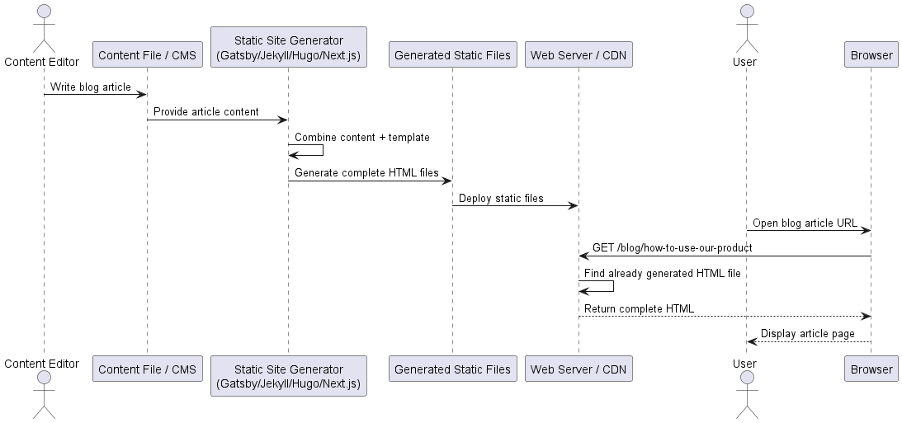
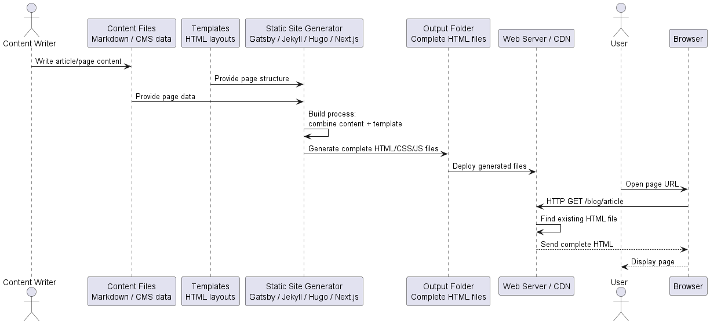

# F02 SPA — Static Rendering Questions

[Source chat](https://chatgpt.com/g/g-p-6a295be0712c8191a00e1149bb7206ea-software-architecture-exam-preparation/c/6a49062c-bafc-83eb-ad19-b118011f3599)

## 1. What happens in a real-life static rendering process❓

A real-life example of **static rendering** is a **blog article page** or **company website page**, for example:

```text
https://company.example.com/blog/how-to-use-our-product
```

The key idea is:

> **The HTML page is created before any user visits it.**

The lecture says that in static rendering, all possible views are **pre-generated during the build process**. At runtime, the server already has complete HTML files, so it does not need to dynamically generate the page for each request. `F-02-javascript-spas_en.pdf`
# Example: company blog article

Imagine a company has a blog article:

```text
/blog/how-to-use-our-product
```

The article title is:

```text
How to Use Our Product
```

The content is written by a content editor.
# Step 1: The content is written before runtime

The editor writes the article in a file or CMS.

Example file:

```markdown
# How to Use Our Product

This guide explains how to use our product step by step.

## Step 1
Create an account.

## Step 2
Log in and open the dashboard.
```

This is **not yet the final HTML page**. It is source content.
# Step 2: A template exists

The website also has an HTML template, for example:

```html
<!DOCTYPE html>
<html>
  <head>
    <title>{{ title }}</title>
  </head>
  <body>
    <header>
      <h1>{{ title }}</h1>
    </header>

    <main>
      {{ content }}
    </main>

    <footer>
      © 2026 Company
    </footer>
  </body>
</html>
```

The template says:

```text
Put the article title here.
Put the article content here.
Use the same header and footer for all pages.
```
# Step 3: Build process generates the final HTML

Before the website is published, a build tool runs.

Example technologies from the lecture include static site generators such as **Gatsby, Jekyll, Hugo, and Next.js**. `F-02-javascript-spas_en.pdf`

The build tool combines:

```text
Content + Template = Complete HTML file
```

So it creates a final file like:

```html
<!DOCTYPE html>
<html>
  <head>
    <title>How to Use Our Product</title>
  </head>
  <body>
    <header>
      <h1>How to Use Our Product</h1>
    </header>

    <main>
      <p>This guide explains how to use our product step by step.</p>

      <h2>Step 1</h2>
      <p>Create an account.</p>

      <h2>Step 2</h2>
      <p>Log in and open the dashboard.</p>
    </main>

    <footer>
      © 2026 Company
    </footer>
  </body>
</html>
```

This file may be saved as something like:

```text
dist/blog/how-to-use-our-product/index.html
```

Important: this happens **before the user visits the page**.
# Step 4: The generated files are deployed

The generated static files are uploaded to a web server or CDN:

```text
/index.html
/about/index.html
/blog/how-to-use-our-product/index.html
/contact/index.html
/style.css
/app.js
/logo.png
```

At this point, the website is already prepared.

The server does not need to ask a database or run a template engine when someone visits the page.
# Step 5: User opens the blog article

Now a user opens:

```text
https://company.example.com/blog/how-to-use-our-product
```

The browser sends:

```http
GET /blog/how-to-use-our-product
```

The server simply finds the already existing file:

```text
/blog/how-to-use-our-product/index.html
```

Then it sends that file back.
# Step 6: Browser displays the page

The browser receives complete HTML and displays it.

There is no need for the server to dynamically generate the page at that moment.

That is why the lecture says **TTFB can be fast**: dynamic generation is no longer necessary. It also says **FCP and TTI can be fast**, as long as the page does not include too much client-side JavaScript. `F-02-javascript-spas_en.pdf`

# Full process as a diagram



# Important difference from server rendering

In **server rendering**, the server creates the HTML **when the request arrives**.

```text
User request → server loads data → server renders HTML → response
```

In **static rendering**, the HTML was created earlier.

```text
Build time → generate HTML → deploy files
User request → server sends existing HTML file
```

So the server does much less work during the actual user request.
# What happens when the article changes ❓

Suppose the editor changes the article title.

Old title:

```text
How to Use Our Product
```

New title:

```text
How to Use Our Product in 5 Minutes
```

The already deployed HTML file still contains the old title.

So the website must be rebuilt:

```text
Edit content → run build again → generate new HTML → deploy again
```

This is one of the lecture’s disadvantages: updating content requires a **new build and deployment**. Static rendering is therefore very suitable for content-driven applications like blogs or company websites, but less suitable for highly interactive or personalized applications such as online banking or games. `F-02-javascript-spas_en.pdf`
# Simple mental model

Static rendering is like a bakery preparing sandwiches **before customers arrive**.

When a customer comes, the bakery does not cook from scratch. It just gives the already prepared sandwich.

Similarly:

```text
Static rendering = prepare HTML pages before users request them
```

That is why it can be very fast for blogs, documentation, landing pages, and company websites.

## 2. What does it mean to provide article content to a static site generator❓

By **“providing article content”**, I meant:

> The static site generator receives/reads the actual article text and data, so it can put that content into an HTML template.

It does **not** mean the user provides the article while opening the website. It happens **before users visit the page**, during the **build process**. That matches the lecture’s idea that static rendering pre-generates views during build time, so complete HTML files already exist at runtime. `F-02-javascript-spas_en.pdf`

Imagine two separate things:

## 1. Article content

This is the real content of the blog post.

Example:

```markdown
title: How to Use Our Product
author: Alice
date: 2026-07-04
This guide explains how to use our product step by step.

## Step 1
Create an account.

## Step 2
Log in and open the dashboard.
```

This contains the **actual article data**:

```text
title = How to Use Our Product
author = Alice
date = 2026-07-04
body = This guide explains...
```

## 2. HTML template

This is the reusable page structure:

```html
<html>
  <head>
    <title>{{ title }}</title>
  </head>
  <body>
    <header>Company Blog</header>

    <main>
      <h1>{{ title }}</h1>
      <p>By {{ author }}</p>

      {{ content }}
    </main>

    <footer>© Company</footer>
  </body>
</html>
```

The template says:

```text
Put the title here.
Put the author here.
Put the article body here.
Use the same header and footer.
```

## 3. “Providing article content” means this

The generator takes:

```text
Article content + HTML template
```

and produces:

```html
<html>
  <head>
    <title>How to Use Our Product</title>
  </head>
  <body>
    <header>Company Blog</header>

    <main>
      <h1>How to Use Our Product</h1>
      <p>By Alice</p>

      <p>This guide explains how to use our product step by step.</p>

      <h2>Step 1</h2>
      <p>Create an account.</p>

      <h2>Step 2</h2>
      <p>Log in and open the dashboard.</p>
    </main>

    <footer>© Company</footer>
  </body>
</html>
```

So in the diagram:

```text
Content File / CMS → Static Site Generator
```

means:

> The generator reads the blog article content from somewhere, such as a Markdown file or CMS, and uses it to fill the template.

A simpler mental model:

```text
Template = empty form
Article content = answers
Static site generator = person who fills the form
Final HTML = completed form
```

## 3. What is a static site generator, and how does it work❓

A **static site generator** is a tool that creates ready-made HTML pages **before users visit the website**.

In the lecture, this belongs to **static rendering**: all possible views are pre-generated during the **build process**, so at runtime the server already has complete HTML files and does not need to dynamically generate the page for each request. Examples mentioned are **Gatsby, Jekyll, Hugo, and Next.js**. `F-02-javascript-spas_en.pdf`

## Simple definition

A static site generator takes:

```text
Content + Templates + Assets
```

and produces:

```text
Complete HTML + CSS + JavaScript files
```

Then these files are uploaded to a web server.

So the static site generator is like a **factory**:

```text
Before users arrive:
raw material → factory → finished pages

When users arrive:
server just gives finished pages
```
# Real example: blog website

Imagine you are building a blog.

You write article content like this:

```markdown
title: How to Use Our Product
author: Alice
This guide explains how to use our product.

## Step 1
Create an account.

## Step 2
Open the dashboard.
```

This is not yet a full HTML page. It is just the **article content**.

Then you have a template:

```html
<html>
  <head>
    <title>{{ title }}</title>
  </head>
  <body>
    <header>Company Blog</header>

    <main>
      <h1>{{ title }}</h1>
      <p>By {{ author }}</p>

      {{ content }}
    </main>

    <footer>© Company</footer>
  </body>
</html>
```

The template says:

```text
Put title here.
Put author here.
Put article body here.
Use this common header and footer.
```

The **static site generator** combines them and creates a final HTML file:

```html
<html>
  <head>
    <title>How to Use Our Product</title>
  </head>
  <body>
    <header>Company Blog</header>

    <main>
      <h1>How to Use Our Product</h1>
      <p>By Alice</p>

      <p>This guide explains how to use our product.</p>

      <h2>Step 1</h2>
      <p>Create an account.</p>

      <h2>Step 2</h2>
      <p>Open the dashboard.</p>
    </main>

    <footer>© Company</footer>
  </body>
</html>
```

This generated file may be saved as:

```text
dist/blog/how-to-use-our-product/index.html
```
# How it works step by step

## Step 1: Developer or editor creates content

For example:

```text
blog-post.md
about.md
contact.md
```

These files contain the actual text/data of the pages.

## Step 2: Developer creates templates

For example:

```text
blog-template.html
page-template.html
layout.html
```

Templates define the structure of the page.

## Step 3: Static site generator runs during build time

The generator reads all content files and all templates.

It does something like:

```text
For every blog article:
  read article content
  read blog template
  insert article data into template
  create final HTML file
```

This is the important part: the HTML is created **before any real user sends a request**.

## Step 4: It creates an output folder

Example output:

```text
dist/
  index.html
  about/
    index.html
  blog/
    how-to-use-our-product/
      index.html
  contact/
    index.html
  style.css
  main.js
```

This `dist` folder contains ready-made files.

## Step 5: Files are deployed to a server/CDN

The server now has complete HTML files.

## Step 6: User opens the page

User visits:

```text
/blog/how-to-use-our-product
```

The browser sends:

```http
GET /blog/how-to-use-our-product
```

The server does **not** generate HTML now.

It simply finds:

```text
/blog/how-to-use-our-product/index.html
```

and sends it back.

That is why static rendering can have fast **TTFB**: dynamic generation is not necessary at request time. The lecture also says FCP and TTI can be fast, as long as there is not too much client-side JavaScript. `F-02-javascript-spas_en.pdf`
# Flow diagram



# Key difference from server rendering

With **server rendering**:

```text
User request → server generates HTML now → response
```

With **static site generation**:

```text
Build time → generator creates HTML
User request → server only sends existing HTML
```

So a static site generator is basically a **build-time HTML producer**.
# Important limitation

When the content changes, the already generated HTML does not automatically change. You usually need:

```text
Change content → run build again → deploy again
```

That is why the lecture says static rendering is suitable for content-driven applications like blogs or company websites, but less suitable for highly interactive or personalized applications such as online banking or games. `F-02-javascript-spas_en.pdf`
