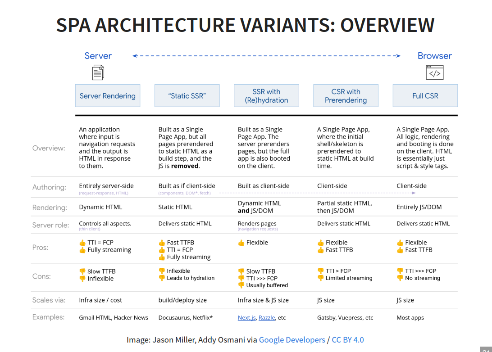

# Rendering Approaches Comparison

## 1. First understand the two separate decisions

❗**Architecture** describes how the whole application behaves.

- MPA
- MPA with AJAX
- SPA

❗**Rendering approach** describes **where and when the HTML view is constructed**.

- Server rendering
- Static rendering
- Client-side rendering (CSR)
- Server-side rendering (SSR)
- CSR with prerendering

They are connected, but they are not identical.

| Architecture/rendering relationship | Meaning |
|---|---|
| Classic MPA | Normally uses server rendering |
| MPA with AJAX | Server-rendered pages with some client-side updates |
| SPA | Normally uses CSR |
| Static rendering | Can produce an MPA or SPA |
| SSR | Hybrid of server rendering and CSR |
| CSR with prerendering | Hybrid of static rendering and CSR |
## Part A: Application architectures

## 2. Multi-Page Application — MPA

▣ **Definition:** An application in which user navigation normally sends a new request to the server and loads a new HTML page.

The client is a **thin client**. Most work happens on the server:

- HTML generation
- Navigation and URL routing
- Access to business logic
- Application-state management

### Advantages

| Criterion | Advantage |
|---|---|
| Client complexity | Client remains relatively simple because most work happens on the server |
| Initial usability | Ready-made HTML can be displayed and made interactive quickly |
| Central control | Routing, HTML generation and application state are handled on the server |
| Client requirements | Relatively little client-side JavaScript is required |

### Disadvantages

| Criterion | Disadvantage |
|---|---|
| Navigation | Switching pages causes a complete reload |
| User experience | The browser blocks while waiting for the response |
| Network dependency | Bandwidth and latency strongly affect performance |
| Frequent interaction | Every server-dependent action may require a new request and reload |
| Client state | Extra effort is needed to preserve previously entered information across requests |
| Server response | TTFB may be slow because the server must dynamically build the page |

💡 **Lecture example:** If search suggestions were implemented as a normal MPA, every typed letter could reload the complete page.

### Suitable scenarios — derived from lecture characteristics

- Applications based mainly on separate pages and forms
- Applications with limited client-side interaction
- Systems where most logic and application state should remain on the server
- Administrative or information systems where page reloads are acceptable

### Less suitable scenarios

- Collaborative editors
- Interactive maps
- Games
- Interfaces requiring immediate reactions to frequent user input
## 3. MPA with AJAX

▣ **Definition:** A normal multi-page application in which selected parts of a page communicate asynchronously with the server and update the DOM without reloading the complete page.

### Advantages

| Criterion | Advantage |
|---|---|
| User experience | Individual parts can update without a complete page reload |
| Responsiveness | Interface can remain usable during server communication |
| Network load | Only required data is exchanged, reducing network traffic |
| Performance | Can provide a more desktop-like experience |
| Existing architecture | Interactive functions can be added without converting the complete system into an SPA |

### Disadvantages

| Criterion | Disadvantage |
|---|---|
| Page navigation | Switching between complete pages still causes reloads |
| Presentation logic | HTML generation and presentation logic become fragmented between client and server |
| Application state | Actual application state is still primarily managed on the server |
| Architecture | It combines two styles: traditional page loading and local AJAX updates |

### Suitable scenarios — derived from lecture characteristics

- A normal website that needs search suggestions
- A form that checks input without reloading
- “Load more” functionality
- Updating a shopping-cart counter
- A server-based application that needs only a few interactive components

💡 **Example:** An online bookstore has normal server-rendered pages, but search suggestions appear asynchronously while the user types.

→ **Result:** Choose **MPA + AJAX**, because only one part needs continuous updating; the entire application does not need SPA behavior.
## 4. Single-Page Application — SPA

▣ **Definition:** An application delivered to the browser that does not reload the page during normal use.

During the initial load, the application and its required resources are loaded. After that:

- The view is changed through DOM manipulation.
- Server communication mainly loads data or executes business logic.
- Communication can happen asynchronously through AJAX.
- The client becomes a **rich/fat client**.

### Advantages

| Criterion | Advantage |
|---|---|
| User experience | Provides desktop-like interaction without complete page reloads |
| Responsiveness | The interface can respond immediately to many user actions |
| Server workload | Some traditional server responsibilities move to the client |
| Scalability and cost | Using client resources can reduce server load |
| Navigation | Views can change locally without requesting complete HTML pages |
| Offline usage | Offline capability is an important SPA goal |
| Interactivity | Well suited to behaviour-driven, highly interactive applications |

### Disadvantages

| Criterion | Disadvantage |
|---|---|
| Initial load | The first request may be expensive because the application must be downloaded |
| Time to Interactive | The user may see content before the application has completely started |
| Client complexity | Rendering, presentation logic, HTML generation and state management move to the client |
| Maintainability | Large client-side applications can become difficult to maintain and customize |
| Browser features | Back, forward and bookmarking initially caused problems, although routers have largely solved them |
| SEO | Search engine optimization can be more complex for JavaScript-heavy applications |
| Dependency | The client implementation depends heavily on JavaScript |

### Suitable scenarios — derived from lecture characteristics

- Collaborative document editors such as Google Docs
- Interactive dashboards
- Drawing and whiteboard applications
- Highly interactive business tools
- Applications that should continue working partly offline
- Interfaces with frequent local state changes

### Less suitable scenarios

- Simple blogs
- Small company websites
- Primarily static information pages
- Applications where downloading a large JavaScript application is unnecessary
## Part B: Rendering approaches

## 5. Performance criteria used in the lecture

| Metric | Meaning |
|---|---|
| **TTFB — Time to First Byte** | Time until the first response byte reaches the browser |
| **FCP — First Contentful Paint** | Time until the first visible content is displayed |
| **TTI — Time to Interactive** | Time until the displayed page can actually be used |

❗A page can have a fast **FCP** but a slow **TTI**.

💡 The user might already see buttons, but clicking them does nothing because the JavaScript application has not finished starting.
## 6. Server rendering

▣ **Definition:** The server dynamically constructs the complete HTML view whenever it receives a request.

This is the rendering approach used by classic MPAs.

**Lecture technologies:** Spring MVC with Thymeleaf, Ruby on Rails and PHP.

### Evaluation

| Criterion | Evaluation |
|---|---|
| Rendering location | Server |
| Rendering time | Dynamically for every request |
| TTFB | Potentially slow |
| FCP | Fast |
| TTI | Fast |
| Client JavaScript | Little JavaScript required |
| Content | Can be generated from current server data |
| Interactivity | Usually page-based |

### Advantages

- Fast FCP because the browser receives ready-made HTML.
- Fast TTI because little client-side JavaScript is required.
- Client remains comparatively thin.
- Server centrally controls the generated page.

### Disadvantages

- TTFB can be slow because the server must first:
  - Access databases
  - Call APIs
  - Perform calculations
  - Render the HTML
- A new view normally requires another server request.
- In a classic MPA, navigation causes page reloads.

### Suitable scenarios — derived from lecture characteristics

- Server-driven form applications
- Applications showing current database information on first load
- Pages where immediate usability is more important than SPA-style interaction
- Applications already based on Spring MVC and server-side templates

💡 **Example:** A banking transaction page must display the customer’s latest account information directly when requested.
## 7. Static rendering

▣ **Definition:** All possible views are generated during the **build process**. At runtime, the server only delivers already-created HTML files.

It can be used for both MPAs and SPAs.

**Lecture technologies:** Gatsby, Jekyll, Hugo and Next.js.

The final overview also calls the SPA-based form **“Static SSR.”**

### Evaluation

| Criterion | Evaluation |
|---|---|
| Rendering location | Build environment |
| Rendering time | Before deployment |
| TTFB | Fast |
| FCP | Fast |
| TTI | Fast when little client-side JavaScript is used |
| Server work per request | Very little; it delivers existing HTML |
| Content updates | Require rebuilding and redeploying |
| Personalization | Limited |

### Advantages

- Fast TTFB because no dynamic rendering is needed.
- Fast FCP because complete HTML already exists.
- TTI can equal FCP when little JavaScript is required.
- Runtime server processing is reduced.

### Disadvantages

- Updating content requires a new build and deployment.
- A complex application could make rebuilding expensive.
- Less suitable for frequently changing content.
- Less suitable for high personalization.
- Less suitable for behaviour-driven applications with extensive interaction.

### Suitable scenarios stated in the lecture

- Blogs
- Company websites
- Content-driven applications
- Content that does not change quickly or frequently

### Less suitable scenarios stated in the lecture

- Online banking
- Games
- Highly personalized applications
- Highly interactive applications
## 8. Client-side rendering — CSR

▣ **Definition:** The server primarily sends JavaScript and a basic HTML shell. JavaScript running in the browser constructs and updates the actual view.

CSR corresponds to the SPA architecture and therefore has the SPA advantages and disadvantages.

**Lecture technologies:** React, Angular and Vue.js.

### Evaluation

| Criterion | Evaluation |
|---|---|
| Rendering location | Browser |
| Initial HTML | Mainly basic script and style tags |
| TTFB | Fast |
| FCP | Can be delayed compared with ready-made HTML |
| TTI | Delayed by downloading, processing and starting the SPA |
| Interactivity after startup | High |
| Server role | Mainly delivers static resources, data and business services |
| Client responsibility | Very high |

### Advantages

- Highly flexible client-side interface.
- No complete page reload after startup.
- Suitable for frequent DOM updates and interaction.
- Client resources can reduce server work.
- Can support offline functionality.

### Disadvantages

- Expensive initial load because the application must be downloaded and started.
- TTI occurs significantly later than FCP.
- Client-side complexity increases.
- SEO can be more complex.
- Heavy dependence on JavaScript.
- Maintainability and state management become challenging in large applications.

### Suitable scenarios — derived from lecture characteristics

- Online editors
- Interactive dashboards
- Whiteboard tools
- Games
- Applications with frequent local UI changes
- Applications where interaction after startup matters more than the initial display time
## 9. Server-side rendering — SSR

▣ **Definition:** A hybrid combination of **server rendering and CSR**, also called **Universal Rendering**.

The server sends:

1. A pre-rendered static HTML view
2. The JavaScript code for the SPA

The browser immediately displays the HTML. Afterwards, JavaScript takes control through **rehydration**.

▣ **Rehydration:** The process through which JavaScript connects to the server-rendered HTML and makes it an interactive SPA.

**Lecture technologies:** Next.js, Nuxt.js and SSR tools provided by Angular, React and Vue.

### Evaluation

| Criterion | Evaluation |
|---|---|
| First rendering location | Server |
| Later rendering | Browser through JavaScript/DOM |
| FCP | Faster than pure CSR |
| TTFB | Depends heavily on server-rendering implementation |
| TTI | Depends heavily on rendering and rehydration |
| Interactivity | Available after rehydration |
| Code requirement | Rendering code must work on client and server |

### Advantages

- Faster FCP than pure CSR.
- Initial content is immediately displayable.
- Retains SPA behaviour after JavaScript takes control.
- Combines server-generated initial content with client-side interactivity.

### Disadvantages

- Rendering code must work on both client and server.
- The implementation is more complex.
- TTFB can become slow if server rendering is expensive.
- TTI can be delayed by rehydration.
- A rehydration error can produce a dangerous situation:
  - The page looks completely rendered.
  - But it is not interactive.

❗SSR is also called **Isomorphic Rendering** because rendering code must run in both environments.

### Suitable scenarios — derived from lecture characteristics

- An interactive SPA whose initial content should appear quickly
- A personalized storefront that should show content immediately and later behave like an SPA
- Applications where pure CSR has an unacceptable initial loading experience

💡 **Example:** A streaming platform immediately displays a server-rendered personalized homepage. JavaScript then hydrates it so menus, recommendations and controls become interactive.
## 10. CSR with prerendering

▣ **Definition:** A hybrid combination of **CSR and static rendering**.

Parts required for the initial view are generated during the build process. After loading, JavaScript starts the SPA and takes control.

It can also deliver targeted static views to search-engine crawlers.

**Lecture technologies:** prerenderer library and Prerender.io.

### Evaluation

| Criterion | Evaluation |
|---|---|
| Initial rendering | Build-time static HTML |
| Later rendering | JavaScript/DOM in the browser |
| TTFB | Fast, analogous to CSR except for the initial load |
| FCP | Faster than pure CSR |
| TTI | Delayed by SPA startup |
| Initial content | Must be suitable for static generation |
| SEO use | Can deliver targeted static views to crawlers |

### Advantages

- Faster FCP than pure CSR.
- Fast TTFB because static HTML can be delivered.
- User initially sees directly displayable content.
- Preserves SPA functionality after startup.
- Can be used to provide static content for search engines.

### Disadvantages

- The page may be visible before it is interactive.
- TTI is delayed by SPA startup.
- Initial content must be suitable for static rendering.
- Not appropriate when the first view must contain newly generated, request-specific information.

### Suitable scenarios — derived from lecture characteristics

- An SPA with a mostly stable landing page
- Product or marketing pages that later become interactive
- Applications where initial content can be generated during the build
- An SPA requiring static views for search-engine crawlers

### Less suitable scenario

- A banking dashboard whose first screen must contain the user’s current balance, because that personalized content cannot normally be generated as one common static build.
## 11. Complete comparison

| Approach | HTML created | TTFB | FCP | TTI | Best suitability | Main limitation |
|---|---|---:|---:|---:|---|---|
| Server rendering | Server, per request | Potentially slow | Fast | Fast | Dynamic server-driven pages | Server must render every request |
| Static rendering | During build | Fast | Fast | Fast if JS is limited | Stable content | Rebuild needed for changes |
| CSR | Browser | Fast | Slower | Delayed | Highly interactive applications | Expensive SPA startup |
| SSR | Server first, browser later | Implementation-dependent | Faster than CSR | Implementation-dependent | Dynamic initial content plus SPA interaction | Rendering and hydration complexity |
| CSR with prerendering | Build first, browser later | Fast | Faster than CSR | Delayed | Static initial view plus SPA interaction | Initial view must be statically renderable |
## 12. Quick scenario-identification rules

| Scenario clue | Likely choice | Reason |
|---|---|---|
| “Separate pages and limited interaction” | MPA + server rendering | Complete server-generated pages are sufficient |
| “Normal website, but one component updates frequently” | MPA + AJAX | Only that component needs asynchronous updating |
| “Highly interactive and no page reloads” | SPA + CSR | Browser manages continuous interface updates |
| “Content rarely changes” | Static rendering | Pages can be generated during the build |
| “Interactive SPA, but initial personalized content must appear quickly” | SSR | Server provides the initial view; SPA takes over |
| “Interactive SPA with a stable initial page” | CSR with prerendering | Static initial content can be built in advance |
| “Offline capability is important” | SPA | Offline capability is one of the SPA goals |
| “Every visitor must see current data immediately” | Server rendering or SSR | The initial response can be generated from current server data |

## Non-lecture clarification

The phrase **“SEO-friendly”** is often used as a general advantage of server and static rendering. The lecture explicitly says that SEO **can be more complex for JavaScript-heavy SPAs** and that prerendering is used in the SEO area, but it does not present a universal rule that every server-rendered page automatically has good SEO.
